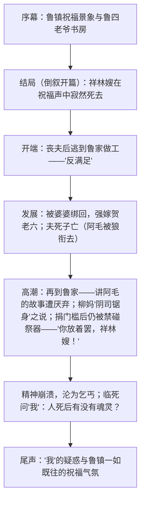

# 12 祝福

## 作者与背景

- 鲁迅（1881—1936），原名周树人，浙江绍兴人，中国现代文学奠基人。《祝福》作于1924年，收入小说集《彷徨》（首篇），是鲁迅反封建思想启蒙的代表作之一。
- 背景：辛亥革命推翻帝制，但封建礼教（夫权、族权、神权、政权"四权"束缚）在农村依然根深蒂固。小说以浙东鲁镇年终"祝福"大典为背景，写祥林嫂被封建礼教一步步吞噬的悲剧。
- "祝福"是旧时浙东年终祭祀天地祖先、祈求来年幸福的仪式——以富人的"祝福"反衬穷人的死亡，标题即具反讽意味。

## 内容梳理

倒叙作用：先写死亡结局，设置悬念，突出祥林嫂之死与"祝福"喜庆的强烈反差，强化悲剧与批判力量。

三次外貌（眼睛）描写对比：初到鲁镇"顺着眼"（安分）→ 再到鲁镇"眼角带些泪痕，眼光也没有先前那样精神"（丧夫失子之痛）→ 临死前"只有那眼珠间或一轮，还可以表示她是一个活物"（精神已死）。鲁迅自言"要极省俭的画出一个人的特点，最好是画她的眼睛"。

## 艺术特色

1. **倒叙结构**与第一人称限制视角："我"是有同情心却软弱逃避的启蒙知识分子，其"说不清"深化了主题反思。
2. **环境描写**：三次祝福景象首尾呼应，雪的意象渲染冷寂；鲁四老爷书房（陈抟"寿"字、《近思录集注》）暗示其理学卫道士身份。
3. **细节与对比**：碗是"空的"、竹竿"下端开了裂"写尽沦落；众人对阿毛故事由"陪出眼泪"到"烦厌唾弃"，写看客的冷漠。
4. **人物塑造**：祥林嫂并非不反抗（逃、撞香案、捐门槛、问魂灵），但她的反抗仍在礼教框架之内，愈挣扎愈沉沦——悲剧的深刻性所在。

## 典型例题

**例1** 谁是杀害祥林嫂的凶手？
**解析**：没有单一凶手，"是封建礼教及其支配下的整个社会环境"：鲁四老爷的鄙弃（"谬种"）代表政权与理学；婆婆强卖代表族权夫权；柳妈的地狱之说与捐门槛骗局代表神权；四婶"你放着罢"断其生路；鲁镇众人的赏鉴与冷漠是帮凶；"我"的支吾逃避亦难辞其咎。祥林嫂死于"无主名无意识的杀人团"，这正是鲁迅批判的深刻处。

**例2** 分析"捐门槛"情节的作用。
**解析**：①情节上是祥林嫂命运的最后转机与更大跌落：她倾其所有"赎罪"，满以为可以重获做人资格；②"你放着罢，祥林嫂！"一声断喝彻底粉碎其希望，直接导致精神崩溃，是压垮她的最后一根稻草；③主题上揭露神权迷信之虚妄与礼教吃人之酷烈——连"赎罪"的路也是骗局，批判入骨。

## 易错点

- 《祝福》收入《彷徨》，不是《呐喊》（《呐喊》收《狂人日记》《阿Q正传》等）。
- 结构是倒叙，不是插叙；判断依据是先写结局再述生平。
- 祥林嫂有反抗（逃出做工、改嫁时"闹得利害"、捐门槛），"麻木不反抗"的表述不准确，但其反抗以礼教观念为武器，具有局限性。
- "我"不等于鲁迅本人，是小说塑造的叙述者形象。
- 鲁四老爷是"讲理学的老监生"，其冷酷主要通过皱眉、"谬种"等只言片语侧面表现。

## 背记要点

1. 关键语句："她是未庄……不，鲁镇人"勿误；名句："我这答话怕于她有些危险……说不清"；结尾"豫备给鲁镇的人们以无限的幸福"（反讽）。
2. 三要素记忆：倒叙结构、三次眼睛描写、三次祝福景象。
3. 主题：批判封建礼教（政权、族权、夫权、神权）吃人，反思国民性（看客）与知识分子的软弱。
4. 高考视角：叙述视角与倒叙作用、环境描写作用、次要人物（柳妈、"我"、众人）功能是小说阅读高频考点。

## 自测题

1. 简述小说采用倒叙的艺术效果。
2. 三次外貌描写中"眼睛"的变化说明了什么？
3. 柳妈是好意还是帮凶？结合文本分析这一形象的意义。
4. 结尾的祝福景象描写有何作用？

## 相关知识点

同写小人物悲剧参见 [[13 林教头风雪山神庙 / 装在套子里的人]] 与 [[14 促织 / 变形记（节选）]]；封建家族社会的全景画卷参见 [[《红楼梦》整本书阅读]]。
