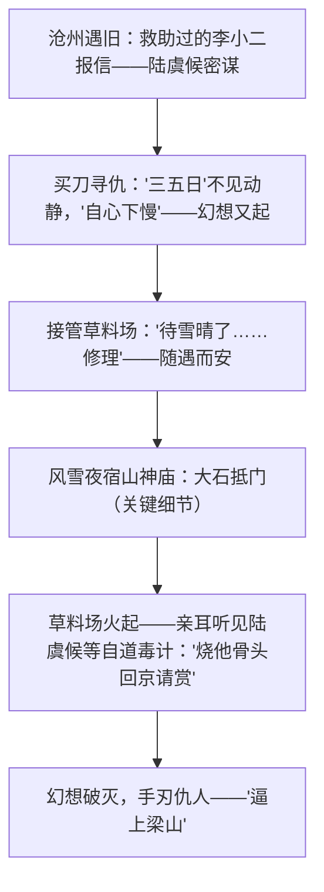

# 13 林教头风雪山神庙 / 装在套子里的人

## 作者与背景

- 《林教头风雪山神庙》选自《水浒传》第十回。《水浒传》，元末明初施耐庵著（一说施耐庵、罗贯中合著），我国第一部以农民起义为题材的长篇章回体白话小说。林冲原为东京八十万禁军枪棒教头，因高俅之子觊觎其妻而遭陷害，刺配沧州——本回写他由隐忍到反抗的最终转变，是"官逼民反"主题的集中体现。
- 《装在套子里的人》：契诃夫（1860—1904），俄国批判现实主义作家，与莫泊桑、欧·亨利并称世界三大短篇小说巨匠。小说作于1898年，沙皇专制统治下告密成风、人人自危，别里科夫是专制制度豢养又受其毒害的"套中人"典型。

## 内容梳理

"风雪"作用：①渲染阴冷肃杀氛围；②推动情节——雪压草厅使林冲夜宿山神庙得以脱险、闻真相（"那雪正下得紧"被鲁迅赞为富有"神韵"）；③映衬人物境遇与心境。

别里科夫的"套子"：有形的（晴天穿雨鞋带雨伞、竖起衣领、表装套子）与无形的（只信政府告示、"千万别闹出什么乱子"的口头禅、以旧思想套人）。情节：漫画事件→骑自行车事件→与柯瓦连科争执被推下楼→华连卡一笑→一命呜呼；可笑又可怖：全城被他辖制十五年，他死后"生活又恢复旧样子"——套子在人心中。

## 艺术特色

1. **《林》细节精妙**：买刀、大石抵门、花枪挑葫芦等细节环环相扣，草蛇灰线；情节张弛有度（一起——买刀寻仇，一落——接管草料场，再起——雪夜复仇）。
2. **《林》人物性格发展**：林冲由委曲求全、随遇而安到奋起反抗，性格随情节层层"逼"出，真实可信。
3. **《装》夸张与讽刺**：漫画式外貌描写、口头禅反复出现，寓庄于谐。
4. **《装》以小见大**：一个庸人的死折射整个专制社会的精神奴役，结尾"不能再这样生活下去"点出变革呼声。

## 典型例题

**例1** 分析林冲性格转变的过程及其社会意义。
**解析**：过程：闻陆谦到来怒而买刀寻仇（反抗火花）→数日无事复归"自心下慢"（幻想安稳）→接管草料场盘算"修屋过冬"（委曲求全至极）→山神庙亲闻烧场害命的真相，幻想彻底破灭，杀敌上梁山（决绝反抗）。意义：林冲有身份、有家室、一忍再忍，连他都被逼上梁山，深刻揭示"官逼民反、民不得不反"的主题——黑暗官府不给好人留任何活路。

**例2** 别里科夫死后，"我们"为什么"从墓园回去的时候……谦逊的、忧郁的脸相"且"一个礼拜没完"生活又照旧了？
**解析**：埋葬别里科夫是"大快人心的事"，但大家不敢流露快活，说明恐惧已内化；不久生活恢复旧样子，因为别里科夫只是专制制度的产物与缩影，制度不除，"套中人"还会层出不穷（"可是还有多少这类套中人留在世上"）。这一结尾把批判从个人引向社会制度与国民精神，深化主题。

## 易错点

- 《水浒传》是元末明初作品、章回体白话小说；"风雪山神庙"是第十回，林冲绰号"豹子头"。
- "那雪正下得紧"的"紧"字妙在以口语传神地写出雪势急密与形势紧迫的双重意味。
- 大石抵门的细节是情节关键：使陆虞候等推门不开、只得门外自道真相，勿遗漏。
- 别里科夫既是沙皇专制的维护者（辖制全城），也是受害者（战战兢兢而死），需双面评价。
- 契诃夫是俄国作家，勿与法国莫泊桑混淆。

## 背记要点

1. 《林》关键情节链：李小二报信→买刀寻仇→接管草料场→风雪夜宿山神庙→手刃仇人。
2. 主题对照：《林》——官逼民反（外部压迫逼出反抗）；《装》——精神奴役（制度使人自我禁锢）。
3. 别里科夫口头禅："千万别闹出什么乱子。"
4. 高考视角：自然环境（风雪）作用、细节描写作用、人物性格发展轨迹、讽刺手法是小说阅读高频题型。

## 自测题

1. "风雪"描写在小说中有哪些作用？举例说明。
2. 概述林冲性格发展的四个阶段。
3. 别里科夫的"套子"有哪些？其死因说明了什么？
4. 两篇小说批判的矛头分别指向什么？塑造人物的手法有何不同？

## 相关知识点

同为批判性小说参见 [[12 祝福]]；变形与异化主题参见 [[14 促织 / 变形记（节选）]]；章回小说巅峰参见 [[《红楼梦》整本书阅读]]。
