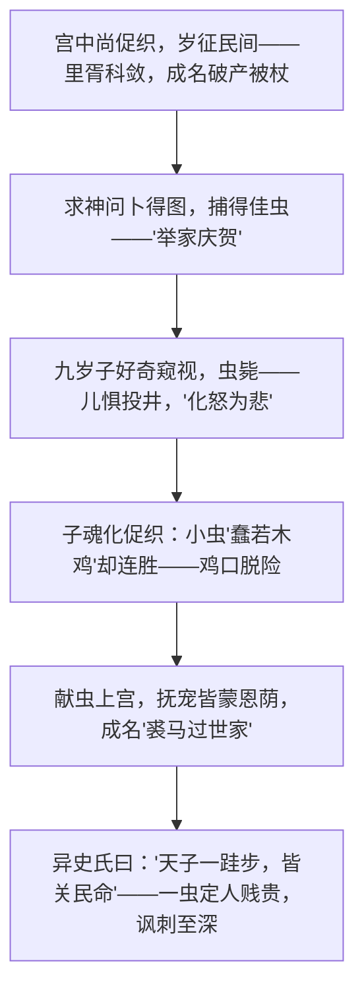

# 14 促织 / 变形记（节选）

## 作者与背景

- 《促织》选自《聊斋志异》。蒲松龄（1640—1715），字留仙，别号柳泉居士，世称聊斋先生，清代文学家。《聊斋志异》是文言短篇小说集的巅峰，"用传奇法，而以志怪"（鲁迅语），郭沫若赞"写鬼写妖高人一等，刺贪刺虐入骨三分"。小说托明宣德年间宫中尚促织之戏，实刺现实吏治。
- 《变形记》：卡夫卡（1883—1924），奥地利（布拉格）小说家，现代主义文学先驱，代表作《变形记》《城堡》《审判》。节选写推销员格里高尔一夜醒来变成巨大甲虫后的处境，表现资本主义社会中人的异化。

## 内容梳理

成名一家的悲喜完全系于一只小虫：征虫（悲）→得虫（喜）→失虫失子（大悲）→魂化促织、因虫富贵（"喜"）——喜剧结局包裹着更深的悲剧：儿子须化为玩物才能救全家，人的价值贱于一虫。

《变形记》梳理：格里高尔变甲虫后首先忧虑的竟是误了火车、丢掉差事（人已异化为挣钱工具）；秘书主任逼上门；家人由惊恐到嫌恶——亲情在利益面前冷却。"变形"是荒诞的设定，写的却是真实的人际与社会关系。

## 文言知识（《促织》）

| 类别 | 例句 | 说明 |
| --- | --- | --- |
| 通假字 | 昂其直，居为奇货 | "直"通"值"，价钱 |
| 通假字 | 手裁举，则又超忽而跃 | "裁"通"才" |
| 通假字 | 翼日进宰 | "翼"通"翌"，次日 |
| 词类活用 | 岁征民间 | 名词作状语，每年 |
| 词类活用 | 得佳者笼养之 | 名词作状语，用笼子 |
| 词类活用 | 成然之 | 意动用法，认为……对 |
| 词类活用 | 益奇之 | 意动用法，认为……奇特 |
| 词类活用 | 而高其直 | 形容词使动，抬高 |
| 特殊句式 | 村中少年好事者驯养一虫 | 定语后置 |
| 特殊句式 | 掭以尖草 | 状语后置 |
| 特殊句式 | 遂为猾胥报充里正役 | 被动句 |

## 典型例题

**例1** 《促织》的结局是喜剧还是悲剧？
**解析**：表面是大团圆：虫获宠、宰擢升、成名"裘马过世家"。实质是更深的悲剧与讽刺：①成名之福建立在儿子魂化促织、供人玩弄之上，人不成其为人；②一家的生死荣辱全系于皇帝的玩物，"天子一跬步，皆关民命"；③官员因献虫得迁，吏治荒唐可见。以喜写悲，讽刺更冷峻，与"异史氏曰"的议论互为表里。

**例2** 格里高尔变形后最忧虑的是什么？这说明了什么？
**解析**：他不惊骇自己变虫，而是焦虑误了五点的火车、担心被解雇、盘算还清父债——身体变形前，他的精神早已被职业与债务"异化"为挣钱机器。卡夫卡以荒诞的外壳写实的心理，揭示现代社会中人被工具化、亲情被金钱关系侵蚀的真相：真正可怕的不是人变甲虫，而是人未变形时已失去自我。

## 易错点

- 蒲松龄是清代人，《聊斋志异》是文言短篇小说集，非白话章回体。
- 《促织》故事托言明宣德年间，实讽清代现实，"借古讽今"。
- "异史氏曰"仿《史记》"太史公曰"，是作者议论，答题可引为主旨依据。
- 卡夫卡是奥匈帝国布拉格的德语作家，《变形记》属现代主义（表现主义），勿以现实主义标准苛求情节合理性。
- 两文"变形"方向相反：成名之子由人化虫是被迫救家，格里高尔变虫后被家庭抛弃——比较题常考。

## 背记要点

1. 《促织》名句："天子偶用一物，未必不过此已忘；而奉行者即为定例。""天子一跬步，皆关民命，不可忽也。"
2. 情节线索：征虫—觅虫—得虫—失虫—化虫—斗虫—献虫。
3. 《变形记》主题词：异化——人在现代社会中沦为工具、亲情物化。
4. 高考视角：荒诞手法与现实批判的关系、中外"变形"母题比较、《促织》文言实词（直、裁、翼、然）与被动句是高频考点。

## 自测题

1. 梳理成名一家因促织而起的心理起伏过程。
2. "异史氏曰"表达了怎样的观点？
3. 格里高尔的家人对他态度发生了怎样的变化？说明了什么？
4. 比较《促织》与《变形记》中"人变虫"的异同及各自的批判指向。

## 相关知识点

批判现实的小说参见 [[12 祝福]] 与 [[13 林教头风雪山神庙 / 装在套子里的人]]；文言词法句法积累参见 [[3 鸿门宴]]。
