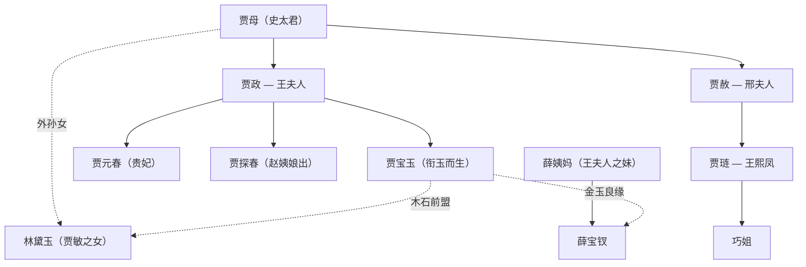

# 《红楼梦》整本书阅读

## 作者与背景

- 曹雪芹（约1715—约1763），名霑，字梦阮，号雪芹，清代小说家。曹家为江宁织造世家，雍正年间被抄没落，作者"于悼红轩中披阅十载，增删五次"写成前八十回；后四十回一般认为由高鹗（一说无名氏）续成，程伟元、高鹗整理刊行（程高本）。
- 《红楼梦》又名《石头记》，是中国古典小说的巅峰，以贾宝玉、林黛玉、薛宝钗的爱情婚姻悲剧为主线，以贾、史、王、薛四大家族的兴衰为背景，展示封建末世的社会全景，被誉为"封建社会的百科全书"。"红学"为专门之学。

## 内容梳理

- 结构要害：前五回是全书总纲——甄士隐梦幻识通灵（缘起）、贾雨村起复（视角）、冷子兴演说荣国府（家族概貌）、林黛玉进贾府（主要人物亮相）、贾宝玉神游太虚幻境（判词曲子预示金陵十二钗命运）。
- 主线与副线：宝黛钗爱情婚姻悲剧＋家族由"烈火烹油、鲜花着锦"到"树倒猢狲散"的衰亡；经典情节如宝玉挨打、黛玉葬花、刘姥姥进大观园、探春理家、抄检大观园。

## 阅读方法与艺术特色

1. **把握前五回总纲**：借判词、《红楼梦曲》理解"草蛇灰线，伏脉千里"的预叙艺术。
2. **人物论**：宝玉——"于国于家无望"的叛逆者，尊重女性、厌弃仕途经济；黛玉——诗魂与泪，敏感孤高，"质本洁来还洁去"；宝钗——"任是无情也动人"，端庄周全而恪守礼教；王熙凤——"机关算尽太聪明"的管理奇才与悲剧人物。
3. **日常生活的诗化叙事**：以饮宴、诗社、节庆等日常场景写人叙事，于细微处见性格与盛衰。
4. **语言艺术**：人物语言高度个性化（凤姐的爽利泼辣、黛玉的机敏尖新）；诗词曲赋与叙事水乳交融（《葬花吟》《芙蓉女儿诔》）。

## 典型例题

**例1** 结合"林黛玉进贾府"分析王熙凤的出场艺术。
**解析**："未见其人，先闻其声"——"我来迟了，不曾迎接远客！"在众人"敛声屏气"中独她放诞无礼，写出其在贾府的特殊地位与得宠；继以浓墨重彩的服饰描写显其华贵俗艳；"丹唇未启笑先闻"及见黛玉时哭笑转换自如，见其机变逢迎。一段出场，身份、性格、人际关系尽出，是古典小说人物出场描写的典范。

**例2** 如何理解《红楼梦》的悲剧意蕴？
**解析**：三重悲剧交织：①爱情婚姻悲剧——"木石前盟"败于"金玉良缘"，黛死钗寡，宝玉出家；②家族悲剧——四大家族"忽喇喇似大厦倾"，繁华成空；③人生与时代悲剧——"千红一窟（哭）、万艳同杯（悲）"，众女儿的毁灭指向对封建末世制度与文化的整体反思。王国维称其为"悲剧中之悲剧"。

## 易错点

- 通行本一百二十回：前八十回曹雪芹作，后四十回为续作（高鹗或无名氏），学界表述留意教材说法。
- 四大家族是贾、史、王、薛；黛玉之母贾敏是贾母之女，黛玉是贾母外孙女。
- "金陵十二钗"正册人物：黛玉、宝钗、元春、探春、湘云、妙玉、迎春、惜春、凤姐、巧姐、李纨、秦可卿——不含袭人、晴雯（属又副册、副册系统）。
- 判词须与人物对应准确，如"玉带林中挂，金簪雪里埋"合咏黛玉、宝钗。
- 大观园是为元妃省亲所建，勿说成贾府原有宅园。

## 背记要点

1. 名句："满纸荒唐言，一把辛酸泪。都云作者痴，谁解其中味？""假作真时真亦假，无为有处有还无。""机关算尽太聪明，反算了卿卿性命。"
2. 前五回总纲功能＋"草蛇灰线，伏脉千里"的结构特点。
3. 鲁迅评价："自有《红楼梦》出来以后，传统的思想和写法都打破了。"
4. 高考视角：北京卷等常设《红楼梦》微写作与简答，聚焦人物评析（凤姐、探春、袭人等）、经典情节复述、判词对应、主题理解。

## 自测题

1. 前五回在全书结构上起什么作用？
2. 从"黛玉葬花"或"宝玉挨打"任选其一，分析人物性格。
3. 写出两句判词并指出所咏人物。
4. 比较黛玉与宝钗形象的差异及其文化内涵。

## 相关知识点

古典小说源流参见 [[13 林教头风雪山神庙 / 装在套子里的人]]（章回体）与 [[14 促织 / 变形记（节选）]]；清代社会背景参见 [[第13课 清朝前中期的鼎盛与危机]]；封建家庭悲剧的现代书写参见 [[5 雷雨（节选）]]。
