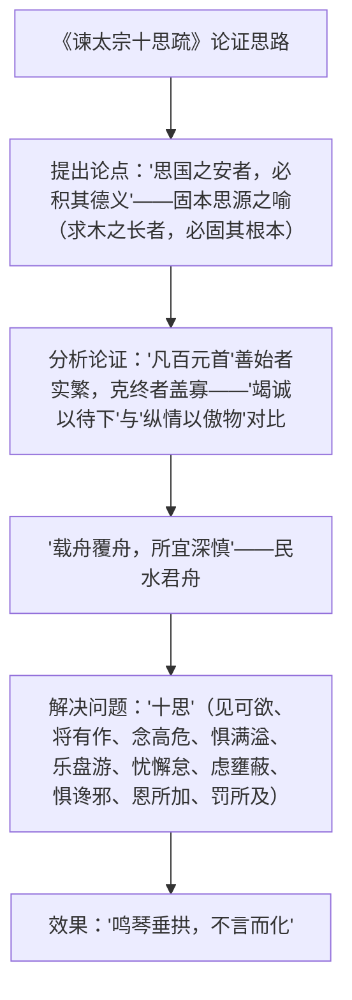

# 15 谏太宗十思疏 / 答司马谏议书

## 作者与背景

- 《谏太宗十思疏》：魏征（580—643），字玄成，唐初政治家，以直谏著称，太宗誉为"人镜"。本文作于贞观十一年（637年），时天下承平渐久，太宗渐趋奢纵，魏征上疏劝其居安思危、戒奢以俭。"疏"为臣下向皇帝分条陈述意见的奏章。
- 《答司马谏议书》：王安石（1021—1086），字介甫，号半山，北宋政治家、文学家，"唐宋八大家"之一。熙宁变法遭司马光（时任翰林学士，曾任谏议大夫）长信指责，王安石以此短书作答，逐条驳斥"侵官、生事、征利、拒谏、致怨"五大罪名。"书"即书信。

## 内容梳理

《答司马谏议书》驳论思路：先立标尺——"名实已明，而天下之理得矣"；再逐条驳斥：受命于人主、议法度于朝廷，非"侵官"；举先王之政以兴利除弊，非"生事"；为天下理财，非"征利"；辟邪说、难壬人，非"拒谨"（拒谏）；至于怨诽之多，"则固前知其如此也"——以盘庚迁都自况，"度义而后动，是而不见可悔"，态度坚决而措辞得体。

## 文言知识

| 类别 | 例句 | 说明 |
| --- | --- | --- |
| 通假字 | 振之以威怒 | "振"通"震"，威吓 |
| 通假字 | 不复一一自辨 | "辨"通"辩"，分辩 |
| 词类活用 | 必固其根本 | 使动用法，使……稳固 |
| 词类活用 | 则思正身以黜恶 | 正：使动；恶：形容词作名词 |
| 词类活用 | 乐盘游则思三驱以为度 | 意动，以……为乐 |
| 词类活用 | 貌恭而不心服 | 名词作状语，表面上、内心里 |
| 词类活用 | 如曰今日当一切不事事 | 前"事"名词作动词，做 |
| 特殊句式 | 虽董之以严刑 | 状语后置 |
| 特殊句式 | 则众何为而不汹汹然 | 宾语前置，"为何" |
| 特殊句式 | 至于怨诽之多 | 定语后置 |
| 古今异义 | 必固其根本 | 根本：树根（古）/事物本质（今） |

## 典型例题

**例1** 《谏太宗十思疏》开篇设喻有何妙处？
**解析**：以"求木之长者，必固其根本；欲流之远者，必浚其泉源"起兴，由自然常理引出"思国之安者，必积其德义"的中心论点。设喻使抽象的治国道理具体可感；且从正面立论后随即反面申说（"源不深而望流之远……"），正反相形，道理愈明；以浅喻深、以物喻政，委婉而有力，符合谏疏"使人主易于接受"的文体要求。

**例2** 《答司马谏议书》如何做到"言简意赅、柔中带刚"？
**解析**：①先确立"名实"这一辩论前提，使驳斥有统一标尺；②对五项指责逐条对照名实，以"受—议—授""举先王之政"等事实正名，寥寥数语即破；③以盘庚迁都之典表明不因怨诽而改其度的决心——"度义而后动，是而不见可悔"；④礼数周全（"与君实游处相好之日久"），语气谦和而立场寸步不让，故柔中带刚、锋芒内敛。

## 易错点

- "谏议"指司马光曾任谏议大夫，《答司马谏议书》是回信，非奏疏。
- "十思"对应"五戒"（见可欲/将有作—戒奢，念高危/惧满溢—戒骄，乐盘游/忧懈怠—戒纵欲，虑壅蔽/惧谗邪—戒轻信，恩所加/罚所及—戒赏罚不公），概括时勿遗漏。
- "载舟覆舟"化用《荀子·王制》"君者舟也，庶人者水也"。
- "盘庚之迁，胥怨者民也"：连百姓都怨恨尚且不改，何况士大夫——用典意在明志。
- 王安石与司马光之争是政见之争，二人私交与人品互相敬重，评价勿脸谱化。

## 背记要点

1. 《十思疏》名句（背诵）："求木之长者，必固其根本；欲流之远者，必浚其泉源。""居安思危，戒奢以俭。""有善始者实繁，能克终者盖寡。""载舟覆舟，所宜深慎。"
2. 《答司马谏议书》名句（背诵）："名实已明，而天下之理得矣。""度义而后动，是而不见可悔故也。"
3. 文体：疏（奏章）重讽谏铺陈；书（信）重驳论明志。
4. 高考视角：两篇均为课标背诵篇目，默写高频；"十思"内容概括、驳论方法、"固""事""见""度"等实词常考。

## 自测题

1. 概括"十思"的内容并说明其针对性。
2. 《十思疏》运用了哪些论证方法？
3. 王安石怎样逐条反驳司马光的五点指责？
4. 比较两篇文章的文体特点与语言风格。

## 相关知识点

劝谏传统参见 [[2 烛之武退秦师]] 与 [[11 谏逐客书 / 与妻书]]；贞观之治参见 [[第6课 从隋唐盛世到五代十国]]；王安石变法参见 [[第9课 两宋的政治和军事]]。
