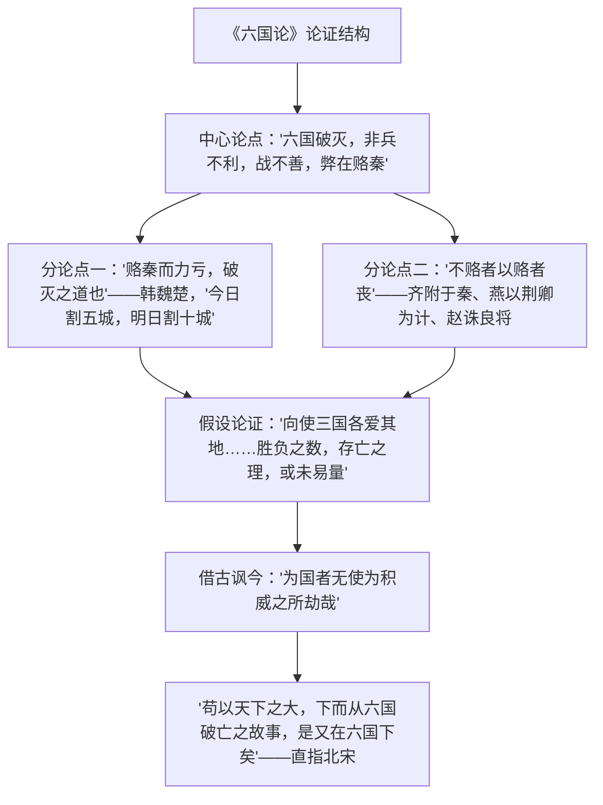

# 16 阿房宫赋 / 六国论

## 作者与背景

- 《阿房宫赋》：杜牧（803—852），字牧之，号樊川居士，晚唐诗人、散文家，与李商隐并称"小李杜"。本文作于唐敬宗宝历元年（825年），时敬宗"大起宫室，广声色"，杜牧借写秦营建阿房宫及其覆亡，讽谏当朝——"宝历大起宫室……故作《阿房宫赋》"。文体为赋（文赋），铺采摛文，托物言志。
- 《六国论》：苏洵（1009—1066），字明允，号老泉，北宋散文家，与子苏轼、苏辙并称"三苏"，同列"唐宋八大家"。北宋对辽、西夏输纳岁币以求苟安，苏洵借论六国破灭之因，讽谏北宋"为国者无使为积威之所劫"。文体为史论。

## 内容梳理

《阿房宫赋》思路：铺陈宫殿之宏丽（"覆压三百余里，隔离天日"）→写宫人珍宝之奢靡（"燕赵之收藏……输来其间"）→议论转折："秦爱纷奢，人亦念其家"，民怨积而"戍卒叫，函谷举，楚人一炬，可怜焦土"→卒章显志："灭六国者六国也，非秦也；族秦者秦也，非天下也"，警告"后人哀之而不鉴之，亦使后人而复哀后人也"。

## 文言知识

| 类别 | 例句 | 说明 |
| --- | --- | --- |
| 通假字 | 当与秦相较，或未易量 | "当"通"倘"，如果 |
| 词类活用 | 六王毕，四海一 | 数词作动词，统一 |
| 词类活用 | 骊山北构而西折 | 名词作状语，向北、向西 |
| 词类活用 | 辇来于秦 | 名词作状语，乘辇车 |
| 词类活用 | 后人哀之而不鉴之 | 意动用法，以……为鉴 |
| 词类活用 | 李牧连却之 | 使动用法，使……退却 |
| 词类活用 | 日削月割，以趋于亡 | 名词作状语，一天天、一月月 |
| 词类活用 | 义不赂秦 | 名词作动词，坚持道义 |
| 特殊句式 | 灭六国者六国也，非秦也 | 判断句 |
| 特殊句式 | 戍卒叫，函谷举 | 被动句（举：被攻占） |
| 特殊句式 | 赵尝五战于秦 | 状语后置 |
| 古今异义 | 其实百倍 | 其实：那实际数目（古） |
| 古今异义 | 可谓智力孤危 | 智力：智谋和力量（古） |

## 典型例题

**例1** 《阿房宫赋》结尾"秦人不暇自哀，而后人哀之；后人哀之而不鉴之，亦使后人而复哀后人也"中四个"后人"各指什么？
**解析**：第一、二、四个"后人"指秦以后的人（含唐人）；第三个"后人"指唐以后的人。句意：唐人若只哀叹秦而不引以为鉴，将使更后来的人再来哀叹唐——层层递进点明借古讽今的写作目的，警策深沉。

**例2** 比较《阿房宫赋》与《六国论》借古讽今的异同。
**解析**：同：都借秦与六国史事讽谏本朝——杜牧讽唐敬宗大兴土木、骄奢亡国之危；苏洵讽北宋赂敌（岁币）苟安之策。异：①文体与写法——赋以铺陈描写为主，由描写生发议论，形象感染；史论以逻辑论证为主，开门见山立论，层层推理。②立论角度——《阿房宫赋》归因于秦不爱其民（"使秦复爱六国之人，则递三世可至万世而为君"）；《六国论》归因于六国赂秦失策。可见同一史事因讽谏对象不同而剪裁立论各异。

## 易错点

- "六王毕，四海一"的"一"是数词作动词；"族秦者秦也"的"族"是名词作动词（灭族）。
- 《六国论》中齐国之亡是"与嬴而不助五国"，燕是"以荆卿为计始速祸"，赵是"牧以谗诛"——三国不赂而亡的原因各异，勿混答。
- "思厥先祖父""可谓智力孤危""下而从六国破亡之故事"中"祖父""智力""故事"皆古今异义。
- 杜牧是晚唐人，苏洵是北宋人；《阿房宫赋》是赋不是论。
- 阿房宫并未完全建成，项羽所烧主要是秦宫室，赋中描写是艺术夸张，不必坐实。

## 背记要点

1. 《阿房宫赋》名句（背诵）："六王毕，四海一，蜀山兀，阿房出。""秦人不暇自哀，而后人哀之；后人哀之而不鉴之，亦使后人而复哀后人也。""灭六国者六国也，非秦也。"
2. 《六国论》名句（背诵）："六国破灭，非兵不利，战不善，弊在赂秦。""以地事秦，犹抱薪救火，薪不尽，火不灭。""为国者无使为积威之所劫哉！"
3. 写作目的：一讽大兴宫室，一讽赂敌求和，均为借古讽今。
4. 高考视角：两篇皆背诵默写高频篇目；论证结构（总分、假设论证）、"故事""其实""智力"等古今异义是常考点。

## 自测题

1. 《六国论》的中心论点和两个分论点分别是什么？
2. "以地事秦，犹抱薪救火"用了什么论证方法？效果如何？
3. 《阿房宫赋》由描写转入议论的关键句是哪一句？
4. 两文分别针对怎样的现实而作？"讽"的落点有何不同？

## 相关知识点

秦的兴亡参见 [[3 鸿门宴]] 与 [[第3课 秦统一多民族封建国家的建立]]；奏疏驳论参见 [[15 谏太宗十思疏 / 答司马谏议书]]；北宋边患背景参见 [[第9课 两宋的政治和军事]]。
