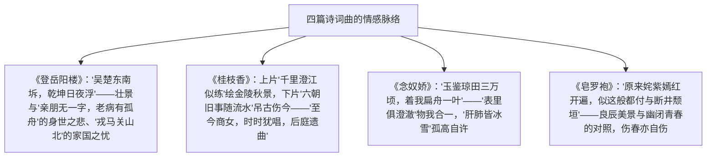

# 登岳阳楼 / 桂枝香·金陵怀古 / 念奴娇·过洞庭 / 游园（皂罗袍）

## 作者与背景

- 《登岳阳楼》：杜甫（712—770），字子美，唐代伟大的现实主义诗人，诗称"诗史"，人称"诗圣"。此五言律诗作于大历三年（768年）漂泊岳州时，诗人晚年多病、亲朋无音，登楼望洞庭而作。
- 《桂枝香·金陵怀古》：王安石，北宋政治家、文学家。此词为金陵怀古名作，登高览胜而叹六朝旧事，被赞"此老乃野狐精也"（苏轼语传）。
- 《念奴娇·过洞庭》：张孝祥（1132—1170），字安国，号于湖居士，南宋词人。乾道二年（1166年）自广西经洞庭湖北归，中秋前夕泛湖而作，写澄澈物境与磊落襟怀。
- 《游园·皂罗袍》：汤显祖（1550—1616），字义仍，号海若，明代戏曲家，"东方的莎士比亚"。《皂罗袍》是《牡丹亭·惊梦》中杜丽娘游园时的名曲，写春色之美与青春之叹。

## 内容梳理

| 篇目 | 体裁 | 核心手法 | 情感基调 |
| --- | --- | --- | --- |
| 登岳阳楼 | 五言律诗 | 阔大之景反衬渺小之身（以乐景壮景衬哀情） | 沉郁顿挫，身世家国之悲 |
| 桂枝香·金陵怀古 | 词（怀古） | 化用典故（《后庭花》）、借古讽今 | 清雄悲慨，警示当世 |
| 念奴娇·过洞庭 | 词（写景抒怀） | 物我交融、比喻（玉鉴琼田） | 澄澈超旷，孤高自信 |
| 游园·皂罗袍 | 昆曲曲词 | 乐景写哀、对偶铺排 | 伤春自怜，青春觉醒 |

## 艺术特色

1. **《登岳阳楼》颔联**："坼""浮"二字力重千钧——洞庭划分吴楚、日夜浮载乾坤，境界宏阔；与颈联个人孤苦形成巨大反差，愈见沉郁。
2. **《桂枝香》**：以"似练""如簇"工笔绘景，"彩舟云淡，星河鹭起"色彩明丽；下片"叹门外楼头，悲恨相续"总括六朝覆辙，末以商女犹唱《后庭花》（化用杜牧诗）警醒北宋君臣。
3. **《念奴娇》**："素月分辉，明河共影，表里俱澄澈"既写湖光月色，又喻人格光明磊落（词人时遭谗罢官而心迹坦然）；"尽挹西江，细斟北斗，万象为宾客"想落天外。
4. **《皂罗袍》**："良辰美景奈何天，赏心乐事谁家院"以顿挫的反问写深闺女子面对春光的惊喜与幽怨，是"以乐景写哀"的绝唱。

## 典型例题

**例1** 赏析"吴楚东南坼，乾坤日夜浮"。
**解析**："坼"写洞庭湖仿佛将吴楚两地从东南裂开，"浮"写日月星辰、天地乾坤似昼夜浮于湖面——两个动词以夸张之笔极言洞庭的浩瀚壮阔、气象万千。景愈壮阔，愈反衬出"老病有孤舟"的诗人之渺小孤苦；个人身世与"戎马关山北"的家国之忧融为一体，体现杜诗沉郁顿挫、境界宏大的特色。

**例2** 《念奴娇·过洞庭》中"表里俱澄澈"为何被称为全词之眼？
**解析**：表层写景：中秋洞庭上下天光、湖月辉映，内外通明；深层写人：词人此时被谗免官北归，"应念岭海经年，孤光自照，肝肺皆冰雪"，以澄澈之景自证心迹之清白坦荡。一语双关，物境与心境、自然之澄澈与人格之澄澈浑然合一，是全词物我交融的枢纽。

## 易错点

- 《登岳阳楼》是五律，非七律；"昔闻洞庭水，今上岳阳楼"含今昔感慨，不是单纯的喜悦。
- 《桂枝香》"至今商女，时时犹唱，后庭遗曲"化用杜牧《泊秦淮》"商女不知亡国恨"，用意是讽当世不知鉴戒，非单纯咏史。
- 张孝祥是南宋词人，风格上承苏轼开阔一路，下启辛弃疾。
- 《皂罗袍》出自《牡丹亭·惊梦》，是曲（昆曲曲牌），不是词牌；"奈何天"表无可奈何之意。
- "锦屏人忒看的这韶光贱"："锦屏人"指深闺中人（杜丽娘自指），叹辜负春光。

## 背记要点

1. 背诵名句：《登岳阳楼》"吴楚东南坼，乾坤日夜浮""戎马关山北，凭轩涕泗流"；《桂枝香》"千里澄江似练，翠峰如簇""六朝旧事随流水，但寒烟衰草凝绿"；《念奴娇》"玉鉴琼田三万顷，着我扁舟一叶""表里俱澄澈"；《皂罗袍》"原来姹紫嫣红开遍，似这般都付与断井颓垣。良辰美景奈何天，赏心乐事谁家院"。
2. 题材归类：登临诗（杜甫）、怀古词（王安石）、写景抒怀词（张孝祥）、戏曲曲词（汤显祖）。
3. 手法主线：情景关系——壮景衬哀、乐景写哀、借景明志、借古讽今。
4. 高考视角：四篇均为常见默写与鉴赏篇目；炼字（坼、浮）、用典（后庭遗曲）、情景关系比较是高频题型。

## 自测题

1. 《登岳阳楼》前两联与后两联在境界上有何反差？如何统一？
2. 《桂枝香》上下片各写什么？"后庭遗曲"有何深意？
3. 说明"孤光自照，肝肺皆冰雪"的抒情内涵。
4. 《皂罗袍》如何以乐景写哀情？

## 相关知识点

诗歌语言的暗示性理论参见 [[9 说木叶]]；戏曲体裁常识参见 [[4 窦娥冤（节选）]]；借古讽今的散文参见 [[16 阿房宫赋 / 六国论]]。
