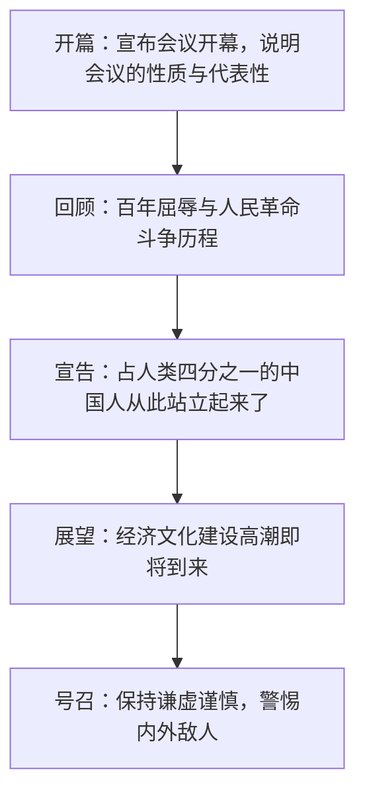

# 1 中国人民站起来了

**选择性必修上册·第一单元 伟大的复兴**｜文体：开幕词（政论演讲）｜作者：毛泽东

## 背景与文体

1949年9月21日，毛泽东在中国人民政治协商会议第一届全体会议上致开幕词。此时人民解放战争已取得决定性胜利，新中国即将诞生。**开幕词**兼具**宣告性、鼓动性、政论性**：回顾历史、宣告成立、展望未来，是理解"站起来了"深刻内涵的关键。

## 文本结构

## 重点精讲

1. **"站起来了"的内涵**：政治上推翻三座大山、人民当家作主；民族尊严上洗雪百年屈辱、自立于世界民族之林；精神上从被侮辱被压迫转向自信自强。
2. **论证思路**：以**历史—现实—未来**为经线，先以近代屈辱史反衬胜利之不易（"我们的先人曾经不屈不挠地斗争"），再以事实宣告革命胜利之必然，最后提出建设任务与忧患意识，逻辑严密、层层推进。
3. **语言特色**：①庄重宏阔的判断句——"中国人从此站立起来了"斩钉截铁；②整散结合，多用排比增强气势；③人称"我们"贯穿全篇，凝聚认同感；④展望部分连用"将要""必将"，坚定中含号召力。
4. **忧患意识**：胜利宣告中不忘"帝国主义者和国内反动派决不甘心于他们的失败"，体现政治家的清醒，与"两个务必"精神相通。

## 典型例题

**例1**："中国人从此站立起来了"一句为何有震撼人心的力量？
**解析**：①内容上凝缩百年屈辱与奋斗，宣告历史性转折；②句式上是不容置疑的判断句，"从此"标示时间界碑；③立场上以"中国人"整体为主语，唤起民族共同体的集体尊严；④置于历史回顾之后，情感蓄势至此喷发，水到渠成。

**例2**：分析本文作为开幕词的针对性与现场感。
**解析**：针对政协会议的**代表构成**说明其广泛代表性，赋予新政权合法性；针对**建国前夕**的形势提出经济文化建设任务；以"诸位代表先生们"的称呼、"庆贺"的语气营造现场庄严氛围；结尾的口号形成情感高潮，具有强烈的现场鼓动效果。

## 易错点

- 本文文体是**开幕词**而非新闻或社论，分析须紧扣"会议现场性+宣告性"。
- "站起来"重在**政治与民族尊严**层面，勿窄化为军事胜利。
- 展望部分并非空泛口号，而是基于"人民民主专政+全国人民团结"的现实依据。
- 文中既有豪迈也有**警惕与忧患**，概括情感基调时不可只答"喜悦自豪"。

## 背记要点

1. 文体：开幕词；场合：1949年9月政协一届全体会议。
2. 名句："占人类总数四分之一的中国人从此站立起来了。"
3. 思路：宣布开幕→回顾斗争→宣告站起→展望建设→警示号召。
4. 语言：判断句庄重有力、排比铺陈、第一人称复数凝聚认同。

## 自测题

1. 结合全文说明"站起来了"包含哪几层含义。
2. 本文是如何处理"回顾历史"与"展望未来"的关系的？
3. 举例说明本文整散结合的句式效果。
4. 开幕词与一般议论文在写作上有何不同？

## 相关知识点

同单元革命历史叙事见 [[2 长征胜利万岁 / 大战中的插曲]]；新闻视角下的民族复兴见 [[3 别了，不列颠尼亚 / 县委书记的榜样——焦裕禄 / 在民族复兴的历史丰碑上]]。
