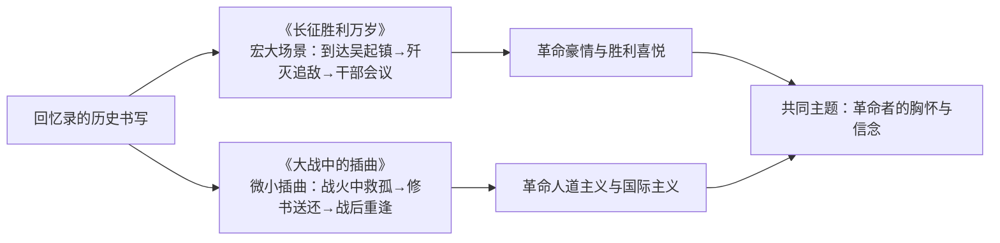

# 2 长征胜利万岁 / 大战中的插曲

**选择性必修上册·第一单元 伟大的复兴**｜文体：回忆录｜作者：杨成武 / 聂荣臻

## 作品概览

两篇均为**回忆录**：《长征胜利万岁》记叙红军到达吴起镇、全歼追敌骑兵及全军干部会议上毛泽东宣告长征胜利的场景；《大战中的插曲》记叙百团大战中聂荣臻救助两个日本小姑娘并写信送还日军的往事。回忆录的特点：**亲历性、真实性、文学性**兼备，以个人视角折射宏大历史。

## 重点精讲

1. **《长征胜利万岁》的场面描写**：吴起镇欢腾场面以**点面结合**呈现——"面"写部队沸腾、口号震天，"点"写战士们的动作神态；毛泽东讲话以**引用**收束全篇，用"二万五千里""十一个省"等数字凸显长征的历史意义（宣言书、宣传队、播种机）。
2. **《大战中的插曲》以小见大**：百团大战是"大战"，救助日本孤女是"插曲"；聂荣臻致日军的**信**是文眼——义正词严揭露侵略罪行，又申明"至仁至义"的人道立场，体现八路军的政治胸怀。
3. **叙事视角**：均用第一人称"我"，兼具当事人的现场感与回望者的评点；《插曲》结尾写四十年后美穗子来华致谢，历史纵深使"插曲"升华为中日友好的佳话。
4. **语言风格**：杨文豪迈热烈，多感叹句、口号；聂文平实深挚，书信部分文白相间、庄重有力。

## 典型例题

**例1**：分析《长征胜利万岁》中吴起镇欢庆场面的描写手法及作用。
**解析**：①点面结合：全景的欢呼与个体的击掌、拥抱互相映衬；②多感官描写：口号声、锣鼓声渲染听觉氛围；③短句与感叹句连用，节奏急促，传达狂喜；作用：具象化"胜利"的抽象意义，为下文毛泽东总结长征意义蓄势。

**例2**：《大战中的插曲》中那封信在文中有何作用？
**解析**：①内容上：揭露日本军阀罪行、阐明八路军抗战到底与人道主义立场，是"插曲"背后思想的直接呈现；②结构上：全文核心，连接救孤与送还两个环节；③形象上：显示聂荣臻的政治远见与仁义胸怀；④主题上：把个人善举上升为民族大义与国际主义精神。

## 易错点

- 回忆录是**纪实**文体，但允许剪裁与文学渲染，勿等同于新闻报道。
- 长征"三大意义"（宣言书、宣传队、播种机）出自**毛泽东讲话引文**，勿记为作者观点。
- 《插曲》主题是**革命人道主义**，不是"以德报怨"的简单道德故事；信中同样有对侵略的严正谴责。
- 两文虽同单元，情感基调不同：一为**豪迈欢腾**，一为**深挚平和**。

## 背记要点

1. 文体：回忆录——亲历、真实、有文学加工。
2. 《长征》：吴起镇会师→切尾巴战斗→全军干部会议宣告胜利。
3. 长征意义：宣言书、宣传队、播种机。
4. 《插曲》：救孤—写信—送还—重逢；文眼是致日军的信。
5. 手法：点面结合、以小见大、第一人称叙事。

## 自测题

1. 什么是回忆录？其纪实性与文学性如何统一？
2. 默写长征"三大意义"并解释其内涵。
3. 说明"大战"与"插曲"这一标题的匠心。
4. 比较两篇课文叙事视角与语言风格的异同。

## 相关知识点

宣告革命胜利的政论表达见 [[1 中国人民站起来了]]；新闻与通讯中的历史瞬间见 [[3 别了，不列颠尼亚 / 县委书记的榜样——焦裕禄 / 在民族复兴的历史丰碑上]]。
