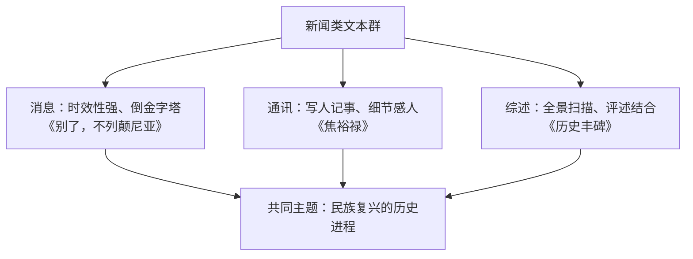

# 3 别了，"不列颠尼亚" / 县委书记的榜样——焦裕禄 / 在民族复兴的历史丰碑上

**选择性必修上册·第一单元 伟大的复兴**｜文体：消息 / 人物通讯 / 新闻综述

## 三篇文体比较

| 篇目 | 文体 | 核心内容 |
| --- | --- | --- |
| 别了，"不列颠尼亚" | 消息（新闻特写笔法） | 1997年香港回归，末任港督撤离 |
| 县委书记的榜样——焦裕禄 | 人物通讯 | 焦裕禄治理兰考"三害"、鞠躬尽瘁 |
| 在民族复兴的历史丰碑上 | 新闻综述（政论性） | 2020年中国抗疫的全景记录与意义评说 |

## 重点精讲

1. **《别了，"不列颠尼亚"》的现实场景与历史背景交织**：四个撤离场景（降旗、告别仪式、易帜、离港）与156年殖民史的闪回穿插，"现实—历史"双线让告别具有纵深感；标题化用《别了，司徒雷登》，主谓倒装突出"别了"，以"不列颠尼亚"号借代英国殖民统治，含蓄而有分量。
2. **零度写作中的情感**：全文不着一句议论，靠**细节与对比**传情——"日落余音"的号角、"大英帝国从海上来，又从海上去"，客观陈述中暗含民族自豪。
3. **《焦裕禄》的典型细节**：藤椅上顶出的大窟窿、"吃别人嚼过的馍没味道"、风雪夜访贫问苦——以细节塑造"亲民爱民、艰苦奋斗、科学求实、迎难而上、无私奉献"的公仆形象。
4. **《历史丰碑》的综述笔法**：以"人民至上、生命至上"为魂，时间线与专题面结合，抒情议论与纪实数据交融，属**宏大叙事**的当代新闻书写。

## 典型例题

**例1**：赏析"大英帝国从海上来，又从海上去"的表达效果。
**解析**：①对偶回环，"来""去"对照，浓缩156年殖民史的始与终；②不加评论而褒贬自见，胜利的庄严与历史的讽喻尽在克制的白描中；③收束全文，与标题"别了"呼应，余味悠长。

**例2**：人物通讯如何做到"真实性与感染力统一"？以《焦裕禄》为例。
**解析**：①选材真实：事迹来自实地采访，有名有姓有场景；②细节传神：藤椅窟窿等特写让精神可触可感；③言行结合：以人物原话（"我是您的儿子"）直接呈现品格；④在叙事中自然穿插抒情议论，情感依托事实而不空泛。

## 易错点

- 《别了，"不列颠尼亚"》是**消息**而非通讯，其文学性来自特写式笔法。
- 标题中"不列颠尼亚"是**借代**（游轮代英国殖民统治），并用了**主谓倒装**。
- 通讯与消息的区别：时效性弱于消息、容量大、可用文学手法、以写人见长。
- 三篇同属"新闻"大类但**次文体不同**，答题先辨文体再谈手法。

## 背记要点

1. 消息结构：标题—导语—主体—背景—结语；倒金字塔。
2. 《别了》：四个场景+历史闪回，双线交织，零度写作。
3. 焦裕禄精神：亲民爱民、艰苦奋斗、科学求实、迎难而上、无私奉献。
4. 综述特点：全景性、评述结合、数据与抒情交融。

## 自测题

1. 列出消息与通讯的三点区别。
2. 《别了，"不列颠尼亚"》选取了哪四个场景？双线如何交织？
3. 举出《焦裕禄》中两个典型细节并分析作用。
4. 《历史丰碑》"丰碑"的含义是什么？

## 相关知识点

政论宣告的庄严表达见 [[1 中国人民站起来了]]；回忆录的历史书写见 [[2 长征胜利万岁 / 大战中的插曲]]。
