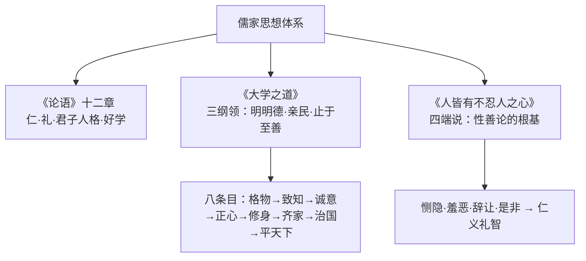

# 4 《论语》十二章 / 大学之道 / 人皆有不忍人之心

**选择性必修上册·第二单元 百家争鸣**｜儒家经典：《论语》《礼记·大学》《孟子》

## 三篇要义

## 重点精讲

1. **《论语》核心章句**："克己复礼为仁"（仁与礼的关系）；"己所不欲，勿施于人"（恕道）；"士不可以不弘毅，任重而道远"（曾子论担当）；"朝闻道，夕死可矣"（求道精神）；"文质彬彬，然后君子"（文与质的统一）；"譬如为山，未成一篑"（为学贵在坚持）。
2. **《大学之道》的逻辑**：三纲领是目标，八条目是路径；**修身**是根本枢纽——"自天子以至于庶人，壹是皆以修身为本"，由内圣（格物至修身）而外王（齐家至平天下），层层递进。
3. **《人皆有不忍人之心》的论证**：以"孺子将入于井"的**情境假设**证人皆有怵惕恻隐之心（排除"内交""要誉"等功利动机）；进而提出**四端说**，用"人之有是四端也，犹其有四体也"的**比喻论证**说明善端天赋；结尾"苟能充之，足以保四海"强调**扩充**的必要。
4. **文言积累**：敏于事而慎于言（状语后置）；见贤思齐焉；质胜文则野，文胜质则史；壹是（一律）；恶（wù）其声而然；非所以内（纳）交于孺子之父母也。

## 典型例题

**例1**：孟子如何证明"人皆有不忍人之心"？评析其论证方法。
**解析**：①举例（情境）论证：突见孺子将入井，人皆有怵惕恻隐之心；②排除法：非为结交其父母、非为博名声、非厌恶哭声，排除功利动机后证明善心出于本性；③比喻论证：四端如四体，与生俱来；④假设论证：有四端而自谓不能者是"自贼"。层层推进，逻辑严密而富于情境感染力。

**例2**：结合《大学之道》说明"八条目"之间的关系及"修身为本"的意义。
**解析**：八条目前后相承：格物致知是认识基础，诚意正心是内在修养，修身承内启外，齐家治国平天下是外在事功；"修身为本"表明儒家由**个体道德**推及**社会治理**的思路——道德自觉是一切政治理想的起点，体现内圣外王之道。

## 易错点

- "克己复礼"是**约束自己使言行合于礼**，不是压抑人性。
- "亲民"一说为"新民"（使民更新），注释争议须按教材处理。
- 四端是**善的萌芽**而非完成形态，故须"扩而充之"；孟子性善论指**人性中有善端**。
- "文质彬彬"的"文""质"指**文采修饰**与**质朴本性**，非今义"斯文"。

## 背记要点

1. 三纲领：明明德、亲民、止于至善；八条目以**修身**为本。
2. 四端：恻隐之心仁之端、羞恶之心义之端、辞让之心礼之端、是非之心智之端。
3. 名句：士不可以不弘毅／己所不欲勿施于人／朝闻道夕死可矣。
4. 论证方法：情境举例、排除、比喻（四端犹四体）。

## 自测题

1. 默写《大学之道》三纲领与八条目原文。
2. 解释"克己复礼为仁"并说明仁与礼的关系。
3. 孟子"孺子入井"一例排除了哪三种功利动机？
4. 翻译："人之有是四端也，犹其有四体也。"

## 相关知识点

道家的辩证智慧见 [[5 《老子》四章 / 五石之瓠]]；墨家兼爱思想的对照见 [[6 兼爱]]。
