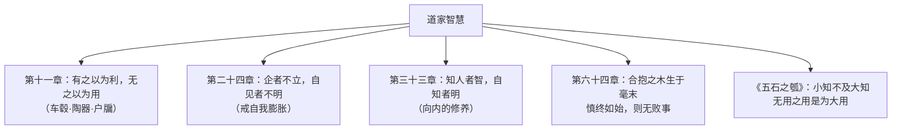

# 5 《老子》四章 / 五石之瓠

**选择性必修上册·第二单元 百家争鸣**｜道家经典：《老子》（《道德经》）/《庄子·逍遥游》

## 文本要点

**《老子》四章**（第十一、二十四、三十三、六十四章）：论"有无相生""自知自胜""慎终如始"；**《五石之瓠》**：惠子以大葫芦"无用"责庄子，庄子以"不龟手之药"故事反驳，提出**"所用之异"**——无用之用方为大用。

## 重点精讲

1. **"有""无"的辩证**：三十辐共一毂、埏埴以为器、凿户牖以为室——"有"提供便利条件，"无"（空虚处）才实现功用。老子以日常器物揭示**相反相成**的辩证思维。
2. **修身箴言**：企者不立、跨者不行——违背自然的强为不能持久；"自胜者强"把力量的标准从外在征服转向**内在超越**；"民之从事，常于几成而败之"警示**慎终如始**。
3. **《五石之瓠》的寓言论证**：同一"不龟手之药"，宋人世世漂洗丝絮，客用以助吴王水战而封侯——**物无定用，用在人心**。惠子拘于"盛水""为瓢"的常规之用，庄子则"虑以为大樽而浮乎江湖"，境界之别在思维的开放与超越。
4. **文言积累**：埏埴（和泥制陶）；自见者不明（xiàn，显露）；几（jī）成而败之；呺然（内中空虚）；掊（击破）之；不龟（jūn）手；洴澼絖（漂洗丝絮）；虑（用绳结缀）以为大樽。

## 典型例题

**例1**：老子如何论证"无之以为用"？这体现了怎样的思维方式？
**解析**：连举车毂、陶器、室屋三例，指出器物的功用恰在其**空虚处**；"有之以为利，无之以为用"总括——"有"与"无"相互依存、相反相成。体现道家**辩证思维**：不执一端，于对立面中见价值，启发人重视被忽视的"无"。

**例2**：分析《五石之瓠》中"不龟手之药"故事的论证作用。
**解析**：①类比论证：药方同一而用途有别，正如大瓠可作大樽——器物价值取决于使用者的眼界；②反驳有力：不直斥惠子，而以故事使其"拙于用大"不言自明；③寓言说理是庄子典型笔法，形象诙谐而意蕴深远，凸显超越功利、逍遥自适的人生境界。

## 易错点

- "自见者不明"的"见"读 **xiàn**（表现自己），非"看见"。
- "无用之用"不是宣扬消极无为，而是**破除固定视角**、发现更大价值。
- 《老子》语言**警句式**（正言若反），《庄子》**寓言式**（想象奇诡），风格勿混。
- "合抱之木生于毫末"强调**防微杜渐、从小处始**，与"慎终如始"侧重不同。

## 背记要点

1. 名句：有之以为利，无之以为用／知人者智，自知者明／合抱之木，生于毫末；九层之台，起于累土／慎终如始，则无败事。
2. 《五石之瓠》：惠子"拙于用大"，庄子"浮乎江湖"——所用之异。
3. 手法：《老子》譬喻+格言警句；《庄子》寓言+类比。
4. 思想内核：辩证看待有无、大小、有用无用。

## 自测题

1. 默写《老子》第十一章并说明其论证思路。
2. 解释"企者不立，跨者不行"的含义与现实启示。
3. "不龟手之药"故事中宋人与客的差别说明了什么？
4. 比较《老子》与《庄子》的说理风格。

## 相关知识点

儒家修身进路的对照见 [[4 《论语》十二章 / 大学之道 / 人皆有不忍人之心]]；墨家功利主义论证见 [[6 兼爱]]。
