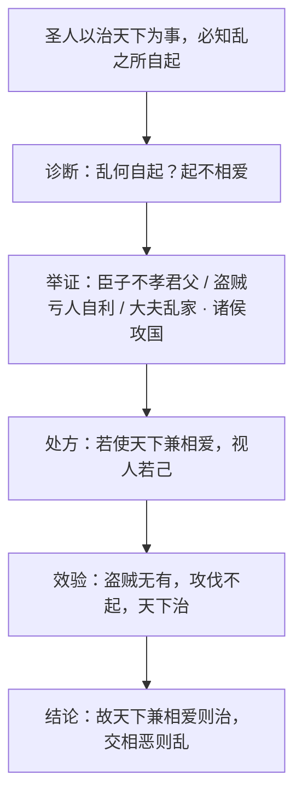

# 6 兼爱

**选择性必修上册·第二单元 百家争鸣**｜墨家经典：《墨子·兼爱（上）》

## 文本要义

墨子面对春秋战国"国相攻、家相篡、人相贼"的乱世，提出**"兼相爱"**的救世主张：天下之乱起于**不相爱**（自爱而不爱人），故"以兼相爱、交相利之法易之"，若天下人**视人如己**，则盗贼无有、攻伐不起，天下大治。

## 重点精讲

1. **论证结构（医者诊病式）**：先立"必知乱之所自起，焉能治之"的方法论（如医之攻人之疾），再**察乱之源**——一切乱象皆归因"不相爱"，继而开出"兼相爱"药方，最后以假设推演其效验，首尾呼应，条理谨严。
2. **层层铺排的例证**：由近及远、由小及大——子亏父、弟亏兄、臣亏君（家内）→盗贼（社会）→大夫乱家、诸侯攻国（天下），同一逻辑反复验证，形成**穷举式**论证。
3. **"兼爱"与儒家"仁爱"之别**：仁爱以血缘为基、**爱有差等**（亲亲而仁民）；兼爱**无差等**，视人之国若视其国、视人之身若视其身，并与"交相利"相连，带有功利互惠色彩。
4. **语言特点**：多用设问、反问推进论证（"察此何自起？皆起不相爱"）；句式整齐重复，同构句连绵铺排，虽质朴少文采，却逻辑力量极强，体现墨家**尚质尚用**的文风。

## 典型例题

**例1**：概括《兼爱》的论证思路，并说明"譬之如医之攻人之疾者然"的作用。
**解析**：思路：提出治天下须知乱源（方法论）→诊断乱源为不相爱（摆事实穷举）→提出兼相爱的对策（开药方）→推演天下治的结果（言效验）。医病之喻的作用：①以类比使抽象的治国方法论浅显可感；②确立"找病因—对症下药"的全文框架，统摄后文。

**例2**：比较墨家"兼爱"与儒家"仁爱"的异同。
**解析**：同：皆以"爱人"为核心，均针对乱世提出救治方案。异：①儒家爱有**差等**，由亲及疏推扩；墨家爱**无差等**，视人如己；②儒家重道德自觉与礼制；墨家兼爱与"交相利"结合，重实际功效；③儒家立足宗法伦理，墨家代表平民立场，故孟子斥其"无父"。

## 易错点

- "兼爱"不是无原则的溺爱，而是**人人平等相爱、爱人如己**的社会原则。
- 文中"亏人自利"是乱源的具体表现，根源仍归结为**不相爱**。
- "焉能治之"的"焉"是**于是、才**，非疑问词；"恶施不孝"的"恶"读 **wū**（怎么）。
- 墨子说理**质朴重逻辑**，勿以"文采不足"评为缺点，那是其自觉的文风选择。

## 背记要点

1. 中心论点：天下兼相爱则治，交相恶则乱。
2. 论证框架：知乱源（如医攻疾）→察乱起于不相爱→以兼相爱易之→天下治。
3. 兼爱特点：无差等、视人若己、与交相利相连。
4. 文风：设问反问推进、同构铺排、尚质尚用。

## 自测题

1. 墨子认为天下之乱起于什么？他列举了哪几类乱象？
2. 翻译："视人之国若视其国，视人之家若视其家，视人之身若视其身。"
3. "医之攻人之疾"的比喻有何论证作用？
4. 简述儒墨两家"爱"的主张之差异。

## 相关知识点

儒家仁爱与四端说见 [[4 《论语》十二章 / 大学之道 / 人皆有不忍人之心]]；道家的处世智慧见 [[5 《老子》四章 / 五石之瓠]]；先秦说理方法的现代运用见 [[逻辑的力量（发现谬误·有效推理·合理论证）]]。
