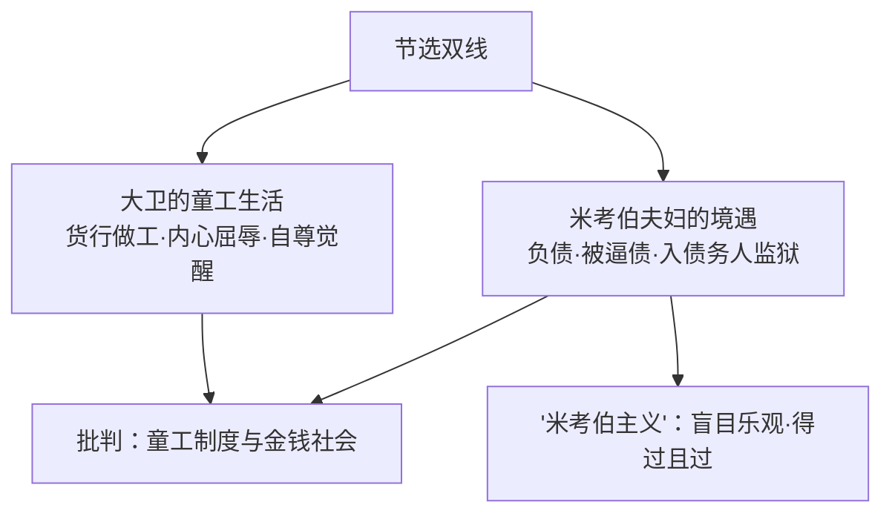

# 7 大卫·科波菲尔（节选）

**选择性必修上册·第三单元 多样的文化**｜英国批判现实主义小说｜作者：狄更斯

## 作品与节选

《大卫·科波菲尔》是狄更斯"半自传体"长篇小说。节选部分写十岁的大卫被继父送到**谋得斯通—格林比货行**当童工，洗刷酒瓶、贴标签，过着屈辱辛酸的生活，并与房东**米考伯夫妇**相识相处——一段"被抛入社会底层"的童年经历。

## 重点精讲

1. **第一人称回顾性叙事**：成年"我"回望童年"我"，双重视角交织——孩子的现场感受（惶恐、羞辱）与成人的评点反思（"我沦落到这样的境地"）互相渗透，既真切又有批判深度。
2. **米考伯形象**：debts 缠身却讲究体面（拿着"时髦的手杖"、戴单片眼镜），一会儿愁云惨雾、一会儿眉飞色舞；口头禅式的乐观（"总会有转机的"）——**"米考伯主义"**成为盲目乐观的代名词。狄更斯以**漫画式夸张**塑造这一喜剧性人物，笑中含泪。
3. **细节与环境描写**：货行的破败（腐朽的地板、灰色的老鼠）、酒瓶的污渍映衬童工生活的阴暗；对食物、账单的精细描写透出**金钱对人的挤压**。
4. **主题**：通过儿童视角揭露19世纪英国**童工制度**的残酷、债务监狱制度的荒谬与社会的冷漠，同时写出苦难中的**善意与温情**（大卫与米考伯一家的友谊）。

## 典型例题

**例1**：分析米考伯先生形象的喜剧性与悲剧性。
**解析**：喜剧性：①外表体面与经济破产的反差；②情绪大起大落的夸张表演；③文绉绉的辞令与狼狈处境的错位。悲剧性：小人物在金钱社会中无力自拔，靠幻想"转机"麻醉自己，入狱仍不改其性。狄更斯以幽默包裹辛酸，笑声背后是对社会制度的控诉。

**例2**：节选采用儿童视角叙事有何效果？
**解析**：①真实感：孩子对货行环境、劳动细节的直觉感受未经世故过滤，更显环境之恶劣；②反差批判力：儿童的天真无辜与所受的成人世界的冷酷形成强烈对照；③情感浓度：屈辱感、孤独感以第一人称直接呈现，易引发共鸣；④回顾性视角又補入成年的理解，深化主题。

## 易错点

- 作品是**半自传体**小说，大卫≠狄更斯本人，勿当传记读。
- 米考伯并非反面人物，作者态度是**同情的讽刺**（哀其不幸、笑其虚浮）。
- "批判现实主义"批判的是**制度与社会**，人物塑造仍充满人道主义温情。
- 分析形象要兼顾**夸张漫画手法**与真实社会依据两面。

## 背记要点

1. 作者：狄更斯，19世纪英国批判现实主义大师。
2. 叙事：第一人称回顾性叙事，儿童视角+成人反思。
3. 米考伯主义：债台高筑却盲目乐观、得过且过。
4. 主题：揭露童工制度、债务监狱与金钱社会，弘扬人道温情。

## 自测题

1. 节选写了大卫哪两方面的生活？两条线索如何交织？
2. 举两处细节说明米考伯"体面与破产"的反差。
3. 什么是"米考伯主义"？作者对这一人物持何态度？
4. 儿童视角叙事的艺术效果有哪些？

## 相关知识点

俄国现实主义的心灵刻画见 [[8 复活（节选）]]；现代主义硬汉叙事见 [[9 老人与海（节选）]]；魔幻现实主义见 [[10 百年孤独（节选）]]。
