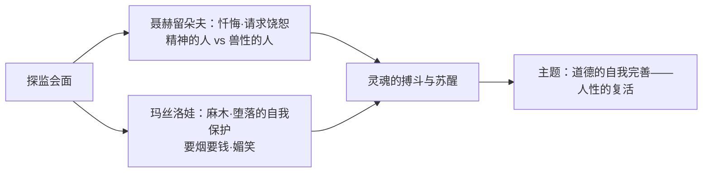

# 8 复活（节选）

**选择性必修上册·第三单元 多样的文化**｜俄国批判现实主义小说｜作者：列夫·托尔斯泰

## 作品与节选

《复活》是托尔斯泰晚年长篇代表作。节选写贵族**聂赫留朵夫**到监狱探望被诬判的**玛丝洛娃**——他年轻时的过错毁掉了她的人生。此次会面中，他请求宽恕并表示要赎罪，而玛丝洛娃从麻木戒备到内心震动，两个灵魂开始走向"复活"。

## 重点精讲

1. **"复活"的含义**：不是宗教奇迹，而是**精神的死而复生**——聂赫留朵夫从自私的贵族生活中醒来，直面罪责；玛丝洛娃从麻木堕落中恢复被践踏的尊严与爱的能力。双向的灵魂救赎构成书名的深意。
2. **心理描写大师笔法**：托尔斯泰擅写**心灵辩证法**——聂赫留朵夫内心"精神的人"与"兽性的人"反复交战（是彻底忏悔还是给钱了事）；玛丝洛娃"忽然笑了""又用那种媚笑看他"的细节，写出灵魂被侮辱后的自我防御,而听到"我要赎罪"时的怔忡则透露内心微澜。
3. **对话与神态的张力**：会面场景几乎全靠对话推进，语言表层平静而潜流汹涌；"您"与"你"称呼的变化、目光的躲闪与直视，都暗示心理距离的移动。
4. **托尔斯泰主义**：道德的自我完善、勿以暴力抗恶、博爱宽恕——节选中聂赫留朵夫的忏悔与赎罪正是其体现，也应看到其历史局限。

## 典型例题

**例1**：分析节选中玛丝洛娃"笑"的内涵。
**解析**：①媚笑是风尘生涯留下的职业性面具，是灵魂麻木、自我保护的外壳；②面对忏悔者时的笑又含轻蔑与不信任——她拒绝廉价的同情；③笑的背后是被侮辱与被损害者深藏的创痛。以"笑"写"哭"，是托尔斯泰心理刻画的高妙处。

**例2**：如何理解聂赫留朵夫身上"精神的人"与"兽性的人"的斗争？
**解析**："兽性的人"指利己的、追求享乐体面的自我，促使他敷衍了事；"精神的人"指良知的自我，要求彻底忏悔、牺牲赎罪。探监中他几度动摇又坚定，这种**灵魂搏斗**使忏悔可信而非说教，也体现托尔斯泰"人是流动的"的人性观：人可堕落亦可复活。

## 易错点

- "复活"是**双主人公**的精神复活，勿只答聂赫留朵夫一人。
- 玛丝洛娃的麻木堕落是**社会摧残的结果**，作者态度是深切同情而非道德指责。
- 托尔斯泰批判的矛头指向**沙俄的司法、贵族制度与伪善教会**，节选虽为私人会面，背景不可忽略。
- "心灵辩证法"指展现心理**流动、矛盾、转化**的过程，非静态心理描写。

## 背记要点

1. 作者：列夫·托尔斯泰；三大代表作：《战争与和平》《安娜·卡列尼娜》《复活》。
2. "复活"=灵魂的死而复生（双向救赎）。
3. 艺术：心灵辩证法、对话潜流、细节（笑、称呼、目光）。
4. 托尔斯泰主义：道德自我完善、不以暴力抗恶、宽恕博爱。

## 自测题

1. 书名"复活"的含义是什么？体现在两位主人公身上各是什么？
2. 举例说明节选中的心理描写手法。
3. 玛丝洛娃对聂赫留朵夫的态度经历了怎样的变化？
4. 什么是"托尔斯泰主义"？如何评价？

## 相关知识点

英国批判现实主义的社会批判见 [[7 大卫·科波菲尔（节选）]]；人的精神力量的另一种书写见 [[9 老人与海（节选）]]。
