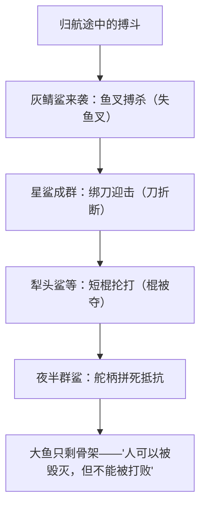

# 9 老人与海（节选）

**选择性必修上册·第三单元 多样的文化**｜美国现代小说｜作者：海明威（1954年诺贝尔文学奖）

## 作品与节选

《老人与海》写古巴老渔夫**圣地亚哥**连续84天一无所获，第85天独自出海钓到一条大马林鱼，历经两天两夜搏斗将其捕获，归程中鱼被鲨鱼群轮番袭击。节选写老人与**鲨鱼搏斗**的过程：用鱼叉、刀子、短棍、舵柄迎击一波又一波鲨鱼，最终大鱼只剩骨架，但老人的意志始终未被打垮。

## 重点精讲

1. **硬汉形象**：圣地亚哥面对不可战胜的对手仍战斗到底——武器逐一失去而斗志不减；伤痛、疲惫、孤独中靠自我对话支撑。他是海明威**"硬汉"（重压下的优雅风度）**的典型：承认失败的事实，绝不接受精神的屈服。
2. **名言解读**："一个人可以被毁灭，但不能被打败"——**肉体与物质**（大鱼、船具、身体）可被摧毁，**精神与尊严**不可征服；结果的失败与过程的胜利构成小说的悲壮张力。
3. **电报体风格**：短句为主、对话简洁、少形容词修饰，动作描写精确如实况（出叉的部位、鲨鱼的姿态）；情感深藏于客观叙述之下，即**冰山理论**——文字呈现八分之一，情感思想的八分之七隐于水下。
4. **内心独白**：大量自我对话（"跟它们斗，我要跟它们斗到死"）兼有意识流色彩，既缓解叙事单调，又直接呈现硬汉的精神世界；对大鱼、狮子的联想拓展了象征空间。
5. **象征意味**：大海—人生搏斗的场域；马林鱼—理想与劳动成果；鲨鱼—毁灭性的厄运；狮子—力量与青春的梦想。（象征解读宜有节制，海明威本人反对过度索解。）

## 典型例题

**例1**：结合节选分析圣地亚哥的"硬汉性格"。
**解析**：①行动上：武器层层失去仍就地取材迎战，永不弃船投降；②心理上：自我鼓励式独白（"现在还不是想的时候……"），以意志压服疲惫与绝望；③态度上：尊重对手（称鲨鱼强壮），承认损失却不哀叹，体现"重压下的优雅风度"；④结局虽败犹荣：物质全失而精神完胜。

**例2**：什么是"冰山理论"？节选如何体现？
**解析**：海明威主张作品只写露出水面的八分之一，其余靠暗示让读者体悟。节选的体现：①白描式动作叙述，不直接抒情议论；②对话与独白简短，痛苦孤独藏于潜台词；③结局只写"鱼只剩下骨架"，失败之痛与精神之胜全由读者填补，含蓄而有力。

## 易错点

- 老人最终"失败"了（鱼被吃光），但主题是**精神不可战胜**，勿答成"胜利凯旋"。
- "硬汉"不是无痛感的莽夫：文中多次写疲惫、疼痛、自我怀疑，**克服**它们才见硬汉本色。
- 冰山理论指**简约含蓄的叙事美学**，不是"内容少"。
- 象征分析应扣文本，避免把每一物象都强行寓意化。

## 背记要点

1. 作者：海明威，美国"迷惘的一代"代表，1954年诺奖。
2. 名言：人可以被毁灭，但不能被打败。
3. 硬汉精神：重压之下的优雅风度；过程的胜利>结果的成败。
4. 艺术：电报体短句、冰山理论、内心独白、象征。

## 自测题

1. 梳理老人与鲨鱼几个回合的搏斗及武器变化。
2. 谈谈你对"人可以被毁灭，但不能被打败"的理解。
3. 举例说明节选语言的"电报体"特点。
4. 老人反复梦见狮子有何意味？

## 相关知识点

批判现实主义的社会关怀见 [[8 复活（节选）]]；拉美魔幻现实主义的叙事实验见 [[10 百年孤独（节选）]]。
