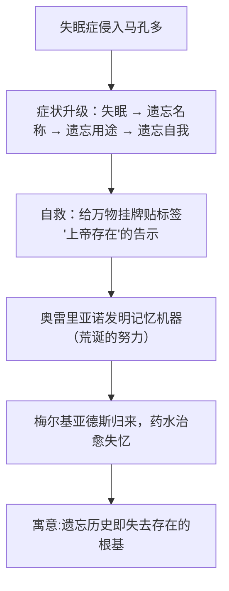

# 10 百年孤独（节选）

**选择性必修上册·第三单元 多样的文化**｜哥伦比亚魔幻现实主义小说｜作者：加西亚·马尔克斯（1982年诺贝尔文学奖）

## 作品与节选

《百年孤独》写马孔多小镇布恩迪亚家族七代人的兴衰。节选写马孔多爆发**失眠症—失忆症**瘟疫：全镇人先失眠、继而遗忘事物的名称与用途，人们给万物**贴标签**自救（"这是牛，每天要挤奶……"），直至吉卜赛人**梅尔基亚德斯**带来药水使小镇康复。

## 重点精讲

1. **魔幻现实主义**：把神奇荒诞的情节（传染性的失眠、集体失忆）用**不动声色的写实笔调**叙述，"魔幻"是手法、"现实"是根底——集体失忆影射拉丁美洲被殖民历史中**记忆与文化被抹除**的创痛，以及人对自身历史的麻木。
2. **失忆的哲学寓意**：名不附物，则世界瓦解——语言、记忆是存在之家；标签写到"上帝存在"，暗示连信仰也需备忘，讽刺而悲凉。**遗忘—记忆**主题与"孤独"主题相通：失去共同记忆的人群陷入更深的孤独。
3. **细节的荒诞与逼真**：失眠者彻夜聚谈、循环讲同一个故事；给牛挂"每天早晨挤奶"的说明——细节精确具体，使荒诞获得**现实的质感**，此即马尔克斯"像外祖母讲故事那样面不改色"的叙述秘诀。
4. **循环时间感**：小说多用"多年以后……"的预叙，时间回环往复，与家族命运的循环呼应（节选亦可见宿命氛围）。

## 典型例题

**例1**：以节选为例，说明"魔幻"与"现实"是如何统一的。
**解析**：①题材魔幻：失眠症会传染、失忆吞噬全镇，超越经验世界；②笔法写实：症状的发展、贴标签的措施写得条分缕析，如医学报告般冷静；③指涉现实：集体失忆是拉美民族历史创伤（殖民掠夺、屠杀被官方抹去）的寓言；④效果：荒诞外壳包裹真实痛感，读者在惊奇中获得对现实更深的认识。

**例2**：如何理解"贴标签"这一情节的深意？
**解析**：①表层：对抗遗忘的滑稽自救，物名尚存而意义已失；②中层：语言与记忆是人把握世界的方式，失去它们，文明即刻崩解；③深层：讽喻人们对历史的健忘——靠外在标签维系的记忆是脆弱的；"上帝存在"的告示更暗示价值信念的空洞化。悲剧内核以喜剧形式呈现。

## 易错点

- 魔幻现实主义的落脚点是**现实**（拉美历史与民族命运），勿只谈"想象奇特"。
- 失眠症情节是**寓言**，分析须由荒诞表象进入历史文化寓意。
- 马尔克斯的叙述态度是**冷静克制**（把荒诞当日常），这正是艺术张力所在。
- 《百年孤独》的"孤独"指**缺乏爱与沟通、被历史抛弃**的生存状态，非一般的寂寞。

## 背记要点

1. 作者：加西亚·马尔克斯，哥伦比亚，魔幻现实主义代表，1982年诺奖。
2. 节选情节：失眠症→失忆症→贴标签自救→梅尔基亚德斯治愈。
3. 手法：以写实笔调叙魔幻之事；细节逼真；预叙与循环时间。
4. 寓意：遗忘历史即失去自我；语言记忆是存在根基；拉美的孤独。

## 自测题

1. 什么是魔幻现实主义？节选中"魔幻"与"现实"各体现在哪里？
2. 梳理失眠症症状发展的几个阶段。
3. "贴标签"细节有哪些讽喻意味？
4. 结合书名谈谈"孤独"的内涵。

## 相关知识点

现实主义诸形态对照：[[7 大卫·科波菲尔（节选）]]（英）、[[8 复活（节选）]]（俄）、[[9 老人与海（节选）]]（美现代）。
