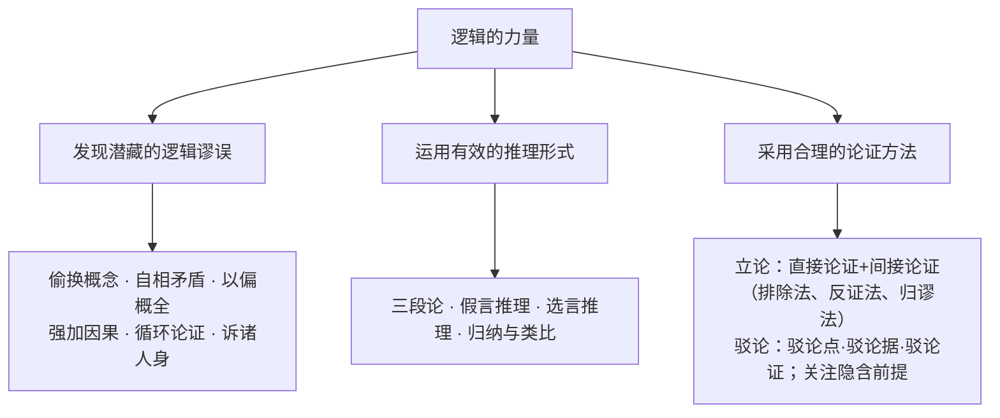

# 逻辑的力量（发现谬误·有效推理·合理论证）

**选择性必修上册·第四单元**｜学习活动单元：运用逻辑方法阅读与写作

## 知识框架

## 重点精讲

1. **逻辑基本规律**：**同一律**（概念判断保持同一，违者"偷换概念/话题"）；**不矛盾律**（互相矛盾的判断不能同真，违者"自相矛盾"，如"我从不发誓"）；**排中律**（互相矛盾的判断不能同假，必有一真）；**充足理由律**（论断须有充分依据，违者"强加因果""诉诸权威"）。
2. **常见谬误举隅**："鲁迅的作品不是一天能读完的，《孔乙己》是鲁迅的作品，所以《孔乙己》不是一天能读完的"——**偷换概念**（"作品"集合义与个体义）；"你说人应该讲诚信，你自己就没撒过谎吗"——**诉诸人身**；"他学习好是因为他家有钱"——**强加因果**。
3. **推理形式**：三段论（大前提—小前提—结论，注意中项周延）；充分条件假言推理（肯定前件式√、否定后件式√；肯定后件、否定前件皆无效）；必要条件假言推理（"只有……才"：否定前件可否定后件）；选言推理（排除法基础）。
4. **间接论证**：**排除法**（穷尽选项逐一排除）；**反证法**（证"非A"假，故A真——如"自相矛盾"寓言）；**归谬法**（驳论利器：假设对方观点为真，推出荒谬结论，如赫尔岑对"流行=高尚"的反驳"那流行性感冒也高尚了？"）。
5. **隐含前提与论证评估**：日常论证常省略前提（"他是运动员，所以身体好"隐含"运动员都身体好"），发掘隐含前提是评估与反驳的关键；合理论证还须考虑**论证角度、证据可靠性与语境**。

## 典型例题

**例1**：指出谬误类型："如果不刻苦学习就不能取得好成绩。小明成绩好，可见他一定很刻苦。"
**解析**："不刻苦→不能取得好成绩"等值于"好成绩→刻苦"？原句为充分条件的否定式表述，其逆否为"取得好成绩→刻苦学习"，推理"成绩好→刻苦"实为**有效**的否定后件式变形——本题需先转换条件形式再判断，训练点在于**条件命题的等值变换**（若学生直接判为"肯定后件"则错）。

**例2**：用归谬法反驳"读书无用论"。
**示例**：假设"读书无用"为真，则知识的获取、技能的习得皆属无用，人类文明的传承亦无必要，社会将退回蒙昧——结论显然荒谬，故"读书无用"不成立。（要点：假设对方观点→合乎逻辑地推出荒谬结果→否定原观点。）

## 易错点

- "自相矛盾"违反**不矛盾律**，"骑墙居中、两不可"违反**排中律**，勿混。
- 充分条件假言推理：**肯定后件、否定前件**均推不出必然结论。
- 类比推理、不完全归纳的结论是**或然**的，只能提供支持而非证明。
- 反证法与归谬法方向相反：反证**立**己（证反面假），归谬**破**敌（证对方谬）。

## 背记要点

1. 四大规律：同一律、不矛盾律、排中律、充足理由律。
2. 谬误清单：偷换概念、自相矛盾、以偏概全、强加因果、循环论证、诉诸人身/权威。
3. 有效式：三段论、肯定前件式、否定后件式、选言排除。
4. 间接论证：排除法、反证法、归谬法；驳论三途径+挖隐含前提。

## 自测题

1. 各举一例说明违反同一律、不矛盾律、充足理由律的谬误。
2. 写出充分条件假言推理的两个有效式与两个无效式。
3. 用反证法证明"两条直线相交只有一个交点"的思路。
4. 分析一则广告中的隐含前提并评估其论证。

## 相关知识点

先秦诸子的论证艺术可作逻辑分析样本：[[6 兼爱]]（穷举归因）、[[5 《老子》四章 / 五石之瓠]]（类比与寓言）、[[4 《论语》十二章 / 大学之道 / 人皆有不忍人之心]]（排除法证四端）。
