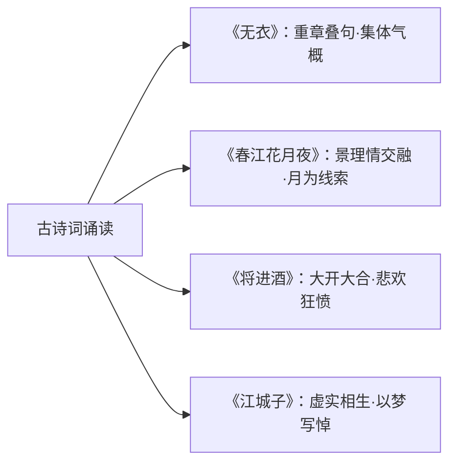

# 无衣 / 春江花月夜 / 将进酒 / 江城子·乙卯正月二十日夜记梦

**选择性必修上册·古诗词诵读**｜《诗经·秦风》/ 张若虚 / 李白 / 苏轼

## 四篇总览

| 篇目 | 朝代·作者 | 体裁 | 情感主旨 |
| --- | --- | --- | --- |
| 无衣 | 先秦·《诗经·秦风》 | 四言诗 | 同仇敌忾的战斗豪情与团结精神 |
| 春江花月夜 | 唐·张若虚 | 七言歌行 | 江月永恒与人生短暂的哲思、游子思妇的离情 |
| 将进酒 | 唐·李白 | 乐府歌行 | 怀才不遇的悲愤与及时行乐外衣下的自信狂放 |
| 江城子·记梦 | 宋·苏轼 | 词（悼亡） | 生死相隔、梦中重逢的深挚悼念 |

## 重点精讲

1. **《无衣》重章叠句**：三章仅易数字（袍/泽/裳；戈矛/矛戟/甲兵；同仇/偕作/偕行），在回环咏唱中情感递进——由**同仇**（思想认同）到**偕作**（行动准备）再到**偕行**（并肩出征），慷慨互助的秦地军风扑面而来。
2. **《春江花月夜》三重境界**：写景（月下春江、花林流霜的澄澈画卷）→哲理（"江畔何人初见月？江月何年初照人？""人生代代无穷已，江月年年望相似"——个体短暂而人类绵延，哀而不伤）→抒情（白云—扁舟—楼上月，思妇游子两地相思）。**月**贯穿始终：升起—高悬—西斜—落，兼为结构线索与情感载体。"孤篇盖全唐"之誉。
3. **《将进酒》情感脉络**：悲（君不见黄河之水/高堂明镜——时光之悲）→欢（人生得意须尽欢、天生我材必有用——自信之乐）→愤（钟鼓馔玉不足贵、古来圣贤皆寂寞——不遇之愤）→狂（五花马千金裘，呼儿将出换美酒——纵酒之狂）；"万古愁"收束，豪放的表层下是深沉的愤激。夸张（会须一饮三百杯、斗酒十千）与巨大的时间空间意象是李白式浪漫主义标志。
4. **《江城子》虚实结构**：上片写实——"十年生死两茫茫"直抒死别之痛，"尘满面，鬓如霜"自伤沦落；下片记梦——"小轩窗，正梳妆"以生前日常细节写重逢，"相顾无言，惟有泪千行"此时无声胜有声；结句"明月夜，短松冈"回到现实，以景结情，余哀不尽。**以虚衬实、乐景写哀**。

## 典型例题

**例1**：赏析"人生代代无穷已，江月年年望相似"的哲理内涵。
**解析**：诗人由月之永恒反观人生：个体生命短暂，但**人类代代相续**同样绵延无尽，与明月共存于天地。突破了"人生苦短"的传统嗟叹，透出**哀而不伤**的盛唐气象，使写景诗获得宇宙意识的深度。

**例2**：《江城子》"小轩窗，正梳妆"好在何处？
**解析**：①选取婚后日常最寻常的镜头，越平常越见恩爱之深；②梦境中妻子栩栩如生，与"千里孤坟"的死别现实对照，以虚衬实，倍增其哀；③白描不加藻饰，与全词"绚烂之极归于平淡"的深情风格一致。

## 易错点

- 《无衣》"与子同袍"是**慷慨相助、共赴国难**，并非写贫困无衣。
- 《春江花月夜》的哲思**不是消极感伤**，"代代无穷已"含欣慰与旷达。
- "天生我材必有用"非单纯乐观口号，须结合全诗**悲愤底色**理解。
- 《江城子》"不思量，自难忘"不矛盾：不是刻意思念，而是**深入骨髓、不待思量**。

## 背记要点

1. 《无衣》：重章叠句，同仇→偕作→偕行的递进。
2. 《春江花月夜》：以月为线索，景—理—情三段；"孤篇盖全唐"。
3. 《将进酒》：悲→欢→愤→狂，夸张与时间意象，结于"万古愁"。
4. 《江城子》：中国文学史上著名悼亡词，虚实相生、白描传情、以景结情。

## 自测题

1. 默写《无衣》第一章并说明重章叠句的效果。
2. 梳理《春江花月夜》中"月"的运行轨迹与结构作用。
3. 结合具体诗句分析《将进酒》的情感起伏。
4. 《江城子》上下片各写什么？"明月夜，短松冈"有何妙处？

## 相关知识点

先秦诗歌的另一面（说理散文）见 [[4 《论语》十二章 / 大学之道 / 人皆有不忍人之心]]；文学表达中的逻辑与抒情之别见 [[逻辑的力量（发现谬误·有效推理·合理论证）]]。
