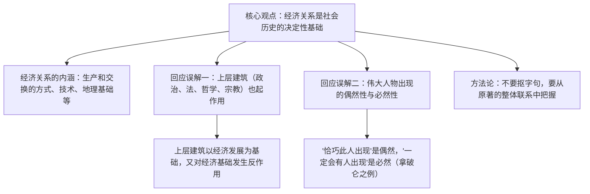

# 1 社会历史的决定性基础

**选择性必修中册·第一单元 理论的价值**｜恩格斯致瓦·博尔吉乌斯的书信（1894年）

## 作者与背景

恩格斯（1820—1895），马克思主义创始人之一。本文是他晚年答复德国大学生瓦·博尔吉乌斯提问的书信，针对当时对唯物史观的**机械化、简单化误读**（把经济因素当成唯一决定因素），系统阐明经济基础与上层建筑的辩证关系，是理解历史唯物主义的经典文献。

## 论证思路

## 内容梳理

| 层次 | 要点 | 关键表述 |
|---|---|---|
| 第一部分 | 经济关系是决定性基础 | 科学"在更大得多的程度上依赖于技术的状况和需要" |
| 第二部分 | 上层建筑的反作用 | 经济不是"唯一决定性的因素"，各因素**交互作用** |
| 第三部分 | 必然性与偶然性 | 历史通过"无数偶然性"为自己开辟道路 |
| 结尾 | 读书方法 | 研究原著本身，勿依据第二手材料下判断 |

## 艺术特色

1. **针对性强**：紧扣提问者的两个疑问逐一作答，破立结合，先立总纲再辨误解。
2. **辩证严密**："归根到底""不是唯一""交互作用"等限定语精确，体现分寸感。
3. **举例典型**：以拿破仑的出现说明偶然与必然的统一，化抽象为具体。
4. **书信文体**：语气恳切平易，兼具学术论文的逻辑力量与谈话的亲切感。

## 典型题例

**例1**：恩格斯如何论述"必然性与偶然性"的关系？
**答案要点**：①观点：历史必然性通过偶然性开辟道路，偶然性是必然性的表现和补充；②举例论证：拿破仑这个科西嘉人成为军事独裁者是偶然，但战争疲惫的法国**需要**一个军事独裁者是必然，"他的角色会由另一个人来扮演"；③意义：既反对英雄史观，又不否认个人的历史作用。

**例2**：分析"经济关系归根到底具有决定意义"中"归根到底"的表达作用。
**答案要点**：①限定决定作用的层面——是**最终的、总体趋势上**的决定，而非对每一历史事件的直接决定；②为上层建筑的反作用留出理论空间，避免机械经济决定论；③体现科学论著语言的严密性、辩证性。

## 易错点

- 误把"经济决定"理解为经济是**唯一**因素——恩格斯明确反对这种简单化。
- 科学与经济的关系：科学依赖技术的状况和**需要**，"需要"比十所大学更能推动科学前进。
- 拿破仑之例证明的是**偶然性背后的必然性**，不是否定个人作用。
- 本文文体是**书信**，兼有政论性；答题勿只按一般议论文套路。

## 背记要点

1. 核心命题：经济关系是社会历史的决定性基础（"归根到底"）。
2. 上层建筑（政治、法、哲学、宗教、文学、艺术）对经济基础有**反作用**。
3. 名句："社会一旦有技术上的需要，这种需要就会比十所大学更能把科学推向前进。"
4. 偶然与必然：历史必然性通过无数偶然性为自己开辟道路。
5. 读书法：研读原著的整体联系，不抠字句、不靠第二手材料。

## 自测题

1. 恩格斯所说的"经济关系"包括哪些内容？
2. 简述上层建筑与经济基础的辩证关系。
3. 拿破仑一例说明了什么哲学道理？
4. 本文作为书信体政论文，其语言有何特点？举例说明。

## 相关知识点

马克思主义中国化的理论文章见 [[2 改造我们的学习 / 人的正确思想是从哪里来的？]]；真理标准问题的讨论见 [[3 实践是检验真理的唯一标准]]。
