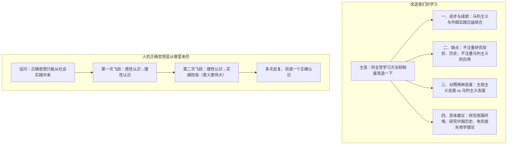

# 2 改造我们的学习 / 人的正确思想是从哪里来的？

**选择性必修中册·第一单元 理论的价值**｜毛泽东政论名篇两篇

## 作者与背景

毛泽东（1893—1976）。《改造我们的学习》是1941年延安整风运动的重要报告，批判**主观主义**学风（教条主义、经验主义），倡导理论联系实际的马克思列宁主义学风。《人的正确思想是从哪里来的？》写于1963年，是为《中共中央关于目前农村工作中若干问题的决定（草案）》所写的一段文字，阐明马克思主义认识论的基本原理。

## 论证思路

## 内容梳理

| 篇目 | 中心论点 | 论证特色 |
|---|---|---|
| 《改造我们的学习》 | 反对主观主义，确立理论联系实际的学风 | 正反对比、破立结合、成语典故（"实事求是""有的放矢"） |
| 《人的正确思想…》 | 正确思想来源于社会实践（三项实践：生产斗争、阶级斗争、科学实验） | 设问开篇、层进结构、两次飞跃 |

## 艺术特色

1. **对比鲜明**：主观主义者被讽为"墙上芦苇，头重脚轻根底浅；山间竹笋，嘴尖皮厚腹中空"，形象辛辣。
2. **概念阐释精当**：对"实事求是"作经典解释——"实事"是客观存在着的一切事物，"是"是客观事物的内部联系即规律性，"求"就是我们去研究。
3. **设问引导**：《人的正确思想…》连用三个设问（是天上掉下来的吗？是自己头脑里固有的吗？），层层排除，引出正面观点。
4. **口语与政论结合**：明白晓畅，善用群众语言，如"有的放矢""对牛弹琴""闭塞眼睛捉麻雀"。

## 典型题例

**例1**：《改造我们的学习》怎样批判主观主义学风？
**答案要点**：①列现象：不注重研究现状、不注重研究历史、不注重马列主义的应用，"言必称希腊"；②析危害：害己害人害革命，"是共产党的大敌"；③作对比：以马列主义态度（有的放矢、实事求是）反衬；④用讽刺：对联式画像，形神兼备。

**例2**：简述"两次飞跃"的内容，并说明为什么第二次飞跃"意义更加伟大"。
**答案要点**：①第一次：在实践中由感性认识能动地飞跃为理性认识；②第二次：理性认识回到实践中去，指导实践并接受检验；③"更伟大"的原因：只有第二次飞跃才能证实认识正确与否，才能实现改造世界的目的。

## 易错点

- "实事求是"在文中是**认识论概念**，不能只按日常义"老实"理解。
- 主观主义包括**教条主义**和**经验主义**两种表现，批判重点是教条主义。
- 正确思想的来源是**社会实践**（三项实践），不是"书本"或"天才头脑"。
- 一个正确认识须经**实践—认识—再实践—再认识**多次反复才能完成。

## 背记要点

1. "实事求是"的经典阐释：实事＝客观事物，是＝规律性，求＝研究。
2. 讽刺对联："墙上芦苇，头重脚轻根底浅；山间竹笋，嘴尖皮厚腹中空。"
3. 三项社会实践：生产斗争、阶级斗争、科学实验。
4. 两次飞跃：感性→理性；理性→实践（检验与发展）。
5. 学风主张：有的放矢——"的"是中国革命，"矢"是马克思列宁主义。

## 自测题

1. 《改造我们的学习》指出的三个"不注重"分别是什么？
2. 解释"有的放矢"在文中的具体含义。
3. 为什么说正确思想不是"自己头脑里固有的"？
4. 两篇文章在语言风格上有何共同点？

## 相关知识点

唯物史观的理论基础见 [[1 社会历史的决定性基础]]；实践观点的进一步展开见 [[3 实践是检验真理的唯一标准]]。
