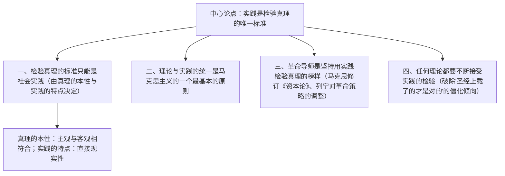

# 3 实践是检验真理的唯一标准

**选择性必修中册·第一单元 理论的价值**｜《光明日报》特约评论员文章（1978年5月11日）

## 作者与背景

本文由胡福明初稿、多人修改，以"特约评论员"名义发表于《光明日报》。当时"两个凡是"束缚思想，文章重申马克思主义认识论基本原理，引发全国范围的**真理标准问题大讨论**，成为改革开放的思想先声，被称为"东风第一枝"。

## 论证思路

## 内容梳理

| 部分 | 分论点 | 论证方法 |
|---|---|---|
| 第一部分 | 检验真理的标准只能是社会实践 | 引用论证（马克思、毛泽东语）＋道理论证 |
| 第二部分 | 理论与实践的统一是最基本的原则 | 道理论证＋反面批驳 |
| 第三部分 | 革命导师是用实践检验真理的榜样 | 举例论证（马克思、恩格斯、列宁、毛泽东） |
| 第四部分 | 任何理论都要不断接受实践检验 | 破立结合，针砭"僵化"倾向 |

## 艺术特色

1. **立论有据**：大量引用经典作家原话，以马克思主义反对对马克思主义的教条化，"以子之矛"策略高明。
2. **破立结合**：立"唯一标准"，破"以理论检验理论""以权威定是非"的错误倾向。
3. **逻辑严密**：从真理的本性（主观符合客观）与实践的特点（直接现实性）双向推出结论。
4. **现实针对性**：呼应思想解放的时代要求，政论的战斗性与理论的科学性统一。

## 典型题例

**例1**：文章为什么说实践是检验真理的"唯一"标准？
**答案要点**：①真理的本性是主观认识同客观实际相符合，检验须**把主观和客观联系起来对照**；②理论、逻辑本身属于主观范畴，不能自我检验；③只有实践具有**直接现实性**的品格，能把思想变为现实、加以对照；④故标准只能是实践且只有一个。

**例2**：分析文中"革命导师的榜样"部分的论证作用。
**答案要点**：①举例论证：马克思根据实践发展修改《资本论》有关论述，列宁依据实践调整革命结论；②说明导师们从不认为自己的理论是终极真理，自觉接受实践检验；③以权威人物的态度反驳"凡是"式思维，最具说服力；④增强文章的现实针对性与感召力。

## 易错点

- "唯一标准"是就**检验环节**说的，不否认理论对实践的指导作用。
- 实践检验是**历史的过程**：实践不断发展，检验也不断深化，不能一次定论。
- 文章批判的是把理论**当作僵死教条**的倾向，不是否定马克思主义本身。
- 本文是**特约评论员文章**（政论文），注意其新闻评论属性与时代语境。

## 背记要点

1. 中心论点：检验真理的标准只能是社会实践。
2. 逻辑依据：真理的本性（主观符合客观）＋实践的特点（直接现实性）。
3. 基本原则：理论与实践的统一是马克思主义的一个最基本的原则。
4. 历史意义：引发真理标准大讨论，推动思想解放与改革开放。
5. 论证方法：引用论证、举例论证、道理论证、破立结合。

## 自测题

1. 为什么逻辑推理不能充当检验真理的标准？
2. "实践的直接现实性"指什么？在论证中起什么作用？
3. 文章列举革命导师的哪些事例？作用何在？
4. 结合时代背景，说说本文发表的历史意义。

## 相关知识点

认识论源头见 [[2 改造我们的学习 / 人的正确思想是从哪里来的？]]；立诚求真的为文之道见 [[4 修辞立其诚 / 怜悯是人的天性]]。
