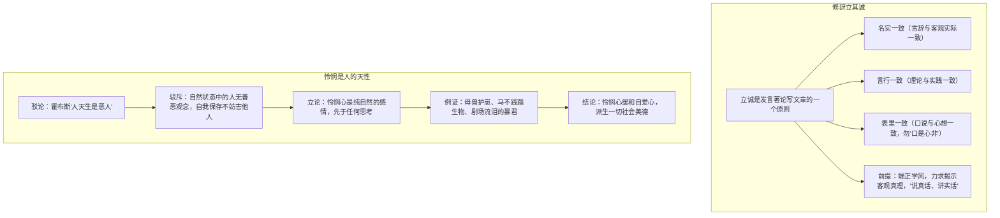

# 4 修辞立其诚 / 怜悯是人的天性

**选择性必修中册·第一单元 理论的价值**｜张岱年学术随笔 / 卢梭《论人与人之间不平等的起因和基础》节选

## 作者与背景

张岱年（1909—2004），哲学家、哲学史家。《修辞立其诚》（1992）借《周易·文言》"修辞立其诚"立论，倡导**为文为人的真诚原则**，有感于时弊而发。
卢梭（1712—1778），法国启蒙思想家。《怜悯是人的天性》节选自其论著，驳斥霍布斯"人天生是恶人"的观点，论证**怜悯心是先于理性思考而存在的自然情感**，是人类美德的基础。

## 论证思路

## 内容梳理

| 篇目 | 论证类型 | 核心观点 | 主要方法 |
|---|---|---|---|
| 《修辞立其诚》 | 立论为主 | 立其诚即坚持真实性，含三个"一致" | 引用经典、分层阐释 |
| 《怜悯是人的天性》 | 驳论为主 | 怜悯是天然美德，是社会美德之源 | 驳论、举例、对比（自然人与文明人） |

## 艺术特色

1. **《修辞立其诚》**：结构清晰，三层"一致"并列推进；引《周易》《汉书》（"修学好古，实事求是"）等，学者散文的严谨与平实。
2. **《怜悯是人的天性》**：先破后立，抓住对方论据推出相反结论（以霍布斯之据驳霍布斯之论）；善用假设与事例，感情充沛，具启蒙檄文色彩。
3. 两文对读：一为中国学人的"诚"论，一为西方哲人的"善"论，皆指向对**人之本真**的守护。

## 典型题例

**例1**：《修辞立其诚》中"立其诚"的三层含义是什么？彼此关系如何？
**答案要点**：①名实一致：言辞、命题与客观实际一致，是**认识层面**的真；②言行一致：理论与实践一致，是**行为层面**的真；③表里一致：心口如一，是**人格层面**的真。三者由文及行及心，层层深入，构成完整的"真诚"体系。

**例2**：卢梭如何驳斥霍布斯的性恶论？
**答案要点**：①指出其推理错误：不能因人有自我保存的欲望就断定人恶，自然状态下的自我保存**最不妨害他人**；②以其矛攻其盾：按霍布斯逻辑反而可推出自然人是善的；③正面立论：举母兽护崽、暴君看剧流泪等例，证明怜悯心先于理性、普遍存在；④指出怜悯心能缓和自爱心，是慷慨、仁慈、人道等美德之源。

## 易错点

- "修辞立其诚"的"修辞"指**发言著论、修饰文辞**的整体活动，非现代修辞学的"修辞格"。
- 张岱年强调"诚"须以**端正学风、追求真理**为前提，不是空谈道德。
- 卢梭的"自然状态"是**理论假设**，不是历史实证。
- 怜悯心与自爱心并非对立消灭，而是**怜悯缓和自爱**，共同维系人类生存。

## 背记要点

1. 三个"一致"：名实一致、言行一致、表里一致。
2. 名句："修辞立其诚"出自《周易·文言》；"实事求是"语出《汉书·河间献王传》。
3. 卢梭核心句：怜悯是"我们在自然状态下代替法律、良风美俗和道德的东西"。
4. 驳论方法：归谬（以对方论据推出相反结论）＋例证。
5. 对读视角：中西哲人共同守护"真"与"善"的人性根基。

## 自测题

1. "立其诚"为什么被视为发言著论的首要原则？
2. 解释"表里一致"并举现实一例说明其意义。
3. 卢梭举"剧场中流泪的暴君"一例意在证明什么？
4. 比较两文论证方式（立论/驳论）的差异。

## 相关知识点

求真务实的学风见 [[3 实践是检验真理的唯一标准]]；坚守道义的哲学对话见 [[5 人应当坚持正义]]。
