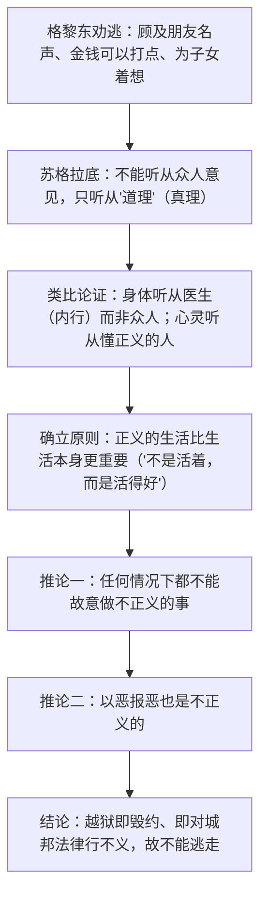

# 5 人应当坚持正义

**选择性必修中册·第一单元 理论的价值**｜柏拉图《克力同》（一译《格黎东篇》）节选

## 作者与背景

柏拉图（前427—前347），古希腊哲学家，苏格拉底的学生。公元前399年苏格拉底被雅典法庭以"不敬神""败坏青年"罪名判处死刑。临刑前，好友格黎东（克力同）潜入狱中劝他越狱逃走，苏格拉底以对话说理拒绝。本文记录了这场对话，展现了**以死践行道义**的哲人形象与苏格拉底"产婆术"式的问答艺术。

## 论证思路

## 内容梳理

| 环节 | 内容 | 说理特点 |
|---|---|---|
| 起点 | 面对劝说不为情绪所动 | 只服从经过论证的最佳道理 |
| 铺垫 | 该听众人还是听内行 | 类比（体操练习者听教练不听众人） |
| 核心 | "活得好"高于"活着" | "好"即"正当""正义" |
| 推进 | 逐条设问，取得对方同意 | 层层追问的"产婆术" |
| 结论 | 不能以不正义回应不正义 | 越狱＝行不义，故拒绝 |

## 艺术特色

1. **对话体说理**：不直接宣讲结论，而以连续设问引导对方自己得出结论，即"精神助产术"。
2. **类比论证**：以身体与健康类比心灵与正义——身体被搞坏则生不如死，心灵（正义所在）被毁坏更甚。
3. **层层推进**：从"听谁的意见"到"什么是好生活"再到"能否以恶报恶"，环环相扣，逻辑链完整。
4. **人格与言辞统一**：苏格拉底以生命践行所论之理，言行一致本身即最有力的论证。

## 典型题例

**例1**：苏格拉底为什么主张"不听从众人的意见，只听从内行的道理"？
**答案要点**：①类比：习体操者若听众人不听教练，身体会被搞坏；②推及：关于正义与不正义的问题，也应听懂得正义的"那一个人"（真理）而非众人；③众人意见随情绪与利害摇摆，缺乏论证根据；④由此为拒绝越狱奠定方法论前提——判断只依道理，不依多数。

**例2**：如何理解"最重要的不是活着，而是活得好"？
**答案要点**：①"活得好"即活得**正当、正义、高尚**；②生命价值不在长度而在道德品质，正义是生活的最高原则；③若靠不正义（越狱毁约）苟活，等于毁坏了自己安身立命的心灵；④这一命题是苏格拉底从容赴死的思想根据，体现哲人对道义的终极坚守。

## 易错点

- 苏格拉底拒绝越狱不是"愚忠"或轻生，而是基于**正义原则与守法承诺**的理性选择。
- "以恶报恶不正义"是文中关键推论，勿遗漏——即使遭受不义，也不能行不义。
- 对话中格黎东的不断"同意"是论证环节，答题须体现**问答推进**的说理方式。
- "活得好"的"好"是道德概念（正当、正义），不是物质意义的"过得好"。

## 背记要点

1. 出处：柏拉图《克力同》；背景：苏格拉底临刑前拒绝越狱。
2. 核心命题：正义高于生命——"不是活着，而是活得好"。
3. 两条推论：任何时候不得故意行不义；不得以恶报恶。
4. 说理方法：产婆术（连续设问）、类比论证（身体/心灵）。
5. 鉴赏视角：言行一致的哲人人格是文本的深层说服力。

## 自测题

1. 格黎东劝苏格拉底越狱的理由有哪些？苏格拉底为何一一不取？
2. 文中"身体与心灵"的类比是如何展开的？
3. 简述"不能以恶报恶"在全文逻辑链中的位置。
4. 结合文本谈谈"产婆术"式对话的说理效果。

## 相关知识点

为文为人之"诚"见 [[4 修辞立其诚 / 怜悯是人的天性]]；以生命践行信念的中国志士见 [[6 记念刘和珍君 / 为了忘却的记念]]。
