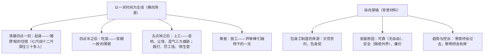

# 7 包身工

**选择性必修中册·第二单元 苦难与新生**｜夏衍报告文学名篇（1936年）

## 作者与背景

夏衍（1900—1995），剧作家、报告文学作家。1935年他多次深入上海日商纱厂实地调查两个多月，1936年发表《包身工》，揭露"包身工"制度——农村女孩被"带工"老板以包身契骗至上海纱厂，两三年间工钱全归带工者，人身完全失去自由。本文是中国现代**报告文学的奠基之作**，兼具新闻的真实性与文学的形象性。

## 结构梳理

## 内容梳理

| 要素 | 内容 |
|---|---|
| 线索 | 横线：起床—早餐—上工—收工的一天；纵线：包身工制度的起因、发展、罪恶 |
| 典型人物 | "芦柴棒"（瘦骨嶙峋，病中被泼冷水逼起）、小福子（被罚顶皮带盘心子） |
| 点面结合 | "面"：群体场景速写；"点"："芦柴棒"等个体特写 |
| 主旨 | 控诉帝国主义与封建势力勾结压榨中国工人的罪恶，预言黑暗制度必然灭亡 |

## 艺术特色

1. **点面结合**：群像（"蓬头、赤脚，一边扣着纽扣"的慌乱起床）与特写（"芦柴棒"烧火、生病）互补，既有广度又有深度。
2. **多种表达方式交织**：记叙场景、说明制度、议论抒情（结尾"黎明的到来，是无法抗拒的"）自然穿插。
3. **对比与反语**："带工"老板的"慈祥"、粥菜"佳肴"皆为反语；包身工与"外头工人"待遇对比，与带工老板暴富对比。
4. **精确数字与事实**：两粥一饭、十二小时工作、劳动强度、工钱数目等，以数据增强真实性与控诉力。
5. **比喻警策**：包身工是"没有锁链的奴隶"；结尾"黑夜""黎明"之喻，饱含义愤与信念。

## 典型题例

**例1**：分析"芦柴棒"这一形象的典型意义及描写手法。
**答案要点**：①手法：外号代名（瘦得像芦柴棒）、细节特写（烧火时的姿态、病中被抄身"打杂的"发现"手脚瘦得像芦棒梗一样"）；②以个体命运浓缩群体苦难，是**点面结合**中的"点"；③其被摧残至形销骨立仍被榨取，最有力地控诉包身工制度"泡在水里的生物"般的非人处境。

**例2**：本文以"一天"为框架穿插制度介绍，这种结构有何妙处？
**答案要点**：①横向场景使读者"目睹"包身工非人生活，具现场感、形象性；②纵向材料揭示制度根源与本质，具深度、说服力；③双线交织，叙议结合，避免平铺直叙；④体现报告文学**新闻性与文学性统一**的文体特征。

## 易错点

- 文体是**报告文学**，答题须兼顾"真实性（新闻性）"与"形象性（文学性）"两端。
- 包身工受**双重压榨**：日本资本家＋中国带工老板（帝国主义与封建势力勾结）。
- 反语的判定："文明的惩罚""慈祥""佳肴"等，注意引号的讽刺功能。
- 三大威胁是**音响、尘埃、湿气**（工作环境），与殴打等人身摧残分开表述。

## 背记要点

1. 文体地位：中国现代报告文学的里程碑。
2. 结构：一天生活（横）＋制度剖析（纵），点面结合。
3. 关键比喻：包身工是"没有锁链的奴隶"，是"罐装了的劳动力"。
4. 结尾警句："黑夜，静寂得像死一般的黑夜！但是，黎明的到来，毕竟是无法抗拒的。"
5. 鉴赏视角：反语、对比、数据实证、场景速写与人物特写。

## 自测题

1. 包身工制度得以存在和发展的原因是什么（"可靠""安全""廉价"如何体现）？
2. 举例说明文中反语的运用及其效果。
3. "两粥一饭，十二小时工作……"一段排比有何表达作用？
4. 报告文学与新闻通讯、小说的主要区别是什么？

## 相关知识点

同时期知识分子的悲愤呐喊见 [[6 记念刘和珍君 / 为了忘却的记念]]；人民寻求解放的文学书写见 [[8 荷花淀 / 小二黑结婚（节选） / 党费]]。
