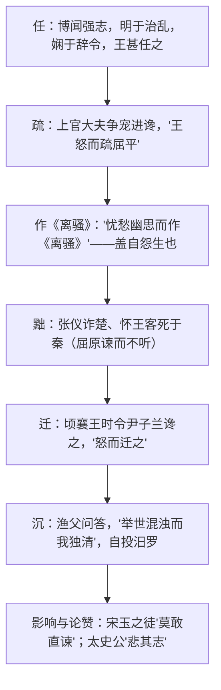

# 9 屈原列传

**选择性必修中册·第三单元 历史的现场**｜司马迁《史记·屈原贾生列传》节选（文言重点）

## 作者与背景

司马迁（约前145—？），字子长，著《史记》。本文为屈原立传，叙其由"王甚任之"到被谗见疏、放逐沉江的一生，并盛赞《离骚》。司马迁遭李陵之祸而发愤著书，与屈原"信而见疑，忠而被谤"的遭际深相共鸣，故此传**传中有评、以议论驰骋**，被称为"太史公掉泪之文"。

## 内容梳理

| 层次 | 事件 | 表现 |
|---|---|---|
| 才与任 | 为楚怀王左徒 | 入则图议国事，出则应对诸侯 |
| 谗与疏 | 上官夺稿进谗 | "平伐其功……'非我莫能为'也" |
| 评《离骚》 | 传中大段议论 | "其文约，其辞微，其志洁，其行廉" |
| 谏与迁 | 谏杀张仪、谏止武关之会 | 见识远而不用，国削身放 |
| 问与沉 | 渔父对话 | "宁赴常流……安能以皓皓之白，而蒙世俗之温蠖乎" |

## 文言知识

- **通假**：离骚者，犹离忧也（"离"通"罹"，遭受）；人穷则反本（"反"通"返"）；靡不毕见（"见"通"现"）；其称文小而其指极大（"指"通"旨"）；屈平既绌（"绌"通"黜"）。
- **重点实词**：属（zhǔ，写作，"屈平属草稿"）；伐（自夸）；疏（疏远）；志（记，"博闻强志"）；迁（放逐）；濯淖（zhuó nào，污浊）。
- **古今异义**：明年（第二年）；颜色（脸色，"颜色憔悴"）；形容（形体容貌，"形容枯槁"）；诡辩（谎言诡诈之辞，"设诡辩于怀王之宠姬"）。
- **句式**：屈原者，名平，楚之同姓也（判断）；信而见疑，忠而被谤（被动）；方正之不容也（被动）；明于治乱，娴于辞令（状语后置）；莫不欲求忠以自为（宾语前置）。

## 典型题例

**例1**：司马迁为何在传记中插入对《离骚》的长篇评论？
**答案要点**：①以文见人：由"其文约，其辞微"论及"其志洁，其行廉"，文品即人品；②揭示创作缘由："盖自怨生"——忧愁幽思，发愤抒情，"盖文王拘而演《周易》"式的发愤著书观的先声；③借评屈原寄寓自身遭际之慨，传评结合是本传独特笔法。

**例2**：渔父问答一节在全文中的作用是什么？
**答案要点**：①以对话展现屈原临终抉择："举世混浊而我独清，众人皆醉而我独醒"；②渔父代表随俗自保的处世观，反衬屈原"宁赴常流而葬乎江鱼腹中"的高洁执着；③将叙事推向悲剧高潮，完成人格塑造；④为太史公"悲其志"的论赞蓄势。

## 易错点

- "离骚"释义按课文："离骚者，犹离忧也"（遭受忧患），勿只答"离别的忧愁"。
- "信而见疑，忠而被谤"是**两种被动句式**（见／被），翻译须体现被动。
- 怀王三次被欺（内惑于郑袖，外欺于张仪）与屈原被疏的关系：忠臣见疏则国事日非。
- 本传"变体"特征：叙事简而议论多，答"写法"题应点出**传评结合**。

## 背记要点

1. 名句："其文约，其辞微，其志洁，其行廉……推此志也，虽与日月争光可也。"
2. 名句："信而见疑，忠而被谤，能无怨乎？屈平之作《离骚》，盖自怨生也。"
3. 名句："举世混浊而我独清，众人皆醉而我独醒，是以见放。"
4. 被动句标志：见、被、于、为……所。
5. 鉴赏视角：传评结合、对比（王之昏与屈之忠）、以文传人。

## 自测题

1. 翻译："博闻强志，明于治乱，娴于辞令。"
2. 指出"皭然泥而不滓者也"的句式与含义。
3. 概括怀王"三困"及其与屈原命运的关系。
4. 默写评《离骚》"其文约"至"虽与日月争光可也"一段。

## 相关知识点

同为史传忠贞人格见 [[10 苏武传]]；史论借古鉴今笔法见 [[11 过秦论 / 五代史伶官传序]]。
