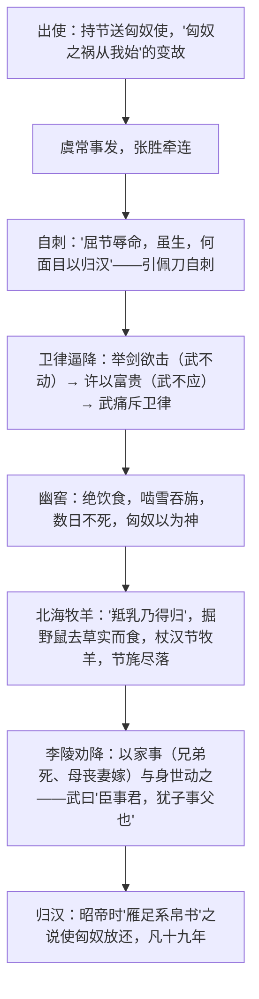

# 10 苏武传

**选择性必修中册·第三单元 历史的现场**｜班固《汉书·李广苏建传》节选（文言重点）

## 作者与背景

班固（32—92），字孟坚，东汉史学家，著我国第一部纪传体断代史《汉书》。天汉元年（前100），苏武奉命以中郎将持节出使匈奴，因虞常谋反事牵连被扣，匈奴多方威逼利诱，苏武坚不投降，北海牧羊十九年，"始以强壮出，及还，须发尽白"。本文是节义人格的千古典范。

## 情节结构

| 对手/考验 | 手段 | 苏武的应对 |
|---|---|---|
| 卫律 | 剑斩虞常示威、举剑胁迫、许以爵禄 | 岿然不动，怒斥其"畔主背亲" |
| 匈奴 | 幽窖断粮、北海苦役 | 啮雪吞旃、掘鼠取实，杖节不失 |
| 李陵 | 以私情与朝廷负我劝降 | "虽蒙斧钺汤镬，诚甘乐之" |

## 文言知识

- **通假**：畔主背亲（"畔"通"叛"）；与旃毛并咽之（"旃"通"毡"）；掘野鼠去草实（"去"通"弆"，收藏）；空自苦亡人之地（"亡"通"无"）；信义安所见乎（"见"通"现"）。
- **重点实词**：币（财物，"置币遗单于"）；假（临时代理，"假吏常惠"）；当（判罪，"汉使张胜谋杀单于近臣，当死"）；望（怨恨，"陵始降时，忽忽如狂，自痛负汉"语境）；相坐（连坐）。
- **词类活用**：单于壮其节（意动，认为……豪壮）；欲因此时降武（使动，使……投降）；空以身膏草野（使动，使……肥沃）；杖汉节牧羊（名作动，执、拄）；羝乳乃得归（名作动，生育）。
- **古今异义**：丈人（对长辈尊称，"汉天子我丈人行也"）；成就（栽培提拔，"皆为陛下所成就"）；实在（确实还活着，"武等实在"）。
- **句式**：送匈奴使留在汉者（定语后置）；见犯乃死，重负国（被动）；何以汝为见（宾语前置）；缑王者，昆邪王姊子也（判断）。

## 典型题例

**例1**：卫律与李陵劝降的方式有何不同？这样写有何作用？
**答案要点**：①卫律：先威（剑斩虞常、举剑胁迫）后利（"赐号称王……富贵如此"），色厉内荏；②李陵：以故友身份动之以情，诉家庭变故与皇帝寡恩，攻心为上；③两场劝降一刚一柔、一利一情，从不同侧面反复淬炼苏武形象；④对比中见人格：卫律无耻、李陵愧疚，愈显苏武"富贵不能淫，威武不能屈"。

**例2**：分析"杖汉节牧羊，卧起操持，节旄尽落"的细节意蕴。
**答案要点**：①"节"是使臣信物，更是国家与操守的象征；②"卧起操持"写朝夕不离，忠贞已化为生命本能；③"节旄尽落"以物之残损写岁月之漫长、处境之艰苦，而节在人在；④以典型细节写精神，含蓄蕴藉，是史传文学以细节传神的典范。

## 易错点

- "汉天子我丈人行也"："丈人"是**长辈**之意，非"岳父"。
- "武以始元六年春至京师……凡十九年"：扣留时长为**十九年**，勿误记。
- 李陵形象并非简单反面：其"喟然叹曰'嗟乎，义士！'"及泣下沾衿，反衬苏武并显其内心矛盾。
- 活用题高频："壮其节"（意动）与"降武""膏草野"（使动）须区分。

## 背记要点

1. 名句："屈节辱命，虽生，何面目以归汉！"
2. 名句："臣事君，犹子事父也。子为父死，亡所恨，愿无复再言！"
3. 细节："杖汉节牧羊，卧起操持，节旄尽落。"
4. 结局："始以强壮出，及还，须发尽白。"
5. 鉴赏视角：对比映衬（卫律/李陵/张胜）、细节描写、语言描写塑造人格。

## 自测题

1. 翻译："见犯乃死，重负国。"
2. 指出"何以汝为见"的句式并翻译。
3. 张胜、卫律、李陵三人各起什么映衬作用？
4. 解释加点词：单于**壮**其节／空以身**膏**草野／**杖**汉节牧羊。

## 相关知识点

忠而被谤的悲剧人格见 [[9 屈原列传]]；史论中的兴亡之鉴见 [[11 过秦论 / 五代史伶官传序]]。
