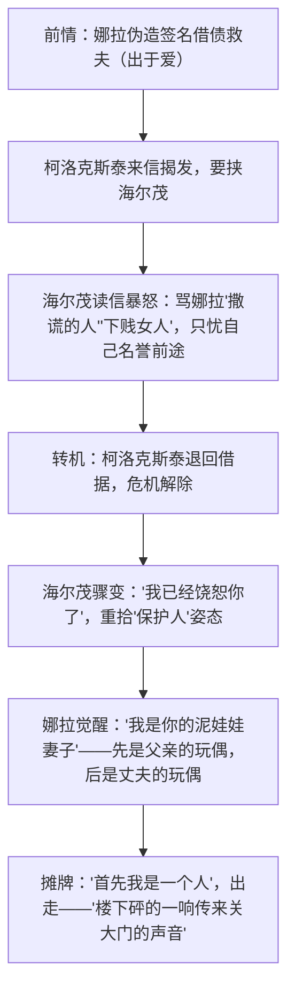

# 12 玩偶之家（节选）

**选择性必修中册·第四单元 丰富的心灵**｜易卜生"社会问题剧"代表作（1879年）

## 作者与背景

易卜生（1828—1906），挪威剧作家，"现代戏剧之父"，首创"社会问题剧"。《玩偶之家》写娜拉为救丈夫海尔茂之病曾伪造父亲签名借债；债主柯洛克斯泰以此要挟，海尔茂得知后暴怒责骂娜拉；危机解除后他又故作宽容——娜拉由此看清自己在家中只是"玩偶"，毅然出走。课文节选**第三幕**冲突爆发部分。"娜拉走后怎样"曾引发中国五四时期的热烈讨论（鲁迅有同题演讲）。

## 戏剧冲突

| 阶段 | 海尔茂 | 娜拉 |
|---|---|---|
| 读信前 | 甜言蜜语，"小鸟儿""小松鼠" | 怀着"奇迹"期待（丈夫会挺身担责） |
| 读信后 | 暴怒自私，只顾名誉 | 幻想破灭，沉默冷静 |
| 危机解除 | 立即"饶恕"，恢复施恩姿态 | 彻底看清，要求"严肃谈话" |
| 结局 | 挽留无效，抓住"奇迹中的奇迹"空想 | 宣告独立，离家出走 |

## 艺术特色

1. **回溯式结构（锁闭式）**：从临近高潮处写起，借书信揭开往事，情节高度浓缩，冲突集中于一夜之间。
2. **突转与发现**：两封信造成两次突转；娜拉对婚姻本质的"发现"完成性格飞跃——由天真"小鸟"到清醒的"人"。
3. **个性化台词与潜台词**：海尔茂前后称呼的变化（"小鸟儿"→"伪君子"→"我的小鸟儿"）暴露其虚伪自私；娜拉语言由琐碎撒娇转为冷静锋利。
4. **象征**："玩偶之家"象征以男性为中心、抹杀女性独立人格的婚姻家庭；结尾关门声被称为"震撼欧洲的一响"。

## 典型题例

**例1**：分析海尔茂形象及其揭示的社会问题。
**答案要点**：①平日温情脉脉（"小松鼠"），实以爱之名行占有之实；②危机中原形毕露：只虑名誉前途，斥妻"下贱"，甚至要剥夺其教育子女之权；③危机一过立刻"饶恕"，自私虚伪、道貌岸然；④他是**男权社会与资产阶级市侩道德**的化身，其"爱"以女性人格依附为前提。

**例2**：如何理解娜拉"首先我是一个人"这句台词？
**答案要点**：①针对海尔茂"你首先是妻子和母亲"的规训而发，是全剧思想核心；②宣示女性独立人格：在承担家庭角色之前，先须成为有独立思想与尊严的"人"；③标志娜拉从依附到觉醒的完成；④超越具体婚姻矛盾，指向个性解放与妇女解放的普遍命题。

## 易错点

- 娜拉出走的根本原因是**人格觉醒**（发现自己是玩偶），不是柯洛克斯泰事件本身——事件只是导火索。
- 海尔茂并非脸谱化"恶人"，其可怕在于**以爱为名的自私**符合当时"体面"的社会规范。
- 戏剧鉴赏须扣**冲突、台词（含潜台词）、舞台说明**分析，勿写成小说人物分析。
- "奇迹"一词前后含义不同：娜拉先盼丈夫担责的"奇迹"，结尾"奇迹中的奇迹"指两人都改变到能真正共同生活。

## 背记要点

1. 文体地位：欧洲"社会问题剧"经典，讨论妇女解放的先声。
2. 核心台词："我真不知道我是先是父亲的泥娃娃孩子，后是你的泥娃娃妻子。""首先我是一个人。"
3. 结构术语：回溯式（锁闭式）结构、突转、发现。
4. 象征：玩偶之家＝人格依附的婚姻；关门声＝决绝的觉醒宣言。
5. 延伸：鲁迅《娜拉走后怎样》——"不是堕落，就是回来"，指出经济权之要。

## 自测题

1. 海尔茂对娜拉的称呼有哪些变化？说明了什么？
2. 举一处潜台词并分析其表达效果。
3. 什么是"突转"？本剧节选中有哪几次突转？
4. 结合鲁迅的演讲，谈谈你对"娜拉走后怎样"的思考。

## 相关知识点

外国文学中的心灵抒唱见 [[13 迷娘（之一） / 致大海 / 自己之歌（节选） / 树和天空]]；对人的价值的哲学讨论见 [[5 人应当坚持正义]]。
