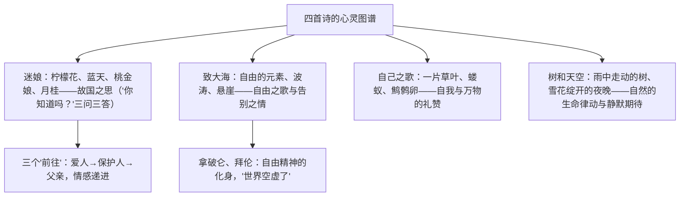

# 13 迷娘（之一） / 致大海 / 自己之歌（节选） / 树和天空

**选择性必修中册·第四单元 丰富的心灵**｜外国诗歌四首：歌德 / 普希金 / 惠特曼 / 特朗斯特罗姆

## 作者与背景

- **《迷娘（之一）》**：歌德（1749—1832，德国），选自小说《威廉·迈斯特的学习时代》。迷娘是被诱拐至德国的意大利少女，此诗唱出她对故国的眷念。
- **《致大海》**：普希金（1799—1837，俄国），"俄罗斯诗歌的太阳"。1824年诗人再度被流放前向大海告别，大海成为**自由精神**的象征；诗中悼念拿破仑与拜伦。
- **《自己之歌（节选）》**：惠特曼（1819—1892，美国），《草叶集》代表作，自由体诗，礼赞自我、平凡生命与万物平等。
- **《树和天空》**：特朗斯特罗姆（1931—2015，瑞典），2011年诺贝尔文学奖得主，以意象凝练、"聚焦式隐喻"著称。

## 意象与主题

| 篇目 | 体式 | 核心意象 | 抒情特点 |
|---|---|---|---|
| 迷娘（之一） | 三节复沓，副歌式 | 柠檬花开的地方、圆柱大厦、云径山冈 | 每节"你知道吗？……前往，前往"回环咏叹 |
| 致大海 | 抒情长诗 | 自由的元素、阴沉的声调、闪光的容颜 | 直抒胸臆，告别与誓言（"把你的峭岩、你的海湾……带走"） |
| 自己之歌 | 自由体（惠特曼体） | 草叶、牛群、小鼠 | 铺陈排比，"我相信一片草叶所需费的工程不会少于星星" |
| 树和天空 | 现代短诗 | 雨中的树、我们、雪花 | 客观呈现意象，节制含蓄，"等待那瞬息／当雪花在空中绽开" |

## 艺术特色

1. **《迷娘》复沓结构**：三节皆以设问起、以呼告结；称呼由"爱人"而"保护人"而"父亲"，写出孤女复杂依恋，物象组合（花、树、屋、山）构成记忆中的意大利。
2. **《致大海》象征与呼告**：通篇以第二人称向大海倾诉，大海即自由；由眼前之景到怀人（拿破仑、拜伦）到自我誓言，情感波澜起伏。
3. **《自己之歌》的铺排与平等观**：目录式罗列平凡物象并赋予神奇（"蝼蚁……同样完美"），自由诗体冲破格律，气象宏阔。
4. **《树和天空》的现代性**：意象自足，主体隐退（树成为行动者"走动""汲取生命"），结尾的"雪花绽开"以静制动，留白丰富。

## 典型题例

**例1**：《迷娘（之一）》中称呼的变化有何表达作用？
**答案要点**：①"爱人啊"—"保护人啊"—"父亲啊"逐节变换；②迷娘对威廉的感情兼有朦胧爱慕、寻求庇护与父女般的依恋，称呼变化呈现情感的多层次；③与"前往，前往"的重复呼告结合，把乡愁与依恋交织推进；④复沓中有变化，避免单调，强化音乐性。

**例2**：《树和天空》中"树"的形象有何特点？诗歌表达了怎样的意蕴？
**答案要点**：①树被拟人化为主动者："在雨中走动""汲取生命"，雨停后"挺拔地静闪"；②自然生命在风雨中积极汲取、在晴夜中静默等待；③"等待雪花在空中绽开"暗示对未来时刻（美、转化、超越）的期待；④人与树互为镜像（"如同我们"），传达对生命律动与宇宙秩序的敬畏，意蕴开放多义。

## 易错点

- 《致大海》的"大海"是**自由的象征**，告别大海实为告别与坚守自由理想，勿只答"热爱自然"。
- 惠特曼诗的"自我"是**与万物平等相通的大我**，不是自我中心。
- 《树和天空》忌过度坐实主题；答题宜说"意蕴多义／留白"，从意象出发多角度阐释。
- 迷娘的三处地点：第一节意大利风物、第二节故居大厦、第三节阿尔卑斯山路——次序勿混。

## 背记要点

1. 《迷娘》句式："你知道吗，那柠檬花开的地方……前往，前往，我愿跟随你，爱人啊，随你前往！"
2. 《致大海》名句："再见吧，自由的元素！"
3. 《自己之歌》名句："我相信一片草叶所需费的工程不会少于星星。"
4. 《树和天空》名句："它在等待那瞬息，当雪花在空中绽开。"
5. 鉴赏视角：复沓与呼告、象征、自由体铺排、意象呈现与留白。

## 自测题

1. 《迷娘（之一）》每节前后两部分（写景设问／呼告）如何配合？
2. 《致大海》为何提及拿破仑与拜伦？
3. 比较《自己之歌》与中国古典诗歌在诗体上的差异。
4. 谈谈《树和天空》题目中"树"与"天空"的关系。

## 相关知识点

戏剧中的个性觉醒见 [[12 玩偶之家（节选）]]；中国古典诗歌的抒情传统见 [[燕歌行并序 / 李凭箜篌引 / 锦瑟 / 书愤]]。
