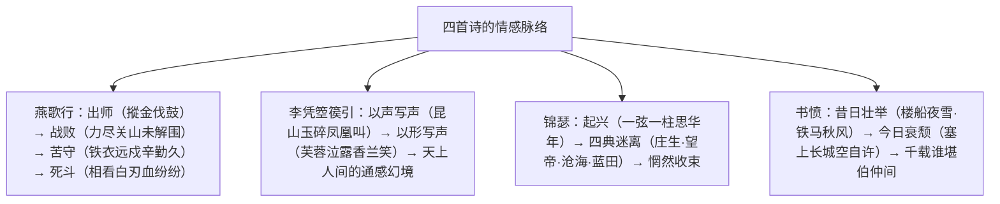

# 燕歌行并序 / 李凭箜篌引 / 锦瑟 / 书愤

**选择性必修中册·古诗词诵读**｜高适 / 李贺 / 李商隐 / 陆游（高考背诵篇目）

## 作者与背景

- **高适《燕歌行并序》**：盛唐边塞诗派代表。序言张公（张守珪）部下战败事，"感征戍之事，因而和焉"。全诗写出师、战败、被围、死斗，讽将帅骄逸、悯士卒苦辛。
- **李贺《李凭箜篌引》**："诗鬼"李贺以浪漫奇诡笔法摹写梨园乐工李凭弹箜篌，被推为"摹写声音至文"。
- **李商隐《锦瑟》**：晚唐朦胧诗典范，追忆平生、寄慨身世，众说纷纭（悼亡、自伤、恋情诸解），"一篇《锦瑟》解人难"。
- **陆游《书愤》**：南宋乾道、淳熙间罢官家居时作（1186年），书早岁抱负与暮年壮志难酬之愤，尊崇诸葛亮以明志。

## 内容梳理

| 篇目 | 体裁 | 名句 | 核心手法 |
|---|---|---|---|
| 燕歌行 | 七言歌行 | "战士军前半死生，美人帐下犹歌舞" | 对比（士卒与将帅、征人与思妇） |
| 李凭箜篌引 | 七言歌行 | "昆山玉碎凤凰叫，芙蓉泣露香兰笑" | 通感、侧面烘托、神话想象 |
| 锦瑟 | 七言律诗 | "此情可待成追忆，只是当时已惘然" | 用典、象征、朦胧多义 |
| 书愤 | 七言律诗 | "楼船夜雪瓜洲渡，铁马秋风大散关" | 今昔对比、用典（塞上长城、出师一表） |

## 艺术特色

1. **《燕歌行》多重对比**："战士军前半死生"对"美人帐下犹歌舞"，鞭挞将帅荒淫；"少妇城南欲断肠"对"征人蓟北空回首"，深化悲剧；结尾"至今犹忆李将军"以古讽今。
2. **《李凭箜篌引》摹声三法**：正面描摹（玉碎、凤叫、蓉泣、兰笑，通感）；侧面烘托（空山凝云、江娥啼竹、紫皇动容、老鱼跳波、吴质不眠）；神话意境（女娲补天处"石破天惊逗秋雨"）。
3. **《锦瑟》用典朦胧**：庄生梦蝶（迷惘）、望帝啼鹃（哀怨）、沧海珠泪（清寥悲苦）、蓝田玉烟（可望难即），四典并置，情境交融而指向不定，成就多义之美。
4. **《书愤》格律沉雄**：颔联纯以名词意象组合（楼船、夜雪、瓜洲渡／铁马、秋风、大散关），无一动词而气象宏大；尾联用《出师表》典，愤而不衰。

## 典型题例

**例1**：《燕歌行》如何通过对比深化主题？
**答案要点**：①士卒浴血与将帅歌舞对比，揭露军中苦乐不均、将帅失职；②征人回首与少妇断肠对比，从家庭维度写战争创痛；③出师时"旌旆逶迤"的煊赫与战败被围的惨烈对比，讽轻敌骄纵；④结尾追慕体恤士卒的李广，与现实将帅对比作结。多重对比交织，使赞颂、同情、讽刺融于一篇。

**例2**：赏析"沧海月明珠有泪，蓝田日暖玉生烟"。
**答案要点**：①用典：鲛人泣珠、蓝田玉烟；②意境：月明沧海、珠光泪影，清怨寂寥；日暖蓝田、良玉生烟，缥缈可望而不可置于眉睫之前；③对仗工丽，冷暖色调相映；④象征美好事物（理想、情感）的可感而不可即，寄寓无限怅惘，是朦胧诗境的极致。

## 易错点

- 《燕歌行》主题是**多元**的：既颂士卒英勇，又讽将帅骄逸，兼悯征戍之苦，勿单一化。
- 《李凭箜篌引》"昆山玉碎凤凰叫"写乐声**清脆与和缓（众弦齐鸣与孤弦独响）**的变化，属正面描写；"老鱼跳波瘦蛟舞"属侧面烘托，须区分。
- 《锦瑟》"五十弦"是瑟之古制并暗示年华，勿实解为诗人五十岁作。
- 《书愤》"塞上长城**空**自许"的"空"字是诗眼，默写勿丢；"出师一表真名世，千载谁堪伯仲间"高频默写。

## 背记要点

1. "战士军前半死生，美人帐下犹歌舞。"（高频默写）
2. "昆山玉碎凤凰叫，芙蓉泣露香兰笑。""石破天惊逗秋雨。"
3. "沧海月明珠有泪，蓝田日暖玉生烟。""此情可待成追忆，只是当时已惘然。"
4. "楼船夜雪瓜洲渡，铁马秋风大散关。""出师一表真名世，千载谁堪伯仲间。"
5. 鉴赏视角：对比讽喻、通感摹声与侧面烘托、用典朦胧、名词意象并置。

## 自测题

1. 默写《燕歌行》中以对比揭露军中苦乐不均的两句。
2. 举例说明《李凭箜篌引》正面描写与侧面烘托的结合。
3. 《锦瑟》中间两联各用什么典故？营造了怎样的意境？
4. 《书愤》"愤"在何处？结合首尾两联分析。

## 相关知识点

史论中的兴亡感慨见 [[11 过秦论 / 五代史伶官传序]]；外国诗歌的抒情方式对照见 [[13 迷娘（之一） / 致大海 / 自己之歌（节选） / 树和天空]]。
