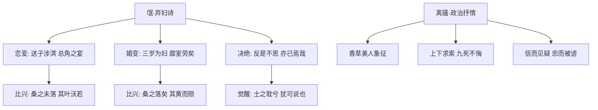

# 1 氓 / 离骚（节选）

## 核心概念 / 课标要求
- 本课为《诗经·卫风·氓》与屈原《离骚》节选，属先秦诗歌，是"古典诗词"单元的开篇。
- 课标要求：把握诗歌的抒情主人公形象，理解比兴手法与浪漫主义风格，体会《诗经》"赋比兴"与《楚辞》"香草美人"的象征传统。
- 氓：弃妇诗，以第一人称叙述婚恋悲剧，展现女性觉醒。
- 离骚：政治抒情诗，抒发"信而见疑、忠而被谤"的忧愤与"上下求索"的执着。

## 知识梳理

| 篇目 | 体裁 | 抒情主人公 | 核心手法 | 主旨 |
|------|------|-----------|---------|------|
| 氓 | 四言叙事诗（《诗经》） | 弃妇 | 赋比兴、对比、倒叙 | 控诉负心男子，表现女性觉醒与刚强 |
| 离骚 | 骚体（楚辞） | 屈原（"余"） | 香草美人、象征、浪漫想象 | 抒发忠君爱国、九死不悔的执着 |

## 重点探究
1. **氓的叙事结构与比兴**：全诗以"桑"为喻，由"桑之未落，其叶沃若"（青春貌美）到"桑之落矣，其黄而陨"（色衰爱弛），比兴贯穿，暗示婚变原因，含蓄而深刻。
2. **离骚的浪漫主义**：大量运用神话传说、想象夸张（"路漫漫其修远兮，吾将上下而求索"），以"香草"喻高洁品德、"美人"喻理想君主，形成独特的象征体系。
3. **抒情主人公对比**：氓中的弃妇由痴情到清醒刚强；离骚中的屈原由忧愤到执着求索，二者都体现对个体尊严与理想的坚守。

## 易错点
- 氓中"士之耽兮，犹可说也"的"说"通"脱"，读 tuō，意为解脱，勿误读。
- 离骚"长太息以掩涕兮"的"太息"即叹息，勿写成"叹息"而失古雅。
- 氓是"弃妇诗"而非"思妇诗"；离骚是"政治抒情诗"而非"爱情诗"。
- 比兴与比喻的区别：比兴是"先言他物以引起所咏之词"，重在起兴与象征，非单纯比喻。

## 背记要点
1. "桑之未落，其叶沃若"与"桑之落矣，其黄而陨"构成比兴，暗示女子由盛而衰。
2. "于嗟鸠兮，无食桑葚！于嗟女兮，无与士耽！"以鸠食桑葚起兴，劝诫女子勿沉溺爱情。
3. "信誓旦旦，不思其反"写男子背信弃义，与"氓之蚩蚩"形成对比。
4. 离骚"长太息以掩涕兮，哀民生之多艰"体现忧国忧民。
5. "亦余心之所善兮，虽九死其犹未悔"表现坚守理想、九死不悔。
6. "路漫漫其修远兮，吾将上下而求索"为千古名句，象征执着探索。

## 自测题
1. 《氓》中"桑之未落，其叶沃若"运用了什么手法？有何作用？
2. 简述《离骚》"香草美人"象征手法的内涵。
3. 氓中的弃妇形象经历了怎样的情感变化？
4. 比较《氓》与《离骚》在抒情方式上的不同。
5. 默写"亦余心之所善兮，虽九死其犹未悔"并解释其含义。

## 相关知识点
- 关联《诗经》"六义"（风雅颂赋比兴）与《楚辞》"骚体"传统。
- 与《孔雀东南飞》并称"乐府双璧"的叙事传统相呼应。
- 为理解屈原《离骚》全文及"香草美人"传统奠定基础。
