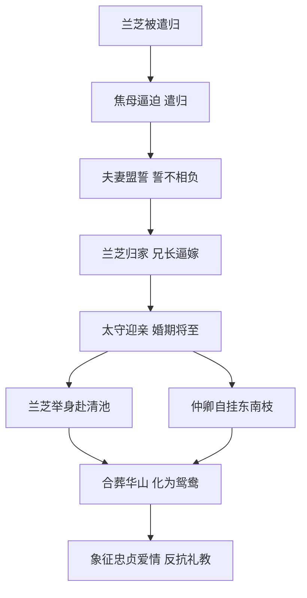

# 2 孔雀东南飞并序

## 核心概念 / 课标要求
- 本课为汉乐府叙事诗《孔雀东南飞》，与《木兰诗》并称"乐府双璧"，是我国古代最长的叙事诗。
- 课标要求：把握故事情节与人物形象，理解铺陈排比、比兴等手法，体会封建礼教对爱情的摧残及主人公的反抗精神。
- 主旨：通过焦仲卿、刘兰芝的爱情悲剧，控诉封建家长制与礼教的罪恶，歌颂忠贞不渝的爱情与反抗精神。

## 知识梳理

| 人物 | 身份 | 性格特点 | 结局 |
|------|------|---------|------|
| 刘兰芝 | 焦仲卿之妻 | 勤劳贤惠、刚强自尊、忠于爱情 | 举身赴清池 |
| 焦仲卿 | 庐江府小吏 | 孝顺软弱、忠于爱情 | 自挂东南枝 |
| 焦母 | 仲卿之母 | 专横霸道、封建家长 | 逼休兰芝 |
| 刘兄 | 兰芝之兄 | 势利、趋炎附势 | 逼兰芝改嫁 |

## 重点探究
1. **铺陈排比手法**：写兰芝"十三能织素，十四学裁衣……"以年龄递进铺陈其才德；写太守迎亲"青雀白鹄舫，四角龙子幡"极尽铺张，反衬悲剧的沉重。
2. **比兴开头与结尾**：开头"孔雀东南飞，五里一徘徊"以孔雀徘徊起兴，奠定哀婉基调；结尾"中有双飞鸟，自名为鸳鸯"以鸳鸯象征忠贞，寄托美好愿望。
3. **人物形象塑造**：兰芝"严妆"辞别、拒婚明志，表现其刚强自尊；仲卿"徘徊庭树下"表现其矛盾软弱，二人形象鲜明立体。

## 易错点
- "孔雀东南飞，五里一徘徊"是"起兴"而非"比喻"，勿混淆。
- 兰芝被遣归的直接原因是焦母逼迫，根本原因是封建礼教与家长制。
- "举身赴清池"是兰芝投水，"自挂东南枝"是仲卿上吊，勿颠倒。
- 本诗是"叙事诗"而非"抒情诗"，注意叙事线索的梳理。

## 背记要点
1. 本诗是我国古代最长的叙事诗，与《木兰诗》并称"乐府双璧"。
2. "十三能织素，十四学裁衣，十五弹箜篌，十六诵诗书"铺陈兰芝才德。
3. "君当作磐石，妾当作蒲苇，蒲苇纫如丝，磐石无转移"为爱情盟誓名句。
4. "孔雀东南飞，五里一徘徊"以比兴起笔，奠定哀婉基调。
5. 结尾"中有双飞鸟，自名为鸳鸯"以浪漫想象寄托美好愿望。
6. 悲剧根源是封建家长制与礼教，主人公以死抗争。

## 自测题
1. 简述《孔雀东南飞》的故事情节。
2. 分析刘兰芝的形象特点。
3. 本诗开头"孔雀东南飞"一句运用了什么手法？
4. 焦仲卿与刘兰芝的爱情悲剧根源是什么？
5. 默写"君当作磐石，妾当作蒲苇"并说明其含义。

## 相关知识点
- 与《木兰诗》并称"乐府双璧"，同属汉乐府民歌。
- 与《氓》同属爱情婚姻题材，可对比弃妇与殉情两种结局。
- 为理解汉乐府"感于哀乐，缘事而发"的叙事传统奠定基础。
