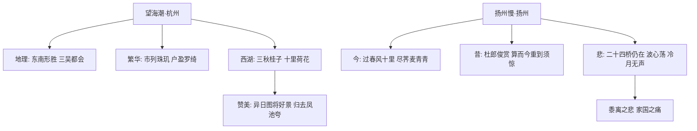

# 4 望海潮（东南形胜） / 扬州慢（淮左名都）

## 核心概念 / 课标要求
- 本课为柳永《望海潮》与姜夔《扬州慢》，一写杭州之繁华，一写扬州之荒芜，同属宋词。
- 课标要求：体会词的意境与情感，理解铺叙、虚实结合、今昔对比等手法，感受宋词婉约与清雅之美。
- 望海潮：以铺叙手法描绘杭州的繁华富庶与西湖胜景，赞美都市生活。
- 扬州慢：以今昔对比写扬州战后的萧条，抒发黍离之悲与家国之痛。

## 知识梳理

| 篇目 | 作者 | 词牌 | 核心手法 | 主旨 |
|------|------|------|---------|------|
| 望海潮 | 柳永 | 望海潮 | 铺叙、点染、夸张 | 赞美杭州繁华与西湖之美 |
| 扬州慢 | 姜夔 | 扬州慢 | 今昔对比、虚实结合、用典 | 抒发黍离之悲、家国之痛 |

## 重点探究
1. **望海潮的铺叙点染**：以"东南形胜，三吴都会，钱塘自古繁华"总起，再分写市井、钱塘江潮、西湖，层层铺叙；"三秋桂子，十里荷花"以点染手法写尽西湖之美。
2. **扬州慢的今昔对比**："过春风十里，尽荠麦青青"以昔日繁华反衬今日荒芜；"二十四桥仍在，波心荡，冷月无声"以景写情，物是人非，抒发黍离之悲。
3. **两词对比**：望海潮写承平之盛，扬州慢写战乱之衰；一为铺叙之工，一为清空骚雅，体现宋词不同风貌。

## 易错点
- 望海潮"三秋桂子，十里荷花"是"点染"手法，非单纯写景。
- 扬州慢"黍离之悲"典出《诗经·王风·黍离》，指亡国之痛、故国之思。
- "豆蔻词工，青楼梦好"用杜牧典故，反衬今日扬州之萧条。
- 望海潮是"婉约词"但写都市繁华，勿误判为豪放词。

## 背记要点
1. 望海潮"东南形胜，三吴都会，钱塘自古繁华"总写杭州。
2. "三秋桂子，十里荷花"以点染写西湖之美。
3. "市列珠玑，户盈罗绮，竞豪奢"写杭州商业繁华。
4. 扬州慢"过春风十里，尽荠麦青青"以今昔对比写荒芜。
5. "二十四桥仍在，波心荡，冷月无声"为写景抒情名句。
6. 扬州慢抒发黍离之悲、家国之痛。

## 自测题
1. 《望海潮》运用了哪些手法描绘杭州？
2. 分析《扬州慢》中今昔对比手法的运用。
3. "黍离之悲"的含义是什么？
4. 比较《望海潮》与《扬州慢》在情感上的不同。
5. 默写"二十四桥仍在，波心荡，冷月无声"。

## 相关知识点
- 关联宋词婉约派（柳永、姜夔）与豪放派（苏轼、辛弃疾）之别。
- 与《蜀道难》《蜀相》同属唐宋诗词单元。
- 扬州慢用杜牧典故，可联系杜牧《遣怀》等诗理解。
