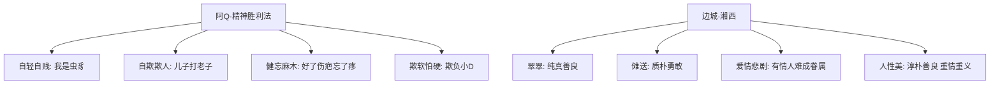

# 5 阿Q正传（节选） / 边城（节选）

## 核心概念 / 课标要求
- 本课为鲁迅《阿Q正传》与沈从文《边城》节选，同属中国现代小说，一写国民劣根性，一写湘西人性美。
- 课标要求：把握人物形象与主题，理解讽刺手法与散文化抒情笔调，体会现代小说的思想深度与艺术特色。
- 阿Q正传：通过阿Q的"精神胜利法"，批判国民的愚昧麻木与自欺欺人。
- 边城：以湘西边城为背景，展现纯朴的人性美与爱情悲剧。

## 知识梳理

| 篇目 | 作者 | 人物 | 核心手法 | 主旨 |
|------|------|------|---------|------|
| 阿Q正传 | 鲁迅 | 阿Q | 讽刺、白描、夸张 | 批判"精神胜利法"与国民劣根性 |
| 边城 | 沈从文 | 翠翠、傩送 | 散文化抒情、象征 | 展现湘西人性美与爱情悲剧 |

## 重点探究
1. **阿Q的"精神胜利法"**：阿Q在现实中处处失败，却以"我是虫豸""儿子打老子"等自欺方式获得精神胜利，深刻揭示国民的愚昧麻木与自欺欺人，具有强烈的批判性。
2. **边城的散文化抒情**：沈从文以诗意的笔触描绘湘西山水与人物，淡化情节冲突，重在营造意境，展现"优美、健康、自然而又不悖乎人性的人生形式"。
3. **两篇小说对比**：阿Q正传以讽刺批判国民性，边城以抒情讴歌人性美；一为"揭出病苦"，一为"供奉人性"，体现现代小说多元主题。

## 易错点
- "精神胜利法"是阿Q的核心性格特征，勿误为"阿Q精神"的褒义理解。
- 阿Q正传是"讽刺小说"，边城是"散文化小说"，文体风格不同。
- 边城的悲剧根源是命运的阴差阳错与封闭环境，非单纯爱情冲突。
- 阿Q正传以"白描"与"夸张"塑造人物，勿与边城的抒情笔调混淆。

## 背记要点
1. 阿Q的"精神胜利法"是自欺欺人、以精神胜利掩盖现实失败。
2. 阿Q正传批判国民的愚昧麻木与自欺欺人。
3. 边城以湘西为背景，展现纯朴的人性美。
4. 翠翠是边城中纯真善良的少女形象。
5. 边城是"散文化小说"，重意境营造与抒情。
6. 两篇小说一为批判国民性，一为讴歌人性美。

## 自测题
1. 什么是阿Q的"精神胜利法"？有何批判意义？
2. 分析阿Q这一人物形象。
3. 《边城》展现了怎样的湘西世界？
4. 比较《阿Q正传》与《边城》在主题与风格上的不同。
5. 翠翠的爱情悲剧说明了什么？

## 相关知识点
- 关联鲁迅"改造国民性"的文学主张与沈从文"湘西世界"。
- 与《大堰河》《再别康桥》等同属中国现当代文学单元。
- 为理解中国现代小说多元主题奠定基础。
