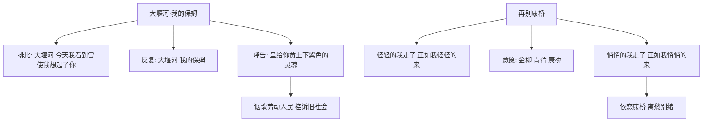

# 6 大堰河——我的保姆 / 再别康桥

## 核心概念 / 课标要求
- 本课为艾青《大堰河——我的保姆》与徐志摩《再别康桥》，同属中国现代新诗。
- 课标要求：体会新诗的情感与意象，理解排比、反复、复沓等手法，感受自由诗与格律诗的不同之美。
- 大堰河：以排比反复深情讴歌保姆大堰河，表达对劳动人民的挚爱与对旧社会的控诉。
- 再别康桥：以"轻轻""悄悄"的复沓写对康桥的依恋，抒发离别之情。

## 知识梳理

| 篇目 | 作者 | 诗体 | 核心手法 | 主旨 |
|------|------|------|---------|------|
| 大堰河 | 艾青 | 自由诗 | 排比、反复、呼告 | 讴歌保姆，控诉旧社会 |
| 再别康桥 | 徐志摩 | 格律诗 | 复沓、意象、音乐美 | 抒发对康桥的依恋与离愁 |

## 重点探究
1. **大堰河的排比反复**：全诗以"大堰河，我的保姆"反复咏叹，以大量排比铺陈大堰河的勤劳善良与苦难，情感真挚浓烈，具有强烈的感染力。
2. **再别康桥的音乐美**：以"轻轻""悄悄"的复沓营造轻柔的节奏，选用"金柳""青荇""康桥"等意象，讲究押韵与回环，体现新月派"三美"（音乐美、绘画美、建筑美）主张。
3. **两诗对比**：大堰河以自由诗体直抒胸臆，再别康桥以格律诗体含蓄抒情；一为深沉悲壮，一为轻柔飘逸。

## 易错点
- 大堰河是"自由诗"，不讲究格律；再别康桥是"格律诗"，讲究押韵。
- 再别康桥"轻轻""悄悄"是"复沓"手法，营造轻柔意境。
- 大堰河是艾青献给保姆的赞歌，勿误为写母亲。
- 再别康桥抒发的是"离别之情"，非"思乡之情"。

## 背记要点
1. 大堰河是艾青献给保姆的赞歌，表达对劳动人民的挚爱。
2. 大堰河以排比、反复、呼告手法抒情。
3. 再别康桥"轻轻的我走了，正如我轻轻的来"为名句。
4. 再别康桥体现新月派"三美"主张。
5. 大堰河是自由诗，再别康桥是格律诗。
6. 再别康桥以"金柳""青荇"等意象写康桥之美。

## 自测题
1. 《大堰河——我的保姆》运用了哪些抒情手法？
2. 分析大堰河这一人物形象。
3. 《再别康桥》体现了新月派怎样的艺术主张？
4. 比较《大堰河》与《再别康桥》在诗体与情感上的不同。
5. 默写"轻轻的我走了，正如我轻轻的来"。

## 相关知识点
- 关联艾青"土地与太阳"意象与徐志摩新月派"三美"主张。
- 与《阿Q正传》《边城》等同属中国现当代文学单元。
- 为理解中国现代新诗发展奠定基础。
