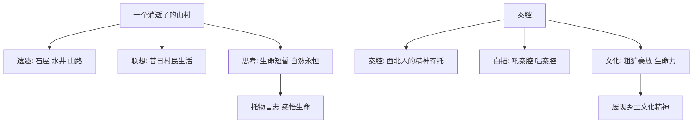

# 7 一个消逝了的山村 / 秦腔

## 核心概念 / 课标要求
- 本课为冯至《一个消逝了的山村》与贾平凹《秦腔》，一为散文，一为文化散文，同属中国现当代散文。
- 课标要求：把握散文的抒情方式与语言特色，理解托物言志、白描等手法，体会对自然与乡土文化的思考。
- 一个消逝了的山村：以山村遗迹为线索，追怀消逝的村庄，思考人与自然、历史与生命。
- 秦腔：以秦腔为对象，展现西北乡土文化的精神内涵与生命力。

## 知识梳理

| 篇目 | 作者 | 文体 | 核心手法 | 主旨 |
|------|------|------|---------|------|
| 一个消逝了的山村 | 冯至 | 抒情散文 | 托物言志、联想 | 追怀消逝山村，思考生命与自然 |
| 秦腔 | 贾平凹 | 文化散文 | 白描、铺陈、方言 | 展现秦腔与西北乡土文化 |

## 重点探究
1. **一个消逝了的山村的托物言志**：作者以山村遗迹（石屋、水井、山路）为线索，展开联想与想象，追怀消逝的村庄，进而思考生命的短暂与自然的永恒，托物言志，含蓄深沉。
2. **秦腔的文化内涵**：贾平凹以白描与铺陈写秦腔的"吼"，展现其粗犷豪放、充满生命力的特点，将秦腔视为西北人精神世界的寄托，体现对乡土文化的深情。
3. **两文对比**：一个消逝了的山村以抒情思辨见长，秦腔以文化铺陈见长；一为对生命与自然的哲思，一为对乡土文化的礼赞。

## 易错点
- 一个消逝了的山村是"抒情散文"，重在托物言志与哲思。
- 秦腔是"文化散文"，重在展现乡土文化，勿误为单纯写戏曲。
- 秦腔的"吼"体现西北人的粗犷豪放，勿以南方戏曲的柔婉理解。
- 一个消逝了的山村以"遗迹"为线索，勿忽略其联想与思考。

## 背记要点
1. 一个消逝了的山村以山村遗迹为线索，托物言志。
2. 该文思考生命的短暂与自然的永恒。
3. 秦腔是西北人的精神寄托，粗犷豪放。
4. 秦腔以白描、铺陈手法展现乡土文化。
5. 两文一为抒情哲思，一为文化礼赞。
6. 秦腔的"吼"体现西北人的生命力。

## 自测题
1. 《一个消逝了的山村》以什么为线索？表达了怎样的思考？
2. 分析该文托物言志手法的运用。
3. 《秦腔》展现了怎样的乡土文化？
4. 比较两篇散文在主题与风格上的不同。
5. 秦腔的"吼"有何文化内涵？

## 相关知识点
- 关联中国现当代散文的抒情与思辨传统。
- 与《阿Q正传》《边城》等同属中国现当代文学单元。
- 为理解乡土文学与文化散文奠定基础。
