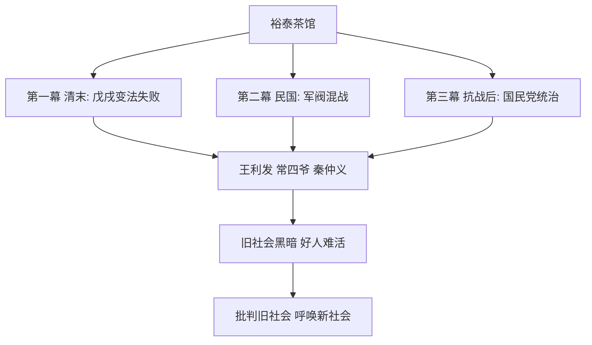

# 8 茶馆（节选）

## 核心概念 / 课标要求
- 本课为老舍话剧《茶馆》节选，是中国现代话剧的经典之作。
- 课标要求：把握话剧的戏剧冲突与人物语言，理解"人像展览式"结构与"京味"语言特色，体会作品对旧社会的批判。
- 主旨：以裕泰茶馆为舞台，通过三幕戏展现清末至民国近五十年的社会变迁，批判旧社会的黑暗与腐朽。

## 知识梳理

| 人物 | 身份 | 性格特点 | 命运 |
|------|------|---------|------|
| 王利发 | 茶馆掌柜 | 精明圆滑、善于经营 | 茶馆被霸占，绝望自尽 |
| 常四爷 | 旗人 | 正直刚强、爱国 | 一生坎坷，仍自食其力 |
| 秦仲义 | 民族资本家 | 实业救国、雄心勃勃 | 工厂被没收，破产 |
| 刘麻子 | 人贩子 | 奸诈贪婪 | 被处死 |

## 重点探究
1. **"人像展览式"结构**：全剧没有贯穿始终的中心情节，而是以茶馆为舞台，通过众多人物与零散事件展现社会百态，被称为"人像展览式"结构，具有高度的概括性。
2. **"京味"语言特色**：老舍以北京口语写人物对话，语言生动幽默、个性鲜明，如王利发的圆滑、常四爷的刚直，通过语言塑造人物，体现浓郁的北京地域特色。
3. **"葬送三个时代"**：全剧通过王利发、常四爷、秦仲义三个主要人物的命运，展现清末、民国、抗战后三个时代的黑暗，揭示旧社会必然灭亡的历史趋势。

## 易错点
- 茶馆是"话剧"，以对话和动作塑造人物，勿以小说笔法理解。
- "人像展览式"结构无中心情节，勿误以为情节松散无意义。
- 王利发"改良"茶馆却仍难逃破产，说明旧社会改良无出路。
- 全剧"葬送三个时代"，批判旧社会，勿误为单纯怀旧。

## 背记要点
1. 茶馆以裕泰茶馆为舞台，展现近五十年社会变迁。
2. 全剧采用"人像展览式"结构。
3. 王利发、常四爷、秦仲义是三个主要人物。
4. 老舍以"京味"语言塑造人物。
5. 全剧"葬送三个时代"，批判旧社会。
6. 茶馆是中国现代话剧的经典之作。

## 自测题
1. 什么是"人像展览式"结构？
2. 分析王利发这一人物形象。
3. 《茶馆》的"京味"语言有何特色？
4. 全剧"葬送三个时代"指哪三个时代？
5. 王利发"改良"茶馆为何仍难逃破产？

## 相关知识点
- 关联老舍"京味"文学与北京地域文化。
- 与《阿Q正传》《边城》等同属中国现当代文学单元。
- 为理解中国现代话剧艺术奠定基础。
