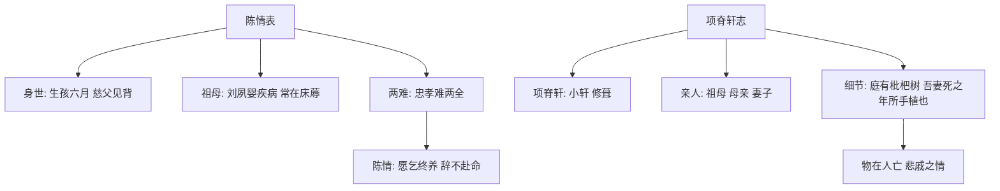

# 9 陈情表 / 项脊轩志

## 核心概念 / 课标要求
- 本课为李密《陈情表》与归有光《项脊轩志》，一为奏表，一为抒情散文，同属古代散文。
- 课标要求：把握文言文的实词虚词与句式，理解"表"的文体特点与散文的抒情手法，体会至情至性的情感表达。
- 陈情表：以"孝"为核心，陈情辞官，恳请终养祖母，情真意切。
- 项脊轩志：以项脊轩为线索，追忆家世与亲人，抒发物在人亡的悲戚。

## 知识梳理

| 篇目 | 作者 | 文体 | 核心手法 | 主旨 |
|------|------|------|---------|------|
| 陈情表 | 李密 | 奏表 | 陈情、对比、骈散结合 | 陈情辞官，恳请终养祖母 |
| 项脊轩志 | 归有光 | 抒情散文 | 以物为线索、细节描写 | 追忆亲人，抒发物在人亡之悲 |

## 重点探究
1. **陈情表的"陈情"艺术**：李密以"臣无祖母，无以至今日；祖母无臣，无以终余年"的对比，将"孝"与"忠"的矛盾层层铺陈，情真意切，最终打动晋武帝，达到辞官目的。
2. **项脊轩志的以物传情**：归有光以项脊轩为线索，通过"庭有枇杷树，吾妻死之年所手植也，今已亭亭如盖矣"等细节，以物写情，含蓄深沉地抒发对祖母、母亲、妻子的追忆与物在人亡之悲。
3. **两文对比**：陈情表以"陈情"说理，项脊轩志以"细节"抒情；一为奏表之恳切，一为散文之含蓄。

## 易错点
- 陈情表是"奏表"，是臣子呈给皇帝的文书，勿误为一般书信。
- "夙遭闵凶"的"闵"通"悯"，指忧患，勿误写。
- 项脊轩志"庭有枇杷树"是"细节描写"以物传情，非单纯写景。
- 项脊轩志是"抒情散文"，重在抒情，勿以论说文理解。

## 背记要点
1. 陈情表以"孝"为核心，陈情辞官，恳请终养祖母。
2. "臣无祖母，无以至今日；祖母无臣，无以终余年"为名句。
3. 陈情表是"奏表"，情真意切，打动晋武帝。
4. 项脊轩志以项脊轩为线索，追忆亲人。
5. "庭有枇杷树，吾妻死之年所手植也"为以物传情名句。
6. 项脊轩志抒发物在人亡的悲戚之情。

## 自测题
1. 《陈情表》是如何"陈情"的？
2. 分析《陈情表》中"忠孝两难"的矛盾。
3. 《项脊轩志》以什么为线索？表达了怎样的情感？
4. 分析"庭有枇杷树"一句的抒情效果。
5. 比较两文在文体与抒情方式上的不同。

## 相关知识点
- 关联"表"的文体特点与古代奏章传统。
- 与《兰亭集序》《归去来兮辞》等同属古代散文单元。
- 项脊轩志的以物传情可联系《项脊轩志》全文理解。
