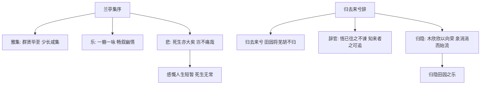

# 10 兰亭集序 / 归去来兮辞并序

## 核心概念 / 课标要求
- 本课为王羲之《兰亭集序》与陶渊明《归去来兮辞并序》，一为序文，一为辞赋，同属古代散文。
- 课标要求：把握文言实词虚词与句式，理解"序"与"辞"的文体特点，体会对生命、自然与人生的思考。
- 兰亭集序：记叙兰亭雅集，抒发对人生短暂、死生无常的感慨。
- 归去来兮辞：抒写辞官归隐的决绝与田园生活的乐趣。

## 知识梳理

| 篇目 | 作者 | 文体 | 核心手法 | 主旨 |
|------|------|------|---------|------|
| 兰亭集序 | 王羲之 | 序文 | 记叙、议论、抒情 | 感慨人生短暂、死生无常 |
| 归去来兮辞 | 陶渊明 | 辞赋 | 抒情、白描、骈散结合 | 抒写辞官归隐之乐 |

## 重点探究
1. **兰亭集序的"乐—痛—悲"**：由兰亭雅集之"乐"，到"俯仰一世"之"痛"，再到"死生亦大矣"之"悲"，情感层层递进，抒发对人生短暂、死生无常的深沉感慨。
2. **归去来兮辞的归隐之乐**：陶渊明以"悟已往之不谏，知来者之可追"写辞官决绝，以"木欣欣以向荣，泉涓涓而始流"写田园之乐，白描与抒情结合，展现归隐的宁静与自由。
3. **两文对比**：兰亭集序由乐转悲，感慨人生；归去来兮辞由仕转隐，追求自由；一为对生命的哲思，一为对田园的向往。

## 易错点
- 兰亭集序是"序文"，记叙雅集并抒发感慨，勿误为游记。
- 归去来兮辞是"辞赋"，讲究押韵与对仗，勿以散文理解。
- "悟已往之不谏，知来者之可追"写辞官决绝，勿误读。
- 兰亭集序"固知一死生为虚诞，齐彭殇为妄作"批判虚无，勿误读。

## 背记要点
1. 兰亭集序记叙兰亭雅集，抒发人生短暂之感慨。
2. "群贤毕至，少长咸集"写雅集之盛。
3. "固知一死生为虚诞，齐彭殇为妄作"批判虚无主义。
4. 归去来兮辞抒写辞官归隐之乐。
5. "悟已往之不谏，知来者之可追"为名句。
6. "木欣欣以向荣，泉涓涓而始流"写田园之乐。

## 自测题
1. 《兰亭集序》的情感经历了怎样的变化？
2. 分析"固知一死生为虚诞，齐彭殇为妄作"的含义。
3. 《归去来兮辞》抒发了怎样的情感？
4. 分析陶渊明归隐的原因与乐趣。
5. 比较两文在文体与主题上的不同。

## 相关知识点
- 关联"序"与"辞"的文体特点。
- 与《陈情表》《项脊轩志》等同属古代散文单元。
- 陶渊明归隐可联系其田园诗理解。
