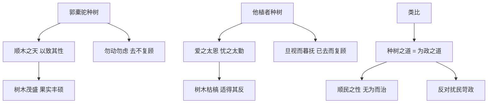

# 11 种树郭橐驼传

## 核心概念 / 课标要求
- 本课为柳宗元《种树郭橐驼传》，是一篇寓言式传记，属古代散文。
- 课标要求：把握文言实词虚词与句式，理解"传"的文体特点与类比说理手法，体会借种树之道讽喻为政之理的深意。
- 主旨：借郭橐驼种树"顺木之天"之道，讽喻统治者应"顺民之性"，反对扰民苛政。

## 知识梳理

| 人物 | 身份 | 种树之道 | 寓意 |
|------|------|---------|------|
| 郭橐驼 | 种树者 | 顺木之天，以致其性 | 顺民之性，无为而治 |
| 他植者 | 一般种树人 | 爱之太恩，忧之太勤 | 扰民苛政，适得其反 |
| 官吏 | 统治者 | 好烦其令，若甚怜焉 | 扰民之政，害民之甚 |

## 重点探究
1. **类比说理手法**：文章以种树之道类比为政之道，郭橐驼"顺木之天"对应统治者应"顺民之性"，他植者"爱之太恩"对应官吏"好烦其令"，层层类比，说理透彻。
2. **"顺其天性"的哲理**：郭橐驼种树成功的关键是"顺木之天，以致其性"，即顺应树木生长的自然规律，不妄加干预，蕴含顺应自然、无为而治的哲理。
3. **对扰民苛政的批判**：文章借"官吏好烦其令"批判当时扰民之政，指出"虽曰爱之，其实害之"，主张统治者应减少干预，让百姓休养生息。

## 易错点
- 本文是"寓言式传记"，借种树说理，勿误为单纯写种树。
- "顺木之天，以致其性"的"天"指自然规律，勿误为天空。
- 郭橐驼是"顺其天性"，他植者是"爱之太恩"，二者对比。
- 文章主旨是讽喻为政，勿忽略其政治寓意。

## 背记要点
1. 郭橐驼种树之道是"顺木之天，以致其性"。
2. 他植者"爱之太恩，忧之太勤"导致树木枯槁。
3. 文章以种树之道类比为政之道。
4. 主旨是顺民之性，反对扰民苛政。
5. "虽曰爱之，其实害之"批判扰民之政。
6. 本文是寓言式传记，借种树说理。

## 自测题
1. 郭橐驼种树成功的关键是什么？
2. 分析本文类比说理手法的运用。
3. 他植者种树失败的原因是什么？
4. 本文讽喻了怎样的为政之道？
5. "虽曰爱之，其实害之"有何深意？

## 相关知识点
- 关联柳宗元"寓言"文体与"永州八记"。
- 与《陈情表》《项脊轩志》等同属古代散文单元。
- 类比说理可联系《劝学》等文言文理解。
