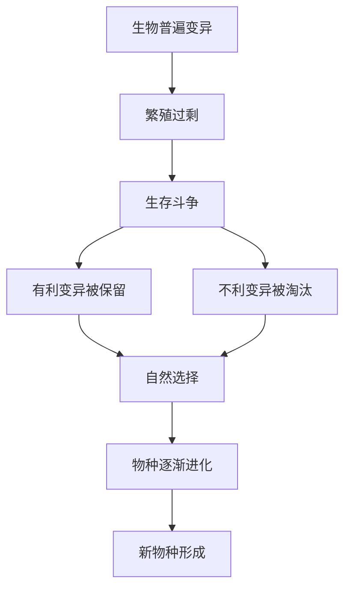

# 13 自然选择的证明

## 核心概念 / 课标要求
- 本课为达尔文《物种起源》节选《自然选择的证明》，属科学论著。
- 课标要求：把握科学论著的论证方法与逻辑结构，理解"自然选择"学说的核心观点，体会科学论证的严密性。
- 主旨：以大量事实为依据，论证"自然选择"是物种进化的主要机制。

## 知识梳理

| 论证要点 | 内容 | 论证方法 |
|---------|------|---------|
| 变异 | 生物普遍存在变异 | 事实列举 |
| 生存斗争 | 生物繁殖过剩导致生存斗争 | 逻辑推理 |
| 自然选择 | 有利变异被保留，不利变异被淘汰 | 归纳论证 |
| 物种形成 | 长期自然选择导致新物种形成 | 综合论证 |

## 重点探究
1. **自然选择学说的核心**：生物普遍存在变异，繁殖过剩导致生存斗争，在斗争中有利变异被保留、不利变异被淘汰，这一过程即"自然选择"，长期积累导致物种进化。
2. **严密的论证逻辑**：文章以大量事实为依据，通过归纳与演绎相结合的方法，层层推进，从变异、生存斗争到自然选择、物种形成，逻辑严密，说服力强。
3. **科学论著的语言**：语言准确、严谨，多用"可能""往往"等限定词，体现科学表述的审慎与客观。

## 易错点
- "自然选择"是"适者生存"，勿误为"强者生存"。
- 变异是"普遍存在"的，自然选择是"保留有利变异"。
- 生存斗争包括种内、种间及与环境斗争，勿只理解为种内竞争。
- 自然选择是"长期"过程，勿误为短期突变。

## 背记要点
1. 生物普遍存在变异，是进化的前提。
2. 繁殖过剩导致生存斗争。
3. 自然选择保留有利变异，淘汰不利变异。
4. 长期自然选择导致物种进化与新物种形成。
5. 文章论证逻辑严密，事实与推理结合。
6. 科学论著语言准确、审慎。

## 自测题
1. 什么是"自然选择"？
2. 简述自然选择学说的论证逻辑。
3. 生存斗争包括哪些类型？
4. 变异在进化中起什么作用？
5. 科学论著的语言有何特点？

## 相关知识点
- 关联达尔文进化论与生物进化思想。
- 与《宇宙的边疆》等同属科学论著单元。
- 论证方法可联系《石钟山记》的求实精神理解。
