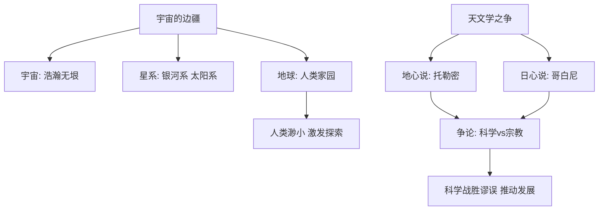

# 14 宇宙的边疆 / 天文学上的旷世之争

## 核心概念 / 课标要求
- 本课为卡尔·萨根《宇宙的边疆》与《天文学上的旷世之争》，一为科普散文，一为科学史论著，同属科学论著。
- 课标要求：把握科普文的语言与结构，理解科学史论著的论证方法，体会科学精神与探索精神。
- 宇宙的边疆：以诗意的语言介绍宇宙的浩瀚与人类的渺小，激发探索精神。
- 天文学上的旷世之争：梳理天文学史上地心说与日心说之争，展现科学发展的历程。

## 知识梳理

| 篇目 | 内容 | 核心手法 | 主旨 |
|------|------|---------|------|
| 宇宙的边疆 | 介绍宇宙的浩瀚与人类的位置 | 诗意语言、由远及近 | 激发探索宇宙的精神 |
| 天文学上的旷世之争 | 地心说与日心说之争 | 史实梳理、论证 | 展现科学发展的历程 |

## 重点探究
1. **宇宙的边疆的诗意语言**：卡尔·萨根以"我们探索宇宙的时候，既要勇于怀疑，又要富于想象"等诗意语言，将科学知识与文学想象结合，由远及近介绍宇宙，激发读者的探索精神。
2. **天文学之争的史实梳理**：文章梳理从托勒密地心说到哥白尼日心说的演变，展现科学在与宗教、谬误的斗争中不断发展的历程，论证科学进步的不易与伟大。
3. **两文对比**：宇宙的边疆以科普散文激发探索，天文学之争以科学史论著展现历程；一为抒情，一为说理。

## 易错点
- 宇宙的边疆是"科普散文"，语言诗意，勿误为纯科学论文。
- 地心说是托勒密提出，日心说是哥白尼提出，勿颠倒。
- 天文学之争是"科学史论著"，重在梳理历程，勿误为单纯科普。
- 日心说战胜地心说体现科学精神，勿忽略其历史意义。

## 背记要点
1. 宇宙的边疆以诗意语言介绍宇宙的浩瀚。
2. 该文由远及近介绍宇宙，激发探索精神。
3. 地心说由托勒密提出，日心说由哥白尼提出。
4. 天文学之争展现科学发展的历程。
5. 科学在与谬误的斗争中不断发展。
6. 两文一为科普散文，一为科学史论著。

## 自测题
1. 《宇宙的边疆》是如何介绍宇宙的？
2. 分析该文诗意语言的特点。
3. 简述地心说与日心说之争。
4. 天文学之争说明了什么？
5. 两篇科学论著在写法上有何不同？

## 相关知识点
- 关联科普文与科学史论著的文体特点。
- 与《自然选择的证明》等同属科学论著单元。
- 科学精神可联系《石钟山记》的求实精神理解。
