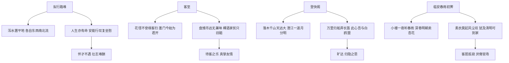

# 拟行路难（其四） / 客至 / 登快阁 / 临安春雨初霁

## 核心概念 / 课标要求
- 本课为古诗词诵读单元，收录鲍照《拟行路难（其四）》、杜甫《客至》、黄庭坚《登快阁》、陆游《临安春雨初霁》四首古诗。
- 课标要求：把握各诗的情感与手法，理解借景抒情、用典、白描等手法，体会不同诗人的艺术风格。
- 拟行路难：抒发怀才不遇、壮志难酬的愤懑。
- 客至：写待客之乐，表现真挚友情与闲适生活。
- 登快阁：抒发登阁远眺的旷达与归隐之思。
- 临安春雨初霁：写客居京华的孤寂与对官场的厌倦。

## 知识梳理

| 篇目 | 作者 | 体裁 | 核心手法 | 主旨 |
|------|------|------|---------|------|
| 拟行路难（其四） | 鲍照 | 乐府 | 比兴、直抒胸臆 | 怀才不遇、壮志难酬 |
| 客至 | 杜甫 | 七律 | 白描、细节 | 待客之乐、真挚友情 |
| 登快阁 | 黄庭坚 | 七律 | 用典、借景抒情 | 旷达与归隐之思 |
| 临安春雨初霁 | 陆游 | 七律 | 白描、反衬 | 客居孤寂、厌倦官场 |

## 重点探究
1. **拟行路难的比兴与直抒**：以"泻水置平地，各自东西南北流"起兴，喻人生际遇不同，再以"安能行叹复坐愁"直抒胸臆，抒发怀才不遇的愤懑。
2. **客至的白描细节**：以"花径不曾缘客扫，蓬门今始为君开""盘飧市远无兼味"等白描细节，写待客的真诚与简朴，表现真挚友情与闲适生活。
3. **登快阁与临安春雨初霁的用典与反衬**：登快阁"此心吾与白鸥盟"用典抒归隐之思；临安春雨初霁"小楼一夜听春雨"以清新之景反衬客居孤寂，抒发厌倦官场之情。

## 易错点
- 拟行路难"泻水置平地"是"比兴"，勿误为单纯写景。
- 客至是"待客"之诗，表现友情，勿误为思乡。
- 登快阁"白鸥盟"用典，指归隐，勿误读。
- 临安春雨初霁以"春雨""杏花"反衬孤寂，勿误为写春景之乐。

## 背记要点
1. 拟行路难"泻水置平地，各自东西南北流"以比兴起笔。
2. 客至"花径不曾缘客扫，蓬门今始为君开"写待客之诚。
3. 登快阁"落木千山天远大，澄江一道月分明"为写景名句。
4. 登快阁"此心吾与白鸥盟"抒归隐之思。
5. 临安春雨初霁"小楼一夜听春雨，深巷明朝卖杏花"为名句。
6. 临安春雨初霁抒发客居孤寂、厌倦官场之情。

## 自测题
1. 《拟行路难（其四）》抒发了怎样的情感？
2. 分析《客至》白描手法的运用。
3. 《登快阁》"白鸥盟"用典有何含义？
4. 《临安春雨初霁》如何以景反衬孤寂？
5. 比较四首诗在情感与手法上的不同。

## 相关知识点
- 关联乐府诗与七言律诗的体裁特点。
- 与《蜀道难》《蜀相》等同属古典诗词。
- 用典手法可联系《扬州慢》等词理解。
