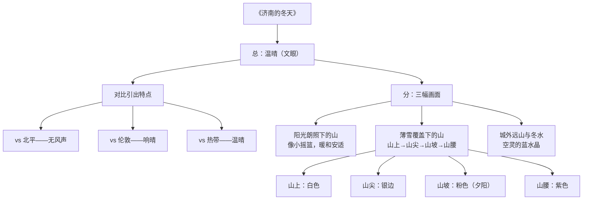

# 2 济南的冬天（老舍）

标签：#中考必考 #写景散文 #背诵篇目

## 一、文学常识

| 项目 | 内容 |
|---|---|
| 作者 | 老舍（1899—1966），原名舒庆春，字舍予，北京人，满族 |
| 称号 | "人民艺术家" |
| 代表作 | 小说《骆驼祥子》《四世同堂》，话剧《茶馆》《龙须沟》 |
| 体裁 | 写景抒情散文 |

## 二、文章主线：一个"暖"字，一个"秀"字

开篇用**对比**突出济南冬天"**温晴**"的总特点：

| 对比对象 | 突出什么 |
|---|---|
| 北平（大风） | 济南**没有风声** |
| 伦敦（多雾） | 济南**响晴** |
| 热带（毒日） | 济南**温晴** |

接着围绕"温晴"写了三幅画面：

1. **阳光朗照下的山**——像"小摇篮"，暖和安适；
2. **薄雪覆盖下的山**——"最妙的是下点小雪呀"，秀气；
3. **城外远山**与**冬天的水**——绿萍、水藻、垂柳，清亮温暖，"整个的是块空灵的蓝水晶"。

## 三、重点语句赏析

**"这一圈小山在冬天特别可爱，好像是把济南放在一个小摇篮里。"**

- **比喻兼拟人**，把围着济南的小山比作摇篮，写出济南地形特点，更传达出小山的慈爱温存、济南冬天的温暖舒适。

**"山尖全白了，给蓝天镶上一道银边。"**

- "镶"字用得精妙：仿佛人有意为之，写出雪后山尖与蓝天相接的秀美线条。

**"那点薄雪好像忽然害了羞，微微露出点粉色。"**

- **拟人**，写夕阳斜照下雪色娇美的情态，"害了羞"赋予薄雪少女般的情态。

## 四、字词积累

| 字词 | 读音 | 释义/注意 |
|---|---|---|
| 响晴 | xiǎng qíng | 晴朗无云 |
| 温晴 | wēn qíng | 温暖晴朗（全文文眼） |
| 安适 | ān shì | 安静而舒适 |
| 着落 | zhuó luò | 可以依靠的来源（"着"易误读） |
| 慈善 | cí shàn | 文中形容冬天温和 |
| 澄清 | chéng qīng | 清亮透明 |
| 空灵 | kōng líng | 清净透明 |
| 髻 | jì | 盘在头顶的发结（"树尖上顶着一髻儿白花"） |

## 五、写作借鉴

1. **抓住特征写景**：全文紧扣"温晴"二字，所有景物都为它服务；
2. **由高到低的空间顺序**：写雪后山景按"山上—山尖—山坡—山腰"层层展开；
3. **情景交融**：处处流露出对济南的喜爱，如称"济南真得算个宝地"。

## 六、与《春》的对比

| 比较点 | 《春》 | 《济南的冬天》 |
|---|---|---|
| 结构 | 盼—绘—赞 | 总（温晴）—分（山、水） |
| 笔调 | 欢快热烈 | 温和亲切 |
| 常用修辞 | 排比、比喻、拟人 | 比喻、拟人 |

## 结构图解

## 七、知识联系

- 与[[1 春（朱自清）]]对读，体会不同作家的语言风格；
- "抓特征、按顺序、融感情"是[[写作：热爱生活，学会观察]]的核心方法。
