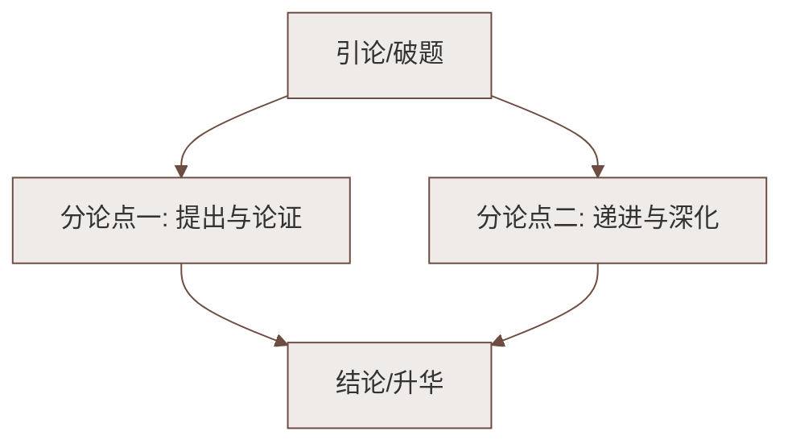

# 3* 雨的四季（刘湛秋）

标签：#自读课文 #写景散文

## 一、文学常识

| 项目 | 内容 |
|---|---|
| 作者 | 刘湛秋（1935—2023），安徽芜湖人，当代诗人、翻译家 |
| 体裁 | 写景抒情散文 |
| 地位 | 自读课文（带 * 号），重在运用前两课学到的方法自主赏析 |

## 二、四季之雨的不同性格

作者笔下，每个季节的雨都有独特"性格"：

| 季节 | 特点 | 关键词句 |
|---|---|---|
| 春雨 | 美丽、娇媚 | 树"睁开特别明亮的眼睛"，万物复苏 |
| 夏雨 | 热烈、粗犷 | "毫不掩饰地倾泻"，荷叶铺满河面 |
| 秋雨 | 端庄、沉静 | 使人静谧、怀想、动情，纯净灵魂 |
| 冬雨（雪） | 自然、平静 | 化妆的雪，带来蜜情般的柔和 |

> 💡 注意：文题是"雨的四季"而不是"四季的雨"——重心在**雨**本身的生命历程与情趣，把雨当作有性格的生命来写。

## 三、重点语句赏析

**"每一棵树仿佛都睁开特别明亮的眼睛。"**

- **拟人**，写春雨洗淋后树木焕然一新、生机勃勃的情态。

**"水珠子从花苞里滴下来，比少女的眼泪还娇媚。"**

- **比喻兼拟人**，以少女的眼泪作比，写出春雨的清亮、娇美。

## 四、字词积累

| 字词 | 读音 | 释义/注意 |
|---|---|---|
| 花苞 | huā bāo | 花未开时包着花朵的小叶片 |
| 娇媚 | jiāo mèi | 仪容甜美具有魅力 |
| 棱镜 | léng jìng | "棱"读 léng |
| 粗犷 | cū guǎng | 粗豪、豪放（**"犷"易误读为 kuàng**） |
| 睫毛 | jié máo | 眼睑边缘的细毛 |
| 衣裳 | yī shang | 轻声 |
| 铃铛 | líng dang | 轻声 |
| 静谧 | jìng mì | 安静（中考高频词） |
| 屋檐 | wū yán | 房顶伸出墙外的部分 |
| 凄冷 | qī lěng | 凄清寒冷 |
| 化妆 | huà zhuāng | 注意与"化装"区分 |
| 淅淅沥沥 | xī xī lì lì | 形容轻微的雨声 |
| 咄咄逼人 | duō duō bī rén | 形容气势汹汹、盛气凌人（易写错） |

## 五、自读方法指引

自读课文的正确打开方式：

1. **用旁批**：教材旁批就是"阅读向导"，先看批注提出的问题再读文；
2. **迁移方法**：把《春》学到的"多感官、修辞赏析"用到本文；
3. **朗读**：本文语言诗化，适合朗读体会节奏与情味。

## 六、知识联系

- 与[[1 春（朱自清）]]的"春雨图"比较：同写春雨，朱自清重"细密"，刘湛秋重"娇媚"；
- 拟人化写景的思路可用于[[写作：热爱生活，学会观察]]。

### 语文阅读与写作结构

