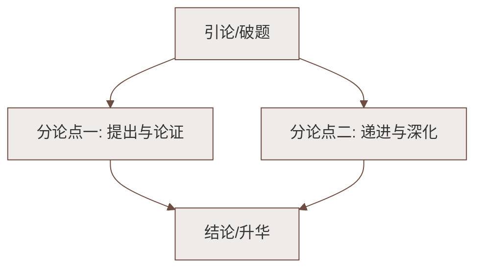

# 写作：热爱生活，学会观察

标签：#写作 #方法指导

## 一、为什么要"学会观察"

写作文"没得可写、写不具体"，根源多半是**没有观察**。罗丹说："生活中不是缺少美，而是缺少发现美的眼睛。"本单元《春》《济南的冬天》之所以动人，正因为作者是生活的细心观察者。

## 二、观察的三把钥匙

### 1. 五官并用（多感官观察）

| 感官 | 观察什么 | 课文示例 |
|---|---|---|
| 视觉 | 形状、颜色、动态 | "红的像火，粉的像霞，白的像雪" |
| 听觉 | 声音 | "鸟儿……唱出宛转的曲子" |
| 嗅觉 | 气味 | "空气里酝酿着泥土的气息" |
| 触觉 | 质感、温度 | "像母亲的手抚摸着你" |
| 味觉 | 味道 | "花里带着甜味儿" |

### 2. 定点换步（观察有顺序）

- **空间顺序**：由远及近、由高到低（《济南的冬天》写雪后山景：山上→山尖→山坡→山腰）；
- **时间顺序**：一天之内、四季变化（《雨的四季》）；
- **逻辑顺序**：整体→局部，先总后分。

### 3. 抓特征、融情感

- 同是写冬天，济南的冬天"温晴"——**抓住了别处没有的特征**；
- 带着感情观察，景物才会"活"：喜悦时"太阳的脸红起来了"。

## 三、从观察到写作：三步走

1. **定对象**：选一个具体的观察对象（一棵树、一场雨、一个街角）；
2. **做记录**：随手记下细节（颜色、声音、变化、联想），积累素材；
3. **加工升格**：
   - 用比喻、拟人让描写生动；
   - 用叠词、短句调节节奏；
   - 结尾融入自己的感受。

## 四、常见问题诊断

| 病症 | 病因 | 药方 |
|---|---|---|
| 内容空洞："花很美" | 没有细看 | 写出颜色、形态、香味，"美"在哪里 |
| 流水账 | 没有取舍 | 只写最有特征的两三处 |
| 干巴巴 | 缺少修辞与感情 | 每段至少一处比喻/拟人 |

## 五、本单元写作实践题

教材提供三道题：片段观察练习、《四季之美》、《窗外》等，共同要求：

1. 写身边真实景物，**忌凭空编造**；
2. 有顺序、有重点；
3. 不少于 500 字（大作文）。

## 六、知识联系

- 方法源头：[[1 春（朱自清）]]的五幅图、[[2 济南的冬天（老舍）]]的抓特征；
- 观察能力也是[[学会记事]]（第二单元写作）的基础。

### 语文阅读与写作结构

