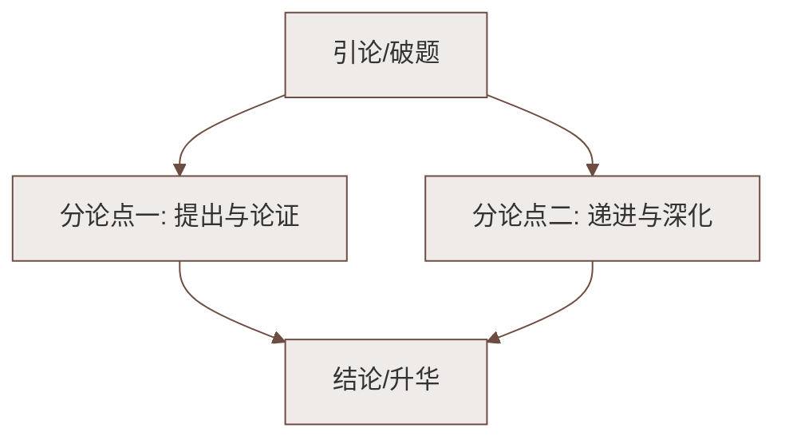

# 5 秋天的怀念（史铁生）

标签：#中考必考 #叙事散文 #母爱

## 一、文学常识

| 项目 | 内容 |
|---|---|
| 作者 | 史铁生（1951—2010），北京人，当代作家 |
| 经历 | 21 岁双腿瘫痪，后患尿毒症，"职业是生病，业余在写作" |
| 代表作 | 散文《我与地坛》《合欢树》，小说《命若琴弦》 |
| 体裁 | 叙事散文（回忆性散文） |

## 二、内容梳理

文章围绕"**看花**"展开三次波澜：

| 次序 | 情节 | "我"的态度 | 母亲的状态 |
|---|---|---|---|
| 第一次 | 母亲提议去北海看花 | 暴怒拒绝："不，我不去！" | 忍住哭声，小心翼翼 |
| 第二次 | 母亲再次央求看菊花 | 勉强答应 | 喜出望外，却永远地走了 |
| 第三次 | 妹妹推"我"去北海看菊花 | 懂得母亲，好好儿活 | （已去世） |

**题目含义**："秋天的怀念"既指怀念发生在秋天（母亲秋天去世、菊花秋天开放），更指对母亲深切的怀念与迟到的懂得。

## 三、细节描写赏析

**"母亲就悄悄地躲出去，在我看不见的地方偷偷地听着我的动静。"**

- "悄悄""偷偷"两个叠词：既怕刺激儿子，又放心不下——写出母亲的**细心、隐忍与深爱**。

**"她憔悴的脸上现出央求般的神色。"**

- "憔悴"暗示母亲重病缠身；"央求"写出她把儿子的生的希望看得比自己的命还重。

**"她忽然不说了。对于'跑'和'踩'一类的字眼儿，她比我还敏感。"**

- 母亲说到"跑"字戛然而止——怕触痛瘫痪的儿子，细微处见深情。

**结尾的菊花描写**："黄色的花淡雅，白色的花高洁，紫红色的花热烈而深沉……"

- 菊花象征**母亲的品格**，也象征"我"终于懂得的**"好好儿活"**——活出各自的姿态与尊严。

## 四、字词积累

| 字词 | 读音 | 释义/注意 |
|---|---|---|
| 瘫痪 | tān huàn | 两字都是病字旁 |
| 暴怒 | bào nù | 突然大怒 |
| 沉寂 | chén jì | 十分安静 |
| 侍弄 | shì nòng | 经营照管（花草）|
| 憔悴 | qiáo cuì | 形容人瘦弱、面色不好 |
| 央求 | yāng qiú | 恳求 |
| 诀别 | jué bié | 分别（多指不易再见的离别） |
| 淡雅 | dàn yǎ | 素净雅致 |
| 烂漫 | làn màn | 颜色鲜明而美丽 |
| 翻来覆去 | fān lái fù qù | 来回翻身 |
| 絮絮叨叨 | xù xù dāo dāo | 形容说话啰嗦 |

## 五、主旨

通过回忆母亲在"我"瘫痪后强忍病痛、小心呵护"我"的往事，表达对母亲深深的怀念与愧疚，以及对"**好好儿活**"这一生命嘱托的领悟。

## 六、知识联系

- 与[[6 散步（莫怀戚）]]同属"亲情单元"，一写母子诀别之痛，一写三代同行之暖；
- "反复出现的关键语句"（好好儿活）的作用是本课高频考点。

### 语文阅读与写作结构

