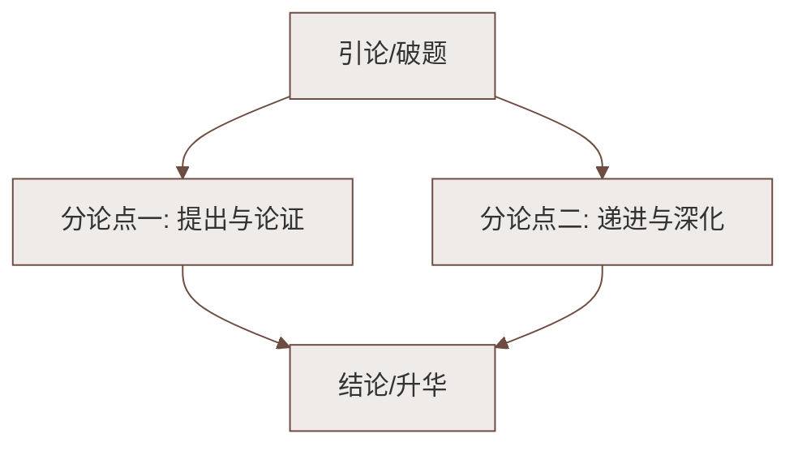

# 6 散步（莫怀戚）

标签：#中考必考 #叙事散文 #亲情

## 一、文学常识

| 项目 | 内容 |
|---|---|
| 作者 | 莫怀戚（1951—2014），重庆人，当代作家 |
| 体裁 | 叙事散文 |
| 主题 | 亲情、责任、生命的传承 |

## 二、情节梳理

一家四口（我、母亲、妻子、儿子）在初春田野散步：

1. **起因**：母亲身体不好，"我"劝她多走走；
2. **分歧**：母亲要走**大路**（平顺），儿子要走**小路**（有意思）；
3. **解决**："我"决定委屈儿子走大路 → 母亲改变主意走小路；
4. **结尾**："我"背母亲，妻子背儿子，稳稳地走。

## 三、名句赏析

**"我的母亲老了，她早已习惯听从她强壮的儿子；我的儿子还小，他还习惯听从他高大的父亲；妻子呢，在外面，她总是听我的。"**

- 对称句式，写出"我"作为**中年人承前启后的责任**。

**"但我和妻子都是慢慢地，稳稳地，走得很仔细，好像我背上的同她背上的加起来，就是整个世界。"**（主旨句）

- "慢慢地、稳稳地、仔细"：生怕有闪失，写出中年人的谨慎与责任感；
- "整个世界"运用**象征（以小见大）**：母亲代表**过去（尊老）**，儿子代表**未来（爱幼）**——中年人肩负着承前启后的使命；
- 一次平常散步，写出**生命传承与家庭责任**的大主题。

## 四、景物描写的作用

**"这南方初春的田野，大块小块的新绿随意地铺着……"**

- 写出初春的**生机与活力**，烘托一家人散步的愉悦心情；
- 暗示"生命"主题——"我"劝母亲散步正是希望她像春天一样焕发生机。

## 五、字词积累

| 字词 | 读音 | 释义/注意 |
|---|---|---|
| 信服 | xìn fú | 相信并佩服 |
| 分歧 | fēn qí | 意见不一致 |
| 取决 | qǔ jué | 由某方面决定 |
| 一霎 | yí shà | 一会儿，短时间 |
| 粼粼 | lín lín | 形容水的明净 |
| 各得其所 | gè dé qí suǒ | 每个人或事物都得到合适的安顿 |

## 六、写作借鉴

1. **以小见大**：小事件（散步）承载大主题（责任与传承）；
2. **对称句**："前面也是妈妈和儿子，后面也是妈妈和儿子"，整齐中含深意；
3. **景物点染**：两处写景不多，却恰到好处。

## 七、知识联系

- 与[[5 秋天的怀念（史铁生）]]对读：两文都写母爱与生命，情感基调迥异；
- "以小见大"手法是[[学会记事]]的重要技巧。

### 语文阅读与写作结构

