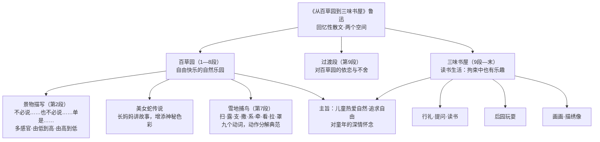

# 9 从百草园到三味书屋（鲁迅）

标签：#中考必考 #回忆性散文 #鲁迅

## 一、文学常识

| 项目 | 内容 |
|---|---|
| 作者 | 鲁迅（1881—1936），原名周树人，字豫才，浙江绍兴人 |
| 地位 | 文学家、思想家、革命家，新文化运动主将 |
| 代表作 | 小说集《呐喊》《彷徨》，散文集《朝花夕拾》，散文诗集《野草》 |
| 出处 | 《朝花夕拾》（原名《旧事重提》，回忆性散文集） |

## 二、结构：两个空间，一条成长线

题目"**从……到……**"点明文章两大部分与顺序：

| 部分 | 内容 | 生活特点 |
|---|---|---|
| 百草园（1—8 段） | 自然乐园：景物、美女蛇传说、雪地捕鸟 | 自由快乐 |
| 三味书屋（9 段—末） | 读书生活：行礼、提问、读书、后园、画画 | 相对拘束却也有乐趣 |

第 9 段是**过渡段**（"我不知道为什么家里的人要将我送进书塾里去了……"），承上启下，写出对百草园的依恋。

## 三、经典段落赏析：百草园景物描写（第 2 段）

**"不必说碧绿的菜畦，光滑的石井栏……也不必说……单是周围的短短的泥墙根一带，就有无限趣味。"**

- **"不必说……也不必说……单是……"句式**：先总体略写，再聚焦详写，突出"单是"后的内容已趣味无穷，何况全园；
- **顺序**：由低到高（植物）再由高到低（动物），整体到局部；
- **多感官**：视觉（碧绿、紫红）、听觉（鸣蝉长吟、油蛉低唱）、味觉（覆盆子又酸又甜）、触觉（光滑）；
- **准确的动词与形容词**：肥胖的黄蜂"伏"、叫天子"窜"。

## 四、雪地捕鸟：动词精准（第 7 段）

**扫**开一块雪，**露**出地面，用短棒**支**起竹筛，**撒**些秕谷，**系**一条长绳，人远远**牵**着，**看**鸟雀下来啄食，**拉**绳，便**罩**住了。

- 九个动词准确连贯，把捕鸟过程写得清晰生动——**动作分解**的典范。

## 五、字词积累

| 字词 | 读音 | 注意 |
|---|---|---|
| 菜畦 | cài qí | "畦"易误读 |
| 桑椹 | sāng shèn | |
| 油蛉 | yóu líng | |
| 斑蝥 | bān máo | |
| 攒 | cuán | 凑在一块儿 |
| 敛 | liǎn | 收拢 |
| 脑髓 | nǎo suǐ | |
| 秕谷 | bǐ gǔ | 长得不饱满的谷粒 |
| 书塾 | shū shú | |
| 人迹罕至 | rén jì hǎn zhì | 少有人来（罕：稀少） |
| 人声鼎沸 | rén shēng dǐng fèi | 形容人声喧闹（鼎沸：锅里的水烧开了） |

## 六、主旨

通过对百草园自由快乐生活和三味书屋读书生活的回忆，表现**儿童热爱自然、追求自由快乐生活的天性**，流露出对童年的深情怀念。（对三味书屋，主流理解是"含轻松的调侃而非批判"。）

## 结构图解

## 七、知识联系

- 出自[[整本书阅读：《朝花夕拾》]]，先读此篇再读整本书事半功倍；
- "不必说……也不必说……单是……"句式与动词连用，是写作仿写高频考点。
