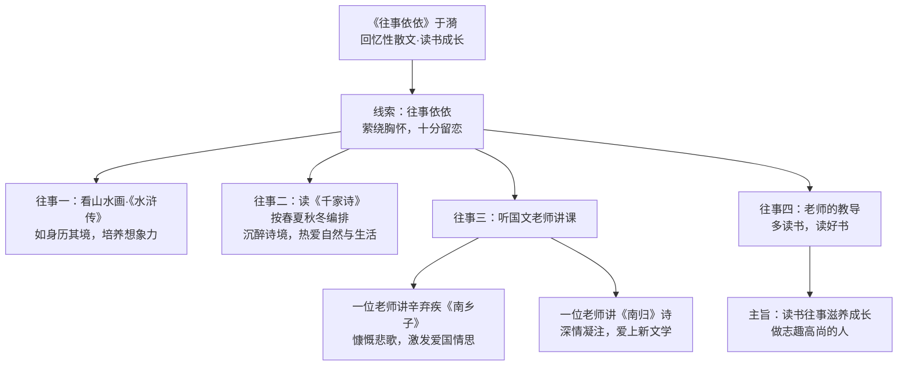

# 10 往事依依（于漪）

标签：#回忆性散文 #读书成长

## 一、文学常识

| 项目 | 内容 |
|---|---|
| 作者 | 于漪（1929— ），江苏镇江人，著名语文特级教师，"人民教育家"国家荣誉称号获得者 |
| 体裁 | 回忆性散文 |
| 主题 | 少年读书往事对自己成长的滋养 |

## 二、内容梳理：几件"依依往事"

| 往事 | 具体内容 | 收获/影响 |
|---|---|---|
| 看山水画、《评注图像水浒传》 | 看图画如身历其境 | 培养想象力，获得美的享受 |
| 读《千家诗》 | 按春夏秋冬编排的诗句 | 沉醉诗的意境，热爱自然与生活 |
| 听两位国文老师讲课 | 一位讲辛弃疾《南乡子》慷慨悲歌；一位讲《南归》诗深情凝注 | 爱上新文学、激发爱国情思 |
| 老师的教导 | "多读书，读好书" | 做一个志趣高尚的人 |

**线索**：题目"往事依依"——"依依"指**萦绕胸怀、十分留恋**，全文以对往事的深深怀念为线索。

## 三、重点语句品味

**"几十年过去，不少事情已经模糊……然而有几件事仍历历在目，至今记忆犹新。"**

- 开篇对比（模糊 vs 历历在目），突出这几件往事影响之深，引出下文。

**"编织我童年美丽的生活花环的，竟是一本让人看不上眼的石印本《千家诗》。"**

- "编织花环"的**比喻**，写出《千家诗》给童年带来的美好与丰富。

## 四、字词积累

| 字词 | 读音 | 释义 |
|---|---|---|
| 依依 | yī yī | 萦绕胸怀，十分留恋 |
| 徜徉 | cháng yáng | 安闲自在地步行（文中指陶醉于其中） |
| 浩淼 | hào miǎo | 形容水面辽阔 |
| 绚丽 | xuàn lì | 灿烂美丽 |
| 雕镂 | diāo lòu | 雕刻 |
| 镌刻 | juān kè | 雕刻 |
| 慷慨 | kāng kǎi | 充满正气，情绪激昂 |
| 凝注 | níng zhù | 凝聚，注视 |
| 历历在目 | lì lì zài mù | 清晰地出现在眼前 |
| 记忆犹新 | jì yì yóu xīn | 记忆保持如新 |
| 搜索枯肠 | sōu suǒ kū cháng | 形容竭力思索 |

## 五、写作借鉴

1. **选材典型**：只选与"读书成长"相关的几件事，中心突出；
2. **详略得当**：两位老师讲课的场景详写（动作、神态描写），其余略写；
3. **首尾呼应**：开头"记忆犹新"，结尾"金色的回忆唤起我的青春激情"。

## 结构图解

## 六、知识联系

- 与[[9 从百草园到三味书屋（鲁迅）]]同写童年学习生活，可比较两种"课堂"；
- 文中"多读书，读好书"呼应[[综合性学习：少年正是读书时]]。
